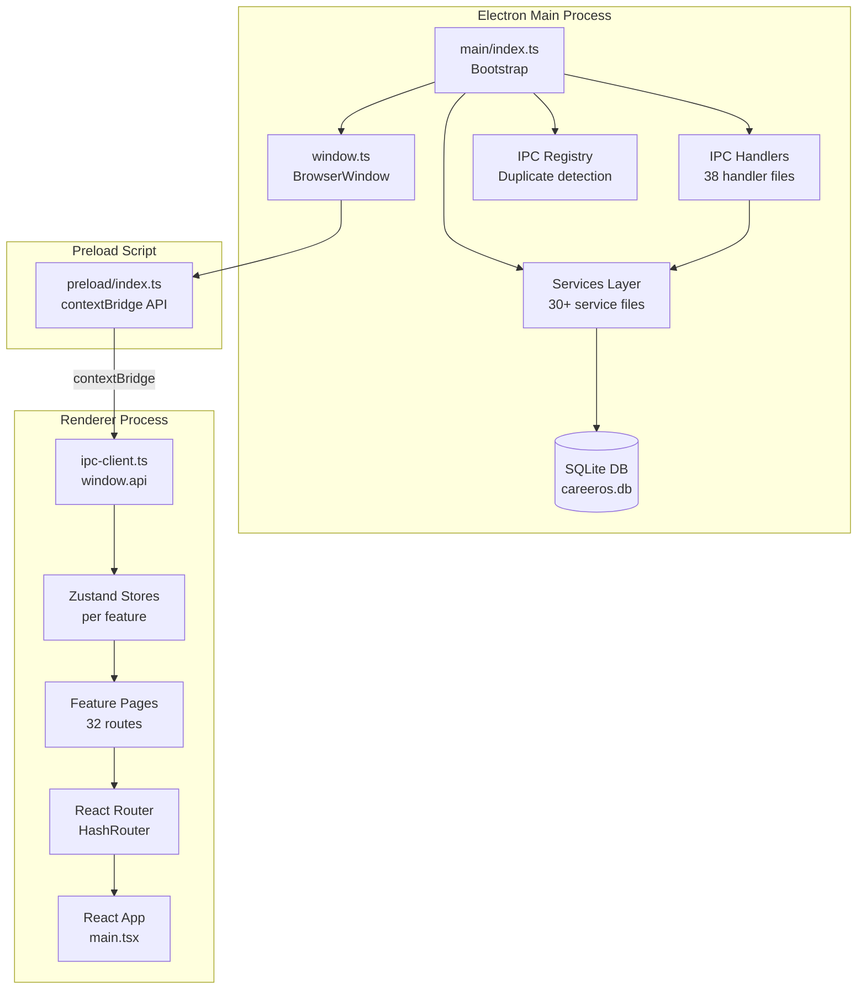

# CareerOS — System Overview

## Application Purpose

CareerOS is a local-first desktop application designed for IT professionals to manage every dimension of their career development in a single, private, offline workspace. It provides a structured environment for tracking skills, projects, certifications, videos, notes, documents, journal entries, and advanced learning features such as spaced repetition, interview preparation, home labs, and career roadmaps — all stored entirely on the user's own machine with no cloud dependency.

The application bridges the gap between passive learning management and active career strategy. Rather than merely cataloguing what a user has learned, CareerOS contextualises knowledge across multiple dimensions: how skills relate to occupations, how certifications advance roadmaps, how home labs prove competence, and how an integrated AI coach synthesises all data into actionable guidance.

## Target Users

- IT professionals pursuing career advancement (sysadmins, cloud engineers, MSP technicians)
- Self-taught developers building structured learning portfolios
- IT certification candidates managing multi-certification study tracks
- Technical leads tracking team and personal skill inventories
- Anyone who wants a private, offline knowledge and career management system

## Core Philosophy

**Local-first.** All data lives in a SQLite database on the user's machine. No accounts, no subscriptions, no data sent to servers. The user owns their data absolutely.

**Integrated, not siloed.** Skills, projects, certifications, labs, videos, and documents are connected through a relational database. A skill links to its labs, interview questions, certifications, videos, and roadmaps — giving a unified view of progress.

**Evidence-based learning.** The system operationalises proven learning science: spaced repetition (SM-2 algorithm), the Feynman Technique, active recall, dependency-aware learning paths, and study plan generation.

## Tech Stack

| Technology | Version | Role |
|---|---|---|
| Electron | 41.7.1 | Desktop application host (main process) |
| React | 18.3.1 | UI rendering (renderer process) |
| TypeScript | 5.6.2 | Language for all source code |
| Vite / electron-vite | 5.4.6 / 2.3.0 | Build system |
| React Router | 6.26.2 | Client-side routing (hash mode) |
| Zustand | 5.0.0 | Feature-level state management |
| better-sqlite3 | 12.10.0 | Synchronous SQLite access in main process |
| Zod | 3.25.76 | Schema validation (forms) |
| React Hook Form | 7.77.0 | Form state management |
| Tailwind CSS | 3.4.12 | Utility-first styling |
| Radix UI | various | Accessible headless UI primitives |
| Lucide React | 0.441.0 | Icon library |
| Monaco Editor | 0.55.1 | Embedded VS Code-style code editor |
| pdfjs-dist | 6.0.227 | PDF rendering in renderer |
| mammoth | 1.12.0 | DOCX-to-HTML conversion in main process |
| react-player | 3.4.0 | Video playback (YouTube, Vimeo, local) |
| mermaid | 11.15.0 | Diagram rendering in markdown workspace |
| dockview | 6.6.1 | Dockable panel layout for workspace |
| nanoid | 3.3.7 | Compact unique ID generation |
| highlight.js | 11.11.1 | Syntax highlighting |

## Architecture Overview



## Frontend Structure

The renderer process is a standard React + Vite single-page application loaded via Electron's `BrowserWindow`. It uses **HashRouter** (required for Electron's `file://` protocol — no server exists to handle path rewrites).

```
src/
├── app/
│   ├── App.tsx              # Root component with RouterProvider
│   └── Router.tsx           # All 32 route definitions
├── features/                # Feature modules (one folder per module)
│   └── <module>/
│       ├── components/      # React page and sub-components
│       ├── store/           # Zustand store
│       ├── types/           # TypeScript types
│       └── schemas/         # Zod validation schemas
├── shared/
│   ├── components/
│   │   ├── layout/          # Shell, Sidebar, Header, TitleBar, PageLayout
│   │   ├── common/          # EmptyState, ErrorBoundary, LoadingSpinner, Pagination
│   │   └── ui/              # Radix UI wrappers (Button, Dialog, Input, etc.)
│   ├── lib/
│   │   ├── ipc-client.ts    # window.api proxy + nullApi browser fallback
│   │   ├── platform.ts      # isElectron detection
│   │   └── utils.ts         # clsx/tailwind-merge utilities
│   └── types/
│       ├── ipc.types.ts     # Full typed API surface
│       ├── common.types.ts  # IpcResult, PaginatedResult, AppPaths
│       └── entities.ts      # All domain entity types
```

## Backend Structure

The Electron main process runs Node.js and hosts all business logic. The entry point is `electron/main/index.ts`, which:
1. Installs the IPC registry (duplicate-channel detection)
2. Runs all 18 database migrations
3. Registers all 38+ IPC handler modules
4. Creates the main browser window

```
electron/
├── main/
│   ├── index.ts             # Bootstrap: registry → migrations → handlers → window
│   └── window.ts            # BrowserWindow creation, CSP, floating windows
├── ipc/
│   ├── channels.ts          # IPC channel name constants (IPC object)
│   ├── index.ts             # Handler registration entry point
│   ├── registry.ts          # Duplicate-channel guard
│   └── *.ipc.ts             # One handler file per feature (38 files)
├── services/
│   ├── database/
│   │   ├── connection.ts    # Singleton DB connection (~$HOME/CareerOS/careeros.db)
│   │   └── migrations/      # 18 migration files + runner
│   └── <feature>/
│       └── *.service.ts     # Business logic, SQL queries
└── preload/
    └── index.ts             # contextBridge: exposes window.api to renderer
```

## IPC Architecture

CareerOS uses Electron's `contextBridge` pattern for secure, type-safe communication between the renderer and main process.

- `nodeIntegration: false` — the renderer cannot access Node.js APIs directly
- `contextIsolation: true` — the renderer has its own JavaScript context
- `contextBridge.exposeInMainWorld('api', api)` — a curated API object is injected at `window.api`
- All calls use `ipcRenderer.invoke()` → `ipcMain.handle()` (request/response, returns Promise)

**Channel naming convention:** `<namespace>:<action>` or `<namespace>:<sub-namespace>:<action>`

Examples:
- `skills:get-all`, `skills:create`
- `home-labs:tasks:create`
- `career:roadmaps:set-skills`
- `lc:paths:get-all` (learning coach)

**IPC Registry:** A startup guard (`electron/ipc/registry.ts`) intercepts every `ipcMain.handle()` call and prevents duplicate channel registration, logging errors in development.

**Browser fallback:** `src/shared/lib/ipc-client.ts` exports a `nullApi` that returns empty results for reads and soft-fail responses for writes when running in a plain browser (outside Electron).

## Database Architecture

- **Engine:** SQLite via `better-sqlite3` (synchronous, native Node addon)
- **Location:** `~/CareerOS/careeros.db` (Electron `home` path, not `userData`)
- **WAL mode:** Enabled for concurrent read performance
- **Foreign keys:** `ON` enforced at connection time
- **Cache:** 32 MB page cache, temp store in memory
- **Migrations:** 18 sequential migrations, tracked in `schema_migrations` table
- **FTS:** SQLite FTS5 virtual tables for full-text search across 10 entity types

## State Management

Each feature module owns a dedicated **Zustand store** (`src/features/<module>/store/<name>.store.ts`). Stores follow a consistent pattern:

```typescript
interface <Module>State {
  items: Item[]
  isLoading: boolean
  error: string | null
  // fetch actions
  loadItems: () => Promise<void>
  // mutation actions
  createItem: (data: Input) => Promise<void>
  updateItem: (id: string, data: Partial<Input>) => Promise<void>
  deleteItem: (id: string) => Promise<void>
}
```

Stores call `api.<module>.*` from `ipc-client.ts` and handle IPC result unwrapping internally.

## Modules by Group

### Learning OS
| Module | Route | Purpose |
|---|---|---|
| Workspace | `/workspace` | Dockable multi-panel layout |
| Dashboard | `/learning-dashboard` | Unified learning metrics |
| AI Coach | `/learning-coach` | Learning paths, SRS, study plans |
| SRS & Recall | `/learning-system` | Spaced repetition flashcard system |
| Knowledge Vault | `/knowledge-vault` | PDF/DOCX reader with annotations |
| Challenges | `/challenge-center` | Daily/weekly learning challenges |
| Scenarios | `/scenario-center` | IT scenario simulations |

### Career OS
| Module | Route | Purpose |
|---|---|---|
| Intelligence | `/career-intelligence` | Roadmaps, analytics, AI recommendations |
| Knowledge Graph | `/knowledge-graph` | Visual entity relationship graph |
| Skills | `/skills` | Skill inventory and categorisation |
| Occupations | `/occupations` | Job role tracking and skill mapping |
| Certifications | `/certifications` | Certification tracking |
| Projects | `/projects` | Project portfolio |
| Home Labs | `/home-lab` | Lab experiments with task tracking |
| Interview Bank | `/interview-questions` | Interview question preparation |

### Knowledge
| Module | Route | Purpose |
|---|---|---|
| Code Workspace | `/code-workspace` | Monaco-based code editor |
| Whiteboard | `/whiteboard` | Free-draw canvas with entity links |
| Markdown | `/markdown-workspace` | Markdown editor with version history |
| Notes | `/notes` | General note-taking |
| Documents | `/documents` | File management with PDF/DOCX viewer |
| Videos | `/videos` | Video library with progress tracking |
| Playlists | `/playlists` | Video playlist organisation |
| Journal | `/journal` | Daily career journal |
| Tags | `/tags` | Cross-module tagging system |

### Cross-cutting
| Module | Route | Purpose |
|---|---|---|
| Search | `/search` | Global FTS5 search across all entities |
| Skill Hub | `/skills/:skillId` | Deep-dive per-skill management |

## Storage System

- **Database file:** `~/CareerOS/careeros.db`
- **Imported files:** Stored under `~/CareerOS/<category>/` by the storage service (copies on import)
- **Directory creation:** Automatic on first launch
- **Backup:** Not automated — user must manually copy `~/CareerOS/` directory
