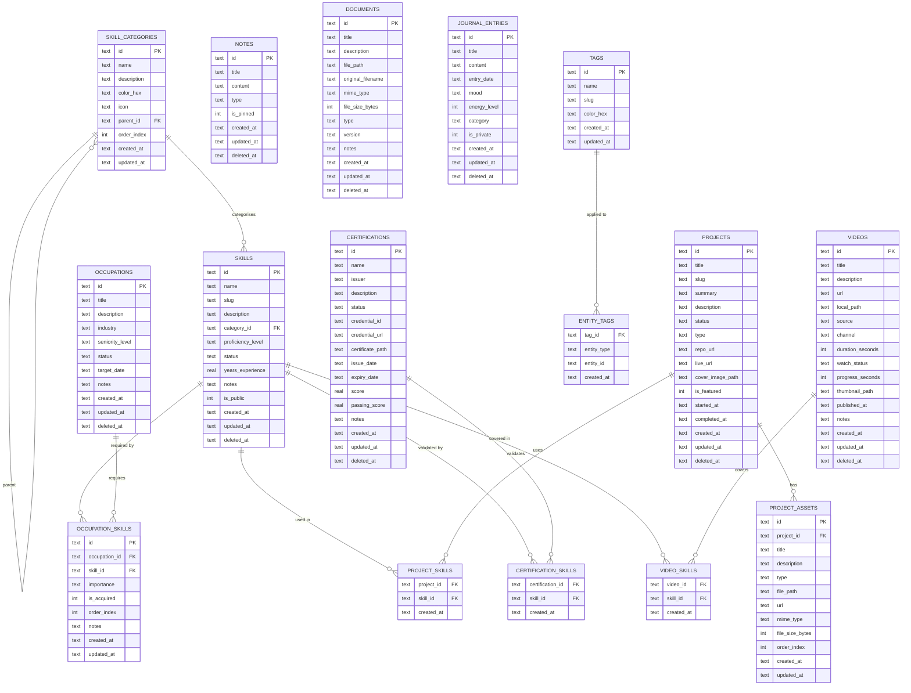
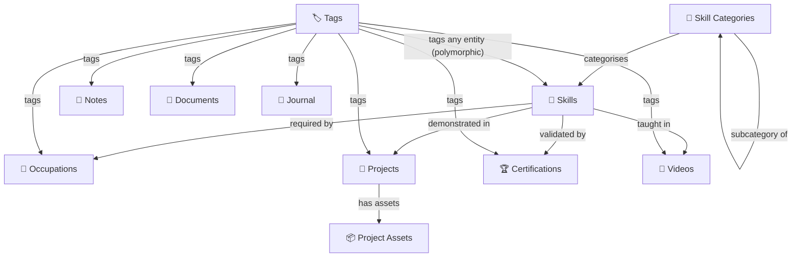
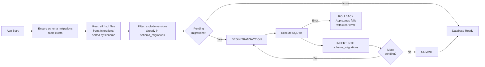

# CareerOS — Phase 2: Database Architecture

**Version:** 1.0.0  
**Date:** 2026-06-03  
**Status:** Approved for Implementation  

---

## Table of Contents

1. [Design Principles](#1-design-principles)
2. [Entity Relationship Diagram](#2-entity-relationship-diagram)
3. [Table Definitions](#3-table-definitions)
4. [Relationships](#4-relationships)
5. [Index Strategy](#5-index-strategy)
6. [Search Architecture](#6-search-architecture)
7. [Migration Strategy](#7-migration-strategy)

---

## 1. Design Principles

| Principle | Decision | Reason |
|---|---|---|
| **Primary Keys** | `TEXT` nanoid (21 chars) | Collision-resistant; safe for future export/import |
| **Timestamps** | `TEXT` ISO 8601 (`YYYY-MM-DDTHH:MM:SS.sssZ`) | SQLite has no native DATETIME; TEXT sorts correctly |
| **Booleans** | `INTEGER` (0/1) with CHECK constraint | SQLite has no BOOLEAN type |
| **Soft deletes** | `deleted_at TEXT` column | Preserves history; all queries filter `WHERE deleted_at IS NULL` |
| **Enums** | `TEXT` with `CHECK` constraint | Human-readable; migrating a CHECK is a simple ALTER |
| **JSON columns** | Avoided — use junction tables | Enables proper indexing, joins, and integrity constraints |
| **Cascades** | `ON DELETE CASCADE` on child FKs | Orphan rows are a data integrity hazard |
| **FTS5** | Content tables + triggers | Single source of truth; no double-write from app code |
| **Normalization** | 3NF minimum | No redundant data; each fact stored exactly once |

---

## 2. Entity Relationship Diagram

### Core Entity Map



### Relationship Summary



---

## 3. Table Definitions

### 3.1 `schema_migrations`

Tracks which migration files have been applied. Never truncated or modified.

```sql
CREATE TABLE IF NOT EXISTS schema_migrations (
  version    TEXT NOT NULL PRIMARY KEY,
  name       TEXT NOT NULL,
  applied_at TEXT NOT NULL DEFAULT (strftime('%Y-%m-%dT%H:%M:%fZ', 'now'))
);
```

---

### 3.2 `skill_categories`

Hierarchical skill taxonomy. Supports unlimited nesting via `parent_id` self-reference.

```sql
CREATE TABLE IF NOT EXISTS skill_categories (
  id          TEXT    NOT NULL PRIMARY KEY,
  name        TEXT    NOT NULL,
  description TEXT,
  color_hex   TEXT    NOT NULL DEFAULT '#6B7280',
  icon        TEXT,
  parent_id   TEXT    REFERENCES skill_categories(id) ON DELETE SET NULL,
  order_index INTEGER NOT NULL DEFAULT 0,
  created_at  TEXT    NOT NULL DEFAULT (strftime('%Y-%m-%dT%H:%M:%fZ', 'now')),
  updated_at  TEXT    NOT NULL DEFAULT (strftime('%Y-%m-%dT%H:%M:%fZ', 'now'))
);
```

**Column Notes:**
- `color_hex` — Used for UI colour coding. Defaults to neutral grey.
- `icon` — Lucide icon name string (e.g. `"code"`, `"database"`).
- `parent_id` — `NULL` = top-level category. Cascade `SET NULL` preserves children when a parent is deleted.
- `order_index` — Manual sort order within the same parent level.

---

### 3.3 `skills`

The central entity. Skills are referenced by Occupations, Projects, Certifications, and Videos.

```sql
CREATE TABLE IF NOT EXISTS skills (
  id                TEXT    NOT NULL PRIMARY KEY,
  name              TEXT    NOT NULL,
  slug              TEXT    NOT NULL UNIQUE,
  description       TEXT,
  category_id       TEXT    NOT NULL REFERENCES skill_categories(id) ON DELETE RESTRICT,
  proficiency_level TEXT    NOT NULL DEFAULT 'beginner'
                    CHECK (proficiency_level IN (
                      'beginner', 'intermediate', 'advanced', 'expert'
                    )),
  status            TEXT    NOT NULL DEFAULT 'learning'
                    CHECK (status IN (
                      'learning', 'practicing', 'proficient', 'mastered'
                    )),
  years_experience  REAL    NOT NULL DEFAULT 0.0,
  notes             TEXT,
  is_public         INTEGER NOT NULL DEFAULT 1 CHECK (is_public IN (0, 1)),
  created_at        TEXT    NOT NULL DEFAULT (strftime('%Y-%m-%dT%H:%M:%fZ', 'now')),
  updated_at        TEXT    NOT NULL DEFAULT (strftime('%Y-%m-%dT%H:%M:%fZ', 'now')),
  deleted_at        TEXT
);
```

**Column Notes:**
- `slug` — URL-safe lowercase identifier (e.g. `"typescript"`, `"react-hooks"`). Generated from `name`.
- `proficiency_level` — Knowledge depth (how well you know it).
- `status` — Application depth (how actively you are using it).
- `category_id` — `ON DELETE RESTRICT` prevents orphan skills; the category must be reassigned first.
- `is_public` — Controls whether this skill appears in exported résumé/portfolio assets.

---

### 3.4 `occupations`

Represents a career target, current role, or aspirational position.

```sql
CREATE TABLE IF NOT EXISTS occupations (
  id              TEXT NOT NULL PRIMARY KEY,
  title           TEXT NOT NULL,
  description     TEXT,
  industry        TEXT,
  seniority_level TEXT CHECK (seniority_level IN (
                    'junior', 'mid', 'senior', 'lead', 'principal',
                    'staff', 'director', 'vp', 'c-level'
                  )),
  status          TEXT NOT NULL DEFAULT 'aspirational'
                  CHECK (status IN (
                    'aspirational', 'active', 'completed', 'archived'
                  )),
  target_date     TEXT,
  notes           TEXT,
  created_at      TEXT NOT NULL DEFAULT (strftime('%Y-%m-%dT%H:%M:%fZ', 'now')),
  updated_at      TEXT NOT NULL DEFAULT (strftime('%Y-%m-%dT%H:%M:%fZ', 'now')),
  deleted_at      TEXT
);
```

---

### 3.5 `occupation_skills`

Junction table: skills required for an occupation, with importance weighting and acquisition tracking.

```sql
CREATE TABLE IF NOT EXISTS occupation_skills (
  id            TEXT    NOT NULL PRIMARY KEY,
  occupation_id TEXT    NOT NULL REFERENCES occupations(id) ON DELETE CASCADE,
  skill_id      TEXT    NOT NULL REFERENCES skills(id)      ON DELETE CASCADE,
  importance    TEXT    NOT NULL DEFAULT 'important'
                CHECK (importance IN ('critical', 'important', 'nice-to-have')),
  is_acquired   INTEGER NOT NULL DEFAULT 0 CHECK (is_acquired IN (0, 1)),
  order_index   INTEGER NOT NULL DEFAULT 0,
  notes         TEXT,
  created_at    TEXT    NOT NULL DEFAULT (strftime('%Y-%m-%dT%H:%M:%fZ', 'now')),
  updated_at    TEXT    NOT NULL DEFAULT (strftime('%Y-%m-%dT%H:%M:%fZ', 'now')),
  UNIQUE (occupation_id, skill_id)
);
```

**Column Notes:**
- Uses a surrogate `id` PK (not composite) to make the row independently referenceable.
- `UNIQUE (occupation_id, skill_id)` — enforces the natural key at the DB level.
- `is_acquired` — Derived state; could be computed from `skills.status`, but stored explicitly to allow manual override.

---

### 3.6 `projects`

Portfolio and personal projects.

```sql
CREATE TABLE IF NOT EXISTS projects (
  id               TEXT    NOT NULL PRIMARY KEY,
  title            TEXT    NOT NULL,
  slug             TEXT    NOT NULL UNIQUE,
  summary          TEXT,
  description      TEXT,
  status           TEXT    NOT NULL DEFAULT 'planning'
                   CHECK (status IN (
                     'planning', 'active', 'completed', 'paused', 'abandoned'
                   )),
  type             TEXT    NOT NULL DEFAULT 'personal'
                   CHECK (type IN (
                     'personal', 'professional', 'open-source', 'freelance', 'academic'
                   )),
  repo_url         TEXT,
  live_url         TEXT,
  cover_image_path TEXT,
  is_featured      INTEGER NOT NULL DEFAULT 0 CHECK (is_featured IN (0, 1)),
  started_at       TEXT,
  completed_at     TEXT,
  created_at       TEXT    NOT NULL DEFAULT (strftime('%Y-%m-%dT%H:%M:%fZ', 'now')),
  updated_at       TEXT    NOT NULL DEFAULT (strftime('%Y-%m-%dT%H:%M:%fZ', 'now')),
  deleted_at       TEXT
);
```

---

### 3.7 `project_assets`

Files, screenshots, links, and demos attached to a project.

```sql
CREATE TABLE IF NOT EXISTS project_assets (
  id              TEXT    NOT NULL PRIMARY KEY,
  project_id      TEXT    NOT NULL REFERENCES projects(id) ON DELETE CASCADE,
  title           TEXT    NOT NULL,
  description     TEXT,
  type            TEXT    NOT NULL DEFAULT 'document'
                  CHECK (type IN (
                    'image', 'video', 'document', 'link', 'screenshot', 'demo', 'other'
                  )),
  file_path       TEXT,
  url             TEXT,
  mime_type       TEXT,
  file_size_bytes INTEGER,
  order_index     INTEGER NOT NULL DEFAULT 0,
  created_at      TEXT    NOT NULL DEFAULT (strftime('%Y-%m-%dT%H:%M:%fZ', 'now')),
  updated_at      TEXT    NOT NULL DEFAULT (strftime('%Y-%m-%dT%H:%M:%fZ', 'now'))
);
```

**Column Notes:**
- `file_path` and `url` are both nullable — an asset is either a local file, a remote URL, or both.
- No `deleted_at` — assets are hard-deleted; the physical file is removed by the storage service first.

---

### 3.8 `project_skills`

Junction table: skills demonstrated in a project.

```sql
CREATE TABLE IF NOT EXISTS project_skills (
  project_id TEXT NOT NULL REFERENCES projects(id) ON DELETE CASCADE,
  skill_id   TEXT NOT NULL REFERENCES skills(id)   ON DELETE CASCADE,
  created_at TEXT NOT NULL DEFAULT (strftime('%Y-%m-%dT%H:%M:%fZ', 'now')),
  PRIMARY KEY (project_id, skill_id)
);
```

---

### 3.9 `certifications`

Professional credentials, licences, and exam results.

```sql
CREATE TABLE IF NOT EXISTS certifications (
  id               TEXT    NOT NULL PRIMARY KEY,
  name             TEXT    NOT NULL,
  issuer           TEXT    NOT NULL,
  description      TEXT,
  status           TEXT    NOT NULL DEFAULT 'planned'
                   CHECK (status IN (
                     'planned', 'in-progress', 'earned', 'expired', 'revoked'
                   )),
  credential_id    TEXT,
  credential_url   TEXT,
  certificate_path TEXT,
  issue_date       TEXT,
  expiry_date      TEXT,
  score            REAL,
  passing_score    REAL,
  notes            TEXT,
  created_at       TEXT    NOT NULL DEFAULT (strftime('%Y-%m-%dT%H:%M:%fZ', 'now')),
  updated_at       TEXT    NOT NULL DEFAULT (strftime('%Y-%m-%dT%H:%M:%fZ', 'now')),
  deleted_at       TEXT
);
```

---

### 3.10 `certification_skills`

Junction table: skills a certification validates.

```sql
CREATE TABLE IF NOT EXISTS certification_skills (
  certification_id TEXT NOT NULL REFERENCES certifications(id) ON DELETE CASCADE,
  skill_id         TEXT NOT NULL REFERENCES skills(id)         ON DELETE CASCADE,
  created_at       TEXT NOT NULL DEFAULT (strftime('%Y-%m-%dT%H:%M:%fZ', 'now')),
  PRIMARY KEY (certification_id, skill_id)
);
```

---

### 3.11 `videos`

Learning videos from external platforms or stored locally.

```sql
CREATE TABLE IF NOT EXISTS videos (
  id               TEXT    NOT NULL PRIMARY KEY,
  title            TEXT    NOT NULL,
  description      TEXT,
  url              TEXT,
  local_path       TEXT,
  source           TEXT    NOT NULL DEFAULT 'other'
                   CHECK (source IN (
                     'youtube', 'vimeo', 'udemy', 'coursera', 'pluralsight', 'local', 'other'
                   )),
  channel          TEXT,
  duration_seconds INTEGER,
  watch_status     TEXT    NOT NULL DEFAULT 'unwatched'
                   CHECK (watch_status IN (
                     'unwatched', 'watching', 'completed', 'revisit'
                   )),
  progress_seconds INTEGER NOT NULL DEFAULT 0,
  thumbnail_path   TEXT,
  published_at     TEXT,
  notes            TEXT,
  created_at       TEXT    NOT NULL DEFAULT (strftime('%Y-%m-%dT%H:%M:%fZ', 'now')),
  updated_at       TEXT    NOT NULL DEFAULT (strftime('%Y-%m-%dT%H:%M:%fZ', 'now')),
  deleted_at       TEXT
);
```

---

### 3.12 `video_skills`

Junction table: skills a video teaches.

```sql
CREATE TABLE IF NOT EXISTS video_skills (
  video_id   TEXT NOT NULL REFERENCES videos(id) ON DELETE CASCADE,
  skill_id   TEXT NOT NULL REFERENCES skills(id) ON DELETE CASCADE,
  created_at TEXT NOT NULL DEFAULT (strftime('%Y-%m-%dT%H:%M:%fZ', 'now')),
  PRIMARY KEY (video_id, skill_id)
);
```

---

### 3.13 `notes`

Free-form Markdown notes. Not linked to a specific module — use `entity_tags` for context.

```sql
CREATE TABLE IF NOT EXISTS notes (
  id         TEXT    NOT NULL PRIMARY KEY,
  title      TEXT    NOT NULL,
  content    TEXT    NOT NULL DEFAULT '',
  type       TEXT    NOT NULL DEFAULT 'general'
             CHECK (type IN (
               'general', 'meeting', 'research', 'tutorial', 'reference', 'idea'
             )),
  is_pinned  INTEGER NOT NULL DEFAULT 0 CHECK (is_pinned IN (0, 1)),
  created_at TEXT    NOT NULL DEFAULT (strftime('%Y-%m-%dT%H:%M:%fZ', 'now')),
  updated_at TEXT    NOT NULL DEFAULT (strftime('%Y-%m-%dT%H:%M:%fZ', 'now')),
  deleted_at TEXT
);
```

---

### 3.14 `documents`

Uploaded file documents (PDFs, Word docs, templates).

```sql
CREATE TABLE IF NOT EXISTS documents (
  id                TEXT    NOT NULL PRIMARY KEY,
  title             TEXT    NOT NULL,
  description       TEXT,
  file_path         TEXT    NOT NULL,
  original_filename TEXT    NOT NULL,
  mime_type         TEXT,
  file_size_bytes   INTEGER,
  type              TEXT    NOT NULL DEFAULT 'other'
                    CHECK (type IN (
                      'resume', 'cover-letter', 'certificate', 'report',
                      'template', 'reference', 'other'
                    )),
  version           TEXT    NOT NULL DEFAULT '1.0',
  notes             TEXT,
  created_at        TEXT    NOT NULL DEFAULT (strftime('%Y-%m-%dT%H:%M:%fZ', 'now')),
  updated_at        TEXT    NOT NULL DEFAULT (strftime('%Y-%m-%dT%H:%M:%fZ', 'now')),
  deleted_at        TEXT
);
```

---

### 3.15 `journal_entries`

Daily career journal. Supports mood tracking and Markdown content.

```sql
CREATE TABLE IF NOT EXISTS journal_entries (
  id           TEXT    NOT NULL PRIMARY KEY,
  title        TEXT    NOT NULL,
  content      TEXT    NOT NULL DEFAULT '',
  entry_date   TEXT    NOT NULL,
  mood         TEXT    CHECK (mood IN (
                 'great', 'good', 'neutral', 'bad', 'terrible'
               )),
  energy_level INTEGER CHECK (energy_level BETWEEN 1 AND 5),
  category     TEXT    NOT NULL DEFAULT 'general'
               CHECK (category IN (
                 'achievement', 'challenge', 'reflection',
                 'learning', 'goal', 'feedback', 'general'
               )),
  is_private   INTEGER NOT NULL DEFAULT 0 CHECK (is_private IN (0, 1)),
  created_at   TEXT    NOT NULL DEFAULT (strftime('%Y-%m-%dT%H:%M:%fZ', 'now')),
  updated_at   TEXT    NOT NULL DEFAULT (strftime('%Y-%m-%dT%H:%M:%fZ', 'now')),
  deleted_at   TEXT
);
```

**Column Notes:**
- `entry_date` — The date the entry is *about*, not `created_at`. Allows backdating.
- `is_private` — Future-proofed for selective export / AI context inclusion.

---

### 3.16 `tags`

Canonical tag definitions. Applied to any entity via `entity_tags`.

```sql
CREATE TABLE IF NOT EXISTS tags (
  id         TEXT NOT NULL PRIMARY KEY,
  name       TEXT NOT NULL,
  slug       TEXT NOT NULL UNIQUE,
  color_hex  TEXT NOT NULL DEFAULT '#6B7280',
  created_at TEXT NOT NULL DEFAULT (strftime('%Y-%m-%dT%H:%M:%fZ', 'now')),
  updated_at TEXT NOT NULL DEFAULT (strftime('%Y-%m-%dT%H:%M:%fZ', 'now'))
);
```

---

### 3.17 `entity_tags`

Polymorphic tag assignment. One row per tag–entity pair.

```sql
CREATE TABLE IF NOT EXISTS entity_tags (
  tag_id      TEXT NOT NULL REFERENCES tags(id) ON DELETE CASCADE,
  entity_type TEXT NOT NULL
              CHECK (entity_type IN (
                'skill', 'occupation', 'project', 'certification',
                'video', 'note', 'document', 'journal_entry'
              )),
  entity_id   TEXT NOT NULL,
  created_at  TEXT NOT NULL DEFAULT (strftime('%Y-%m-%dT%H:%M:%fZ', 'now')),
  PRIMARY KEY (tag_id, entity_type, entity_id)
);
```

**Design Note:** `entity_id` is untyped (`TEXT`) because SQLite does not support polymorphic FK constraints. Referential integrity for this column is enforced by application-layer logic in the IPC handlers.

---

## 4. Relationships

### Relationship Matrix

| From | To | Type | Via | On Delete |
|---|---|---|---|---|
| `skill_categories` | `skill_categories` | Self-referential 0..1 → Many | `parent_id` | SET NULL |
| `skill_categories` | `skills` | 1 → Many | `category_id` | RESTRICT |
| `occupations` | `occupation_skills` | 1 → Many | `occupation_id` | CASCADE |
| `skills` | `occupation_skills` | 1 → Many | `skill_id` | CASCADE |
| `projects` | `project_assets` | 1 → Many | `project_id` | CASCADE |
| `projects` | `project_skills` | 1 → Many | `project_id` | CASCADE |
| `skills` | `project_skills` | 1 → Many | `skill_id` | CASCADE |
| `certifications` | `certification_skills` | 1 → Many | `certification_id` | CASCADE |
| `skills` | `certification_skills` | 1 → Many | `skill_id` | CASCADE |
| `videos` | `video_skills` | 1 → Many | `video_id` | CASCADE |
| `skills` | `video_skills` | 1 → Many | `skill_id` | CASCADE |
| `tags` | `entity_tags` | 1 → Many | `tag_id` | CASCADE |

### Delete Behaviour

```mermaid
flowchart TD
    DEL_CAT[Delete Skill Category]
    DEL_SKILL[Delete Skill]
    DEL_OCC[Delete Occupation]
    DEL_PROJ[Delete Project]
    DEL_CERT[Delete Certification]
    DEL_VIDEO[Delete Video]
    DEL_TAG[Delete Tag]

    DEL_CAT -->|SET NULL on children| CHILDREN_CAT[Child categories\nbecome top-level]
    DEL_CAT -->|RESTRICT| BLOCK[Blocked if skills\nstill assigned]

    DEL_SKILL -->|CASCADE| OCC_SK[occupation_skills rows deleted]
    DEL_SKILL -->|CASCADE| PROJ_SK[project_skills rows deleted]
    DEL_SKILL -->|CASCADE| CERT_SK[certification_skills rows deleted]
    DEL_SKILL -->|CASCADE| VID_SK[video_skills rows deleted]

    DEL_OCC -->|CASCADE| OCC_SK2[occupation_skills rows deleted]
    DEL_PROJ -->|CASCADE| PROJ_SK2[project_skills rows deleted]
    DEL_PROJ -->|CASCADE| PROJ_ASSETS[project_assets rows deleted]
    DEL_CERT -->|CASCADE| CERT_SK2[certification_skills rows deleted]
    DEL_VIDEO -->|CASCADE| VID_SK2[video_skills rows deleted]
    DEL_TAG -->|CASCADE| ET[entity_tags rows deleted]
```



---

## 5. Index Strategy

### Rationale

Indexes are created for:
1. Every foreign key column (SQLite does not auto-index FKs)
2. Every `status` and `type` column used in `WHERE` clauses
3. Every date column used in `ORDER BY`
4. `deleted_at` with a partial index (`WHERE deleted_at IS NULL`) — only active rows are indexed

### All Index Definitions

```sql
-- ─────────────────────────────────────────────
-- skill_categories
-- ─────────────────────────────────────────────
CREATE INDEX IF NOT EXISTS idx_skill_categories_parent_id
  ON skill_categories (parent_id);

CREATE INDEX IF NOT EXISTS idx_skill_categories_order
  ON skill_categories (order_index);

-- ─────────────────────────────────────────────
-- skills
-- ─────────────────────────────────────────────
CREATE INDEX IF NOT EXISTS idx_skills_category_id
  ON skills (category_id)
  WHERE deleted_at IS NULL;

CREATE INDEX IF NOT EXISTS idx_skills_status
  ON skills (status)
  WHERE deleted_at IS NULL;

CREATE INDEX IF NOT EXISTS idx_skills_proficiency_level
  ON skills (proficiency_level)
  WHERE deleted_at IS NULL;

CREATE UNIQUE INDEX IF NOT EXISTS idx_skills_slug
  ON skills (slug);

CREATE INDEX IF NOT EXISTS idx_skills_active
  ON skills (created_at)
  WHERE deleted_at IS NULL;

-- ─────────────────────────────────────────────
-- occupations
-- ─────────────────────────────────────────────
CREATE INDEX IF NOT EXISTS idx_occupations_status
  ON occupations (status)
  WHERE deleted_at IS NULL;

CREATE INDEX IF NOT EXISTS idx_occupations_active
  ON occupations (created_at)
  WHERE deleted_at IS NULL;

-- ─────────────────────────────────────────────
-- occupation_skills
-- ─────────────────────────────────────────────
CREATE INDEX IF NOT EXISTS idx_occupation_skills_occupation_id
  ON occupation_skills (occupation_id);

CREATE INDEX IF NOT EXISTS idx_occupation_skills_skill_id
  ON occupation_skills (skill_id);

CREATE INDEX IF NOT EXISTS idx_occupation_skills_importance
  ON occupation_skills (importance);

CREATE INDEX IF NOT EXISTS idx_occupation_skills_acquired
  ON occupation_skills (is_acquired);

-- ─────────────────────────────────────────────
-- projects
-- ─────────────────────────────────────────────
CREATE INDEX IF NOT EXISTS idx_projects_status
  ON projects (status)
  WHERE deleted_at IS NULL;

CREATE INDEX IF NOT EXISTS idx_projects_type
  ON projects (type)
  WHERE deleted_at IS NULL;

CREATE INDEX IF NOT EXISTS idx_projects_featured
  ON projects (is_featured)
  WHERE deleted_at IS NULL;

CREATE UNIQUE INDEX IF NOT EXISTS idx_projects_slug
  ON projects (slug);

CREATE INDEX IF NOT EXISTS idx_projects_started_at
  ON projects (started_at)
  WHERE deleted_at IS NULL;

-- ─────────────────────────────────────────────
-- project_assets
-- ─────────────────────────────────────────────
CREATE INDEX IF NOT EXISTS idx_project_assets_project_id
  ON project_assets (project_id);

CREATE INDEX IF NOT EXISTS idx_project_assets_type
  ON project_assets (type);

CREATE INDEX IF NOT EXISTS idx_project_assets_order
  ON project_assets (project_id, order_index);

-- ─────────────────────────────────────────────
-- project_skills
-- ─────────────────────────────────────────────
CREATE INDEX IF NOT EXISTS idx_project_skills_project_id
  ON project_skills (project_id);

CREATE INDEX IF NOT EXISTS idx_project_skills_skill_id
  ON project_skills (skill_id);

-- ─────────────────────────────────────────────
-- certifications
-- ─────────────────────────────────────────────
CREATE INDEX IF NOT EXISTS idx_certifications_status
  ON certifications (status)
  WHERE deleted_at IS NULL;

CREATE INDEX IF NOT EXISTS idx_certifications_expiry_date
  ON certifications (expiry_date)
  WHERE deleted_at IS NULL;

CREATE INDEX IF NOT EXISTS idx_certifications_issuer
  ON certifications (issuer)
  WHERE deleted_at IS NULL;

-- ─────────────────────────────────────────────
-- certification_skills
-- ─────────────────────────────────────────────
CREATE INDEX IF NOT EXISTS idx_certification_skills_certification_id
  ON certification_skills (certification_id);

CREATE INDEX IF NOT EXISTS idx_certification_skills_skill_id
  ON certification_skills (skill_id);

-- ─────────────────────────────────────────────
-- videos
-- ─────────────────────────────────────────────
CREATE INDEX IF NOT EXISTS idx_videos_watch_status
  ON videos (watch_status)
  WHERE deleted_at IS NULL;

CREATE INDEX IF NOT EXISTS idx_videos_source
  ON videos (source)
  WHERE deleted_at IS NULL;

CREATE INDEX IF NOT EXISTS idx_videos_created_at
  ON videos (created_at)
  WHERE deleted_at IS NULL;

-- ─────────────────────────────────────────────
-- video_skills
-- ─────────────────────────────────────────────
CREATE INDEX IF NOT EXISTS idx_video_skills_video_id
  ON video_skills (video_id);

CREATE INDEX IF NOT EXISTS idx_video_skills_skill_id
  ON video_skills (skill_id);

-- ─────────────────────────────────────────────
-- notes
-- ─────────────────────────────────────────────
CREATE INDEX IF NOT EXISTS idx_notes_type
  ON notes (type)
  WHERE deleted_at IS NULL;

CREATE INDEX IF NOT EXISTS idx_notes_pinned
  ON notes (is_pinned)
  WHERE deleted_at IS NULL AND is_pinned = 1;

CREATE INDEX IF NOT EXISTS idx_notes_updated_at
  ON notes (updated_at)
  WHERE deleted_at IS NULL;

-- ─────────────────────────────────────────────
-- documents
-- ─────────────────────────────────────────────
CREATE INDEX IF NOT EXISTS idx_documents_type
  ON documents (type)
  WHERE deleted_at IS NULL;

CREATE INDEX IF NOT EXISTS idx_documents_created_at
  ON documents (created_at)
  WHERE deleted_at IS NULL;

-- ─────────────────────────────────────────────
-- journal_entries
-- ─────────────────────────────────────────────
CREATE INDEX IF NOT EXISTS idx_journal_entries_entry_date
  ON journal_entries (entry_date)
  WHERE deleted_at IS NULL;

CREATE INDEX IF NOT EXISTS idx_journal_entries_category
  ON journal_entries (category)
  WHERE deleted_at IS NULL;

CREATE INDEX IF NOT EXISTS idx_journal_entries_mood
  ON journal_entries (mood)
  WHERE deleted_at IS NULL;

-- ─────────────────────────────────────────────
-- tags
-- ─────────────────────────────────────────────
CREATE UNIQUE INDEX IF NOT EXISTS idx_tags_slug
  ON tags (slug);

-- ─────────────────────────────────────────────
-- entity_tags
-- ─────────────────────────────────────────────
CREATE INDEX IF NOT EXISTS idx_entity_tags_entity
  ON entity_tags (entity_type, entity_id);

CREATE INDEX IF NOT EXISTS idx_entity_tags_tag_id
  ON entity_tags (tag_id);
```

---

## 6. Search Architecture

### Technology: SQLite FTS5

FTS5 is used for full-text search across all content-bearing tables. The implementation uses **content tables** — FTS5 reads from the source table on rebuild, and **triggers** keep the index in sync on every INSERT, UPDATE, and DELETE.

### Why Content Tables + Triggers

| Approach | Pros | Cons |
|---|---|---|
| Standalone FTS (no content) | Simple | Stores content twice |
| Content table + rebuild | No triggers needed | `rebuild` is a full scan — slow on large data |
| **Content table + triggers** | Instant sync, no duplication | Triggers must be maintained alongside schema |

### FTS5 Virtual Table Definitions

Each searchable module gets its own FTS5 virtual table. The `tokenize` option uses `unicode61` to handle accented characters and Unicode text correctly.

```sql
-- Skills
CREATE VIRTUAL TABLE IF NOT EXISTS skills_fts USING fts5(
  name, description, notes,
  content     = 'skills',
  content_rowid = 'rowid',
  tokenize    = 'unicode61 remove_diacritics 1'
);

-- Occupations
CREATE VIRTUAL TABLE IF NOT EXISTS occupations_fts USING fts5(
  title, description, industry, notes,
  content     = 'occupations',
  content_rowid = 'rowid',
  tokenize    = 'unicode61 remove_diacritics 1'
);

-- Projects
CREATE VIRTUAL TABLE IF NOT EXISTS projects_fts USING fts5(
  title, summary, description,
  content     = 'projects',
  content_rowid = 'rowid',
  tokenize    = 'unicode61 remove_diacritics 1'
);

-- Certifications
CREATE VIRTUAL TABLE IF NOT EXISTS certifications_fts USING fts5(
  name, issuer, description, notes,
  content     = 'certifications',
  content_rowid = 'rowid',
  tokenize    = 'unicode61 remove_diacritics 1'
);

-- Videos
CREATE VIRTUAL TABLE IF NOT EXISTS videos_fts USING fts5(
  title, description, channel, notes,
  content     = 'videos',
  content_rowid = 'rowid',
  tokenize    = 'unicode61 remove_diacritics 1'
);

-- Notes
CREATE VIRTUAL TABLE IF NOT EXISTS notes_fts USING fts5(
  title, content,
  content     = 'notes',
  content_rowid = 'rowid',
  tokenize    = 'unicode61 remove_diacritics 1'
);

-- Documents
CREATE VIRTUAL TABLE IF NOT EXISTS documents_fts USING fts5(
  title, description, notes,
  content     = 'documents',
  content_rowid = 'rowid',
  tokenize    = 'unicode61 remove_diacritics 1'
);

-- Journal Entries
CREATE VIRTUAL TABLE IF NOT EXISTS journal_entries_fts USING fts5(
  title, content,
  content     = 'journal_entries',
  content_rowid = 'rowid',
  tokenize    = 'unicode61 remove_diacritics 1'
);
```

### FTS5 Sync Triggers

The same three-trigger pattern (INSERT / DELETE / UPDATE) is applied to every FTS-enabled table. The UPDATE trigger deletes the old row then inserts the new one — FTS5 does not support in-place UPDATE.

```sql
-- ─────────────────────────────────────────────
-- skills FTS triggers
-- ─────────────────────────────────────────────
CREATE TRIGGER IF NOT EXISTS skills_fts_ai
AFTER INSERT ON skills BEGIN
  INSERT INTO skills_fts (rowid, name, description, notes)
  VALUES (new.rowid, new.name, new.description, new.notes);
END;

CREATE TRIGGER IF NOT EXISTS skills_fts_ad
AFTER DELETE ON skills BEGIN
  INSERT INTO skills_fts (skills_fts, rowid, name, description, notes)
  VALUES ('delete', old.rowid, old.name, old.description, old.notes);
END;

CREATE TRIGGER IF NOT EXISTS skills_fts_au
AFTER UPDATE ON skills BEGIN
  INSERT INTO skills_fts (skills_fts, rowid, name, description, notes)
  VALUES ('delete', old.rowid, old.name, old.description, old.notes);
  INSERT INTO skills_fts (rowid, name, description, notes)
  VALUES (new.rowid, new.name, new.description, new.notes);
END;

-- ─────────────────────────────────────────────
-- occupations FTS triggers
-- ─────────────────────────────────────────────
CREATE TRIGGER IF NOT EXISTS occupations_fts_ai
AFTER INSERT ON occupations BEGIN
  INSERT INTO occupations_fts (rowid, title, description, industry, notes)
  VALUES (new.rowid, new.title, new.description, new.industry, new.notes);
END;

CREATE TRIGGER IF NOT EXISTS occupations_fts_ad
AFTER DELETE ON occupations BEGIN
  INSERT INTO occupations_fts (occupations_fts, rowid, title, description, industry, notes)
  VALUES ('delete', old.rowid, old.title, old.description, old.industry, old.notes);
END;

CREATE TRIGGER IF NOT EXISTS occupations_fts_au
AFTER UPDATE ON occupations BEGIN
  INSERT INTO occupations_fts (occupations_fts, rowid, title, description, industry, notes)
  VALUES ('delete', old.rowid, old.title, old.description, old.industry, old.notes);
  INSERT INTO occupations_fts (rowid, title, description, industry, notes)
  VALUES (new.rowid, new.title, new.description, new.industry, new.notes);
END;

-- ─────────────────────────────────────────────
-- projects FTS triggers
-- ─────────────────────────────────────────────
CREATE TRIGGER IF NOT EXISTS projects_fts_ai
AFTER INSERT ON projects BEGIN
  INSERT INTO projects_fts (rowid, title, summary, description)
  VALUES (new.rowid, new.title, new.summary, new.description);
END;

CREATE TRIGGER IF NOT EXISTS projects_fts_ad
AFTER DELETE ON projects BEGIN
  INSERT INTO projects_fts (projects_fts, rowid, title, summary, description)
  VALUES ('delete', old.rowid, old.title, old.summary, old.description);
END;

CREATE TRIGGER IF NOT EXISTS projects_fts_au
AFTER UPDATE ON projects BEGIN
  INSERT INTO projects_fts (projects_fts, rowid, title, summary, description)
  VALUES ('delete', old.rowid, old.title, old.summary, old.description);
  INSERT INTO projects_fts (rowid, title, summary, description)
  VALUES (new.rowid, new.title, new.summary, new.description);
END;

-- ─────────────────────────────────────────────
-- certifications FTS triggers
-- ─────────────────────────────────────────────
CREATE TRIGGER IF NOT EXISTS certifications_fts_ai
AFTER INSERT ON certifications BEGIN
  INSERT INTO certifications_fts (rowid, name, issuer, description, notes)
  VALUES (new.rowid, new.name, new.issuer, new.description, new.notes);
END;

CREATE TRIGGER IF NOT EXISTS certifications_fts_ad
AFTER DELETE ON certifications BEGIN
  INSERT INTO certifications_fts (certifications_fts, rowid, name, issuer, description, notes)
  VALUES ('delete', old.rowid, old.name, old.issuer, old.description, old.notes);
END;

CREATE TRIGGER IF NOT EXISTS certifications_fts_au
AFTER UPDATE ON certifications BEGIN
  INSERT INTO certifications_fts (certifications_fts, rowid, name, issuer, description, notes)
  VALUES ('delete', old.rowid, old.name, old.issuer, old.description, old.notes);
  INSERT INTO certifications_fts (rowid, name, issuer, description, notes)
  VALUES (new.rowid, new.name, new.issuer, new.description, new.notes);
END;

-- ─────────────────────────────────────────────
-- videos FTS triggers
-- ─────────────────────────────────────────────
CREATE TRIGGER IF NOT EXISTS videos_fts_ai
AFTER INSERT ON videos BEGIN
  INSERT INTO videos_fts (rowid, title, description, channel, notes)
  VALUES (new.rowid, new.title, new.description, new.channel, new.notes);
END;

CREATE TRIGGER IF NOT EXISTS videos_fts_ad
AFTER DELETE ON videos BEGIN
  INSERT INTO videos_fts (videos_fts, rowid, title, description, channel, notes)
  VALUES ('delete', old.rowid, old.title, old.description, old.channel, old.notes);
END;

CREATE TRIGGER IF NOT EXISTS videos_fts_au
AFTER UPDATE ON videos BEGIN
  INSERT INTO videos_fts (videos_fts, rowid, title, description, channel, notes)
  VALUES ('delete', old.rowid, old.title, old.description, old.channel, old.notes);
  INSERT INTO videos_fts (rowid, title, description, channel, notes)
  VALUES (new.rowid, new.title, new.description, new.channel, new.notes);
END;

-- ─────────────────────────────────────────────
-- notes FTS triggers
-- ─────────────────────────────────────────────
CREATE TRIGGER IF NOT EXISTS notes_fts_ai
AFTER INSERT ON notes BEGIN
  INSERT INTO notes_fts (rowid, title, content)
  VALUES (new.rowid, new.title, new.content);
END;

CREATE TRIGGER IF NOT EXISTS notes_fts_ad
AFTER DELETE ON notes BEGIN
  INSERT INTO notes_fts (notes_fts, rowid, title, content)
  VALUES ('delete', old.rowid, old.title, old.content);
END;

CREATE TRIGGER IF NOT EXISTS notes_fts_au
AFTER UPDATE ON notes BEGIN
  INSERT INTO notes_fts (notes_fts, rowid, title, content)
  VALUES ('delete', old.rowid, old.title, old.content);
  INSERT INTO notes_fts (rowid, title, content)
  VALUES (new.rowid, new.title, new.content);
END;

-- ─────────────────────────────────────────────
-- documents FTS triggers
-- ─────────────────────────────────────────────
CREATE TRIGGER IF NOT EXISTS documents_fts_ai
AFTER INSERT ON documents BEGIN
  INSERT INTO documents_fts (rowid, title, description, notes)
  VALUES (new.rowid, new.title, new.description, new.notes);
END;

CREATE TRIGGER IF NOT EXISTS documents_fts_ad
AFTER DELETE ON documents BEGIN
  INSERT INTO documents_fts (documents_fts, rowid, title, description, notes)
  VALUES ('delete', old.rowid, old.title, old.description, old.notes);
END;

CREATE TRIGGER IF NOT EXISTS documents_fts_au
AFTER UPDATE ON documents BEGIN
  INSERT INTO documents_fts (documents_fts, rowid, title, description, notes)
  VALUES ('delete', old.rowid, old.title, old.description, old.notes);
  INSERT INTO documents_fts (rowid, title, description, notes)
  VALUES (new.rowid, new.title, new.description, new.notes);
END;

-- ─────────────────────────────────────────────
-- journal_entries FTS triggers
-- ─────────────────────────────────────────────
CREATE TRIGGER IF NOT EXISTS journal_entries_fts_ai
AFTER INSERT ON journal_entries BEGIN
  INSERT INTO journal_entries_fts (rowid, title, content)
  VALUES (new.rowid, new.title, new.content);
END;

CREATE TRIGGER IF NOT EXISTS journal_entries_fts_ad
AFTER DELETE ON journal_entries BEGIN
  INSERT INTO journal_entries_fts (journal_entries_fts, rowid, title, content)
  VALUES ('delete', old.rowid, old.title, old.content);
END;

CREATE TRIGGER IF NOT EXISTS journal_entries_fts_au
AFTER UPDATE ON journal_entries BEGIN
  INSERT INTO journal_entries_fts (journal_entries_fts, rowid, title, content)
  VALUES ('delete', old.rowid, old.title, old.content);
  INSERT INTO journal_entries_fts (rowid, title, content)
  VALUES (new.rowid, new.title, new.content);
END;
```

### Global Search Query Pattern

The search service executes a `UNION ALL` across all FTS tables ranked by BM25. Soft-deleted rows are excluded via a join back to the source table.

```sql
-- Global search: top 20 results across all modules, ranked by relevance
SELECT
  'skill'          AS entity_type,
  s.id             AS entity_id,
  s.name           AS title,
  snippet(skills_fts, 1, '<mark>', '</mark>', '…', 20) AS excerpt,
  bm25(skills_fts) AS rank
FROM skills_fts
JOIN skills s ON s.rowid = skills_fts.rowid
WHERE skills_fts MATCH ?
  AND s.deleted_at IS NULL

UNION ALL

SELECT
  'occupation'     AS entity_type,
  o.id             AS entity_id,
  o.title          AS title,
  snippet(occupations_fts, 1, '<mark>', '</mark>', '…', 20) AS excerpt,
  bm25(occupations_fts) AS rank
FROM occupations_fts
JOIN occupations o ON o.rowid = occupations_fts.rowid
WHERE occupations_fts MATCH ?
  AND o.deleted_at IS NULL

UNION ALL

SELECT
  'project'        AS entity_type,
  p.id             AS entity_id,
  p.title          AS title,
  snippet(projects_fts, 1, '<mark>', '</mark>', '…', 20) AS excerpt,
  bm25(projects_fts) AS rank
FROM projects_fts
JOIN projects p ON p.rowid = projects_fts.rowid
WHERE projects_fts MATCH ?
  AND p.deleted_at IS NULL

-- ... (same pattern for certifications, videos, notes, documents, journal_entries)

ORDER BY rank
LIMIT 20;
```

### Supported Query Syntax

| Syntax | Example | Behaviour |
|---|---|---|
| Simple term | `typescript` | Matches any row containing "typescript" |
| Prefix | `type*` | Matches "type", "types", "typescript" |
| Phrase | `"react hooks"` | Exact phrase match |
| AND (implicit) | `react router` | Both terms must appear |
| OR | `react OR vue` | Either term |
| NOT | `javascript NOT typescript` | Exclude rows with second term |
| Column scope | `name:typescript` | Search in `name` column only |

### FTS5 Integrity Rebuild

If the FTS index ever diverges from the source table (e.g., after a direct DB edit or crash), it can be fully rebuilt without data loss:

```sql
INSERT INTO skills_fts(skills_fts) VALUES ('rebuild');
-- Repeat for each FTS virtual table
```

---

## 7. Migration Strategy

### Overview

Migrations are sequential numbered SQL files. A `schema_migrations` table tracks which have been applied. The migration runner executes at app startup — it is idempotent and safe to run repeatedly.



### Migration File Layout

```
electron/services/database/migrations/
├── 001_initial_schema.sql     Core tables + indexes
├── 002_fts5_search.sql        FTS5 virtual tables + all sync triggers
└── 003_seed_categories.sql    Default skill category seed data
```

### Migration File: `001_initial_schema.sql`

```sql
-- CareerOS Migration 001: Initial Schema
-- Creates all core entity tables, junction tables, and indexes.

PRAGMA journal_mode = WAL;
PRAGMA foreign_keys = ON;

-- Migration tracking
CREATE TABLE IF NOT EXISTS schema_migrations (
  version    TEXT NOT NULL PRIMARY KEY,
  name       TEXT NOT NULL,
  applied_at TEXT NOT NULL DEFAULT (strftime('%Y-%m-%dT%H:%M:%fZ', 'now'))
);

-- ── Skill Categories ──────────────────────────
CREATE TABLE IF NOT EXISTS skill_categories (
  id          TEXT    NOT NULL PRIMARY KEY,
  name        TEXT    NOT NULL,
  description TEXT,
  color_hex   TEXT    NOT NULL DEFAULT '#6B7280',
  icon        TEXT,
  parent_id   TEXT    REFERENCES skill_categories(id) ON DELETE SET NULL,
  order_index INTEGER NOT NULL DEFAULT 0,
  created_at  TEXT    NOT NULL DEFAULT (strftime('%Y-%m-%dT%H:%M:%fZ', 'now')),
  updated_at  TEXT    NOT NULL DEFAULT (strftime('%Y-%m-%dT%H:%M:%fZ', 'now'))
);
CREATE INDEX IF NOT EXISTS idx_skill_categories_parent_id ON skill_categories (parent_id);
CREATE INDEX IF NOT EXISTS idx_skill_categories_order     ON skill_categories (order_index);

-- ── Skills ───────────────────────────────────
CREATE TABLE IF NOT EXISTS skills (
  id                TEXT    NOT NULL PRIMARY KEY,
  name              TEXT    NOT NULL,
  slug              TEXT    NOT NULL UNIQUE,
  description       TEXT,
  category_id       TEXT    NOT NULL REFERENCES skill_categories(id) ON DELETE RESTRICT,
  proficiency_level TEXT    NOT NULL DEFAULT 'beginner'
                    CHECK (proficiency_level IN ('beginner','intermediate','advanced','expert')),
  status            TEXT    NOT NULL DEFAULT 'learning'
                    CHECK (status IN ('learning','practicing','proficient','mastered')),
  years_experience  REAL    NOT NULL DEFAULT 0.0,
  notes             TEXT,
  is_public         INTEGER NOT NULL DEFAULT 1 CHECK (is_public IN (0,1)),
  created_at        TEXT    NOT NULL DEFAULT (strftime('%Y-%m-%dT%H:%M:%fZ', 'now')),
  updated_at        TEXT    NOT NULL DEFAULT (strftime('%Y-%m-%dT%H:%M:%fZ', 'now')),
  deleted_at        TEXT
);
CREATE INDEX IF NOT EXISTS idx_skills_category_id       ON skills (category_id)         WHERE deleted_at IS NULL;
CREATE INDEX IF NOT EXISTS idx_skills_status            ON skills (status)               WHERE deleted_at IS NULL;
CREATE INDEX IF NOT EXISTS idx_skills_proficiency_level ON skills (proficiency_level)    WHERE deleted_at IS NULL;
CREATE INDEX IF NOT EXISTS idx_skills_active            ON skills (created_at)           WHERE deleted_at IS NULL;

-- ── Occupations ──────────────────────────────
CREATE TABLE IF NOT EXISTS occupations (
  id              TEXT NOT NULL PRIMARY KEY,
  title           TEXT NOT NULL,
  description     TEXT,
  industry        TEXT,
  seniority_level TEXT CHECK (seniority_level IN
                    ('junior','mid','senior','lead','principal','staff','director','vp','c-level')),
  status          TEXT NOT NULL DEFAULT 'aspirational'
                  CHECK (status IN ('aspirational','active','completed','archived')),
  target_date     TEXT,
  notes           TEXT,
  created_at      TEXT NOT NULL DEFAULT (strftime('%Y-%m-%dT%H:%M:%fZ', 'now')),
  updated_at      TEXT NOT NULL DEFAULT (strftime('%Y-%m-%dT%H:%M:%fZ', 'now')),
  deleted_at      TEXT
);
CREATE INDEX IF NOT EXISTS idx_occupations_status ON occupations (status) WHERE deleted_at IS NULL;
CREATE INDEX IF NOT EXISTS idx_occupations_active ON occupations (created_at) WHERE deleted_at IS NULL;

-- ── Occupation Skills ─────────────────────────
CREATE TABLE IF NOT EXISTS occupation_skills (
  id            TEXT    NOT NULL PRIMARY KEY,
  occupation_id TEXT    NOT NULL REFERENCES occupations(id) ON DELETE CASCADE,
  skill_id      TEXT    NOT NULL REFERENCES skills(id)      ON DELETE CASCADE,
  importance    TEXT    NOT NULL DEFAULT 'important'
                CHECK (importance IN ('critical','important','nice-to-have')),
  is_acquired   INTEGER NOT NULL DEFAULT 0 CHECK (is_acquired IN (0,1)),
  order_index   INTEGER NOT NULL DEFAULT 0,
  notes         TEXT,
  created_at    TEXT    NOT NULL DEFAULT (strftime('%Y-%m-%dT%H:%M:%fZ', 'now')),
  updated_at    TEXT    NOT NULL DEFAULT (strftime('%Y-%m-%dT%H:%M:%fZ', 'now')),
  UNIQUE (occupation_id, skill_id)
);
CREATE INDEX IF NOT EXISTS idx_occupation_skills_occupation_id ON occupation_skills (occupation_id);
CREATE INDEX IF NOT EXISTS idx_occupation_skills_skill_id      ON occupation_skills (skill_id);
CREATE INDEX IF NOT EXISTS idx_occupation_skills_importance    ON occupation_skills (importance);
CREATE INDEX IF NOT EXISTS idx_occupation_skills_acquired      ON occupation_skills (is_acquired);

-- ── Projects ─────────────────────────────────
CREATE TABLE IF NOT EXISTS projects (
  id               TEXT    NOT NULL PRIMARY KEY,
  title            TEXT    NOT NULL,
  slug             TEXT    NOT NULL UNIQUE,
  summary          TEXT,
  description      TEXT,
  status           TEXT    NOT NULL DEFAULT 'planning'
                   CHECK (status IN ('planning','active','completed','paused','abandoned')),
  type             TEXT    NOT NULL DEFAULT 'personal'
                   CHECK (type IN ('personal','professional','open-source','freelance','academic')),
  repo_url         TEXT,
  live_url         TEXT,
  cover_image_path TEXT,
  is_featured      INTEGER NOT NULL DEFAULT 0 CHECK (is_featured IN (0,1)),
  started_at       TEXT,
  completed_at     TEXT,
  created_at       TEXT    NOT NULL DEFAULT (strftime('%Y-%m-%dT%H:%M:%fZ', 'now')),
  updated_at       TEXT    NOT NULL DEFAULT (strftime('%Y-%m-%dT%H:%M:%fZ', 'now')),
  deleted_at       TEXT
);
CREATE INDEX IF NOT EXISTS idx_projects_status     ON projects (status)      WHERE deleted_at IS NULL;
CREATE INDEX IF NOT EXISTS idx_projects_type       ON projects (type)        WHERE deleted_at IS NULL;
CREATE INDEX IF NOT EXISTS idx_projects_featured   ON projects (is_featured) WHERE deleted_at IS NULL;
CREATE INDEX IF NOT EXISTS idx_projects_started_at ON projects (started_at)  WHERE deleted_at IS NULL;

-- ── Project Assets ────────────────────────────
CREATE TABLE IF NOT EXISTS project_assets (
  id              TEXT    NOT NULL PRIMARY KEY,
  project_id      TEXT    NOT NULL REFERENCES projects(id) ON DELETE CASCADE,
  title           TEXT    NOT NULL,
  description     TEXT,
  type            TEXT    NOT NULL DEFAULT 'document'
                  CHECK (type IN ('image','video','document','link','screenshot','demo','other')),
  file_path       TEXT,
  url             TEXT,
  mime_type       TEXT,
  file_size_bytes INTEGER,
  order_index     INTEGER NOT NULL DEFAULT 0,
  created_at      TEXT    NOT NULL DEFAULT (strftime('%Y-%m-%dT%H:%M:%fZ', 'now')),
  updated_at      TEXT    NOT NULL DEFAULT (strftime('%Y-%m-%dT%H:%M:%fZ', 'now'))
);
CREATE INDEX IF NOT EXISTS idx_project_assets_project_id ON project_assets (project_id);
CREATE INDEX IF NOT EXISTS idx_project_assets_type       ON project_assets (type);
CREATE INDEX IF NOT EXISTS idx_project_assets_order      ON project_assets (project_id, order_index);

-- ── Project Skills ────────────────────────────
CREATE TABLE IF NOT EXISTS project_skills (
  project_id TEXT NOT NULL REFERENCES projects(id) ON DELETE CASCADE,
  skill_id   TEXT NOT NULL REFERENCES skills(id)   ON DELETE CASCADE,
  created_at TEXT NOT NULL DEFAULT (strftime('%Y-%m-%dT%H:%M:%fZ', 'now')),
  PRIMARY KEY (project_id, skill_id)
);
CREATE INDEX IF NOT EXISTS idx_project_skills_project_id ON project_skills (project_id);
CREATE INDEX IF NOT EXISTS idx_project_skills_skill_id   ON project_skills (skill_id);

-- ── Certifications ───────────────────────────
CREATE TABLE IF NOT EXISTS certifications (
  id               TEXT    NOT NULL PRIMARY KEY,
  name             TEXT    NOT NULL,
  issuer           TEXT    NOT NULL,
  description      TEXT,
  status           TEXT    NOT NULL DEFAULT 'planned'
                   CHECK (status IN ('planned','in-progress','earned','expired','revoked')),
  credential_id    TEXT,
  credential_url   TEXT,
  certificate_path TEXT,
  issue_date       TEXT,
  expiry_date      TEXT,
  score            REAL,
  passing_score    REAL,
  notes            TEXT,
  created_at       TEXT    NOT NULL DEFAULT (strftime('%Y-%m-%dT%H:%M:%fZ', 'now')),
  updated_at       TEXT    NOT NULL DEFAULT (strftime('%Y-%m-%dT%H:%M:%fZ', 'now')),
  deleted_at       TEXT
);
CREATE INDEX IF NOT EXISTS idx_certifications_status      ON certifications (status)      WHERE deleted_at IS NULL;
CREATE INDEX IF NOT EXISTS idx_certifications_expiry_date ON certifications (expiry_date) WHERE deleted_at IS NULL;
CREATE INDEX IF NOT EXISTS idx_certifications_issuer      ON certifications (issuer)      WHERE deleted_at IS NULL;

-- ── Certification Skills ──────────────────────
CREATE TABLE IF NOT EXISTS certification_skills (
  certification_id TEXT NOT NULL REFERENCES certifications(id) ON DELETE CASCADE,
  skill_id         TEXT NOT NULL REFERENCES skills(id)         ON DELETE CASCADE,
  created_at       TEXT NOT NULL DEFAULT (strftime('%Y-%m-%dT%H:%M:%fZ', 'now')),
  PRIMARY KEY (certification_id, skill_id)
);
CREATE INDEX IF NOT EXISTS idx_certification_skills_certification_id ON certification_skills (certification_id);
CREATE INDEX IF NOT EXISTS idx_certification_skills_skill_id         ON certification_skills (skill_id);

-- ── Videos ───────────────────────────────────
CREATE TABLE IF NOT EXISTS videos (
  id               TEXT    NOT NULL PRIMARY KEY,
  title            TEXT    NOT NULL,
  description      TEXT,
  url              TEXT,
  local_path       TEXT,
  source           TEXT    NOT NULL DEFAULT 'other'
                   CHECK (source IN ('youtube','vimeo','udemy','coursera','pluralsight','local','other')),
  channel          TEXT,
  duration_seconds INTEGER,
  watch_status     TEXT    NOT NULL DEFAULT 'unwatched'
                   CHECK (watch_status IN ('unwatched','watching','completed','revisit')),
  progress_seconds INTEGER NOT NULL DEFAULT 0,
  thumbnail_path   TEXT,
  published_at     TEXT,
  notes            TEXT,
  created_at       TEXT    NOT NULL DEFAULT (strftime('%Y-%m-%dT%H:%M:%fZ', 'now')),
  updated_at       TEXT    NOT NULL DEFAULT (strftime('%Y-%m-%dT%H:%M:%fZ', 'now')),
  deleted_at       TEXT
);
CREATE INDEX IF NOT EXISTS idx_videos_watch_status ON videos (watch_status) WHERE deleted_at IS NULL;
CREATE INDEX IF NOT EXISTS idx_videos_source       ON videos (source)       WHERE deleted_at IS NULL;
CREATE INDEX IF NOT EXISTS idx_videos_created_at   ON videos (created_at)   WHERE deleted_at IS NULL;

-- ── Video Skills ──────────────────────────────
CREATE TABLE IF NOT EXISTS video_skills (
  video_id   TEXT NOT NULL REFERENCES videos(id) ON DELETE CASCADE,
  skill_id   TEXT NOT NULL REFERENCES skills(id) ON DELETE CASCADE,
  created_at TEXT NOT NULL DEFAULT (strftime('%Y-%m-%dT%H:%M:%fZ', 'now')),
  PRIMARY KEY (video_id, skill_id)
);
CREATE INDEX IF NOT EXISTS idx_video_skills_video_id ON video_skills (video_id);
CREATE INDEX IF NOT EXISTS idx_video_skills_skill_id ON video_skills (skill_id);

-- ── Notes ────────────────────────────────────
CREATE TABLE IF NOT EXISTS notes (
  id         TEXT    NOT NULL PRIMARY KEY,
  title      TEXT    NOT NULL,
  content    TEXT    NOT NULL DEFAULT '',
  type       TEXT    NOT NULL DEFAULT 'general'
             CHECK (type IN ('general','meeting','research','tutorial','reference','idea')),
  is_pinned  INTEGER NOT NULL DEFAULT 0 CHECK (is_pinned IN (0,1)),
  created_at TEXT    NOT NULL DEFAULT (strftime('%Y-%m-%dT%H:%M:%fZ', 'now')),
  updated_at TEXT    NOT NULL DEFAULT (strftime('%Y-%m-%dT%H:%M:%fZ', 'now')),
  deleted_at TEXT
);
CREATE INDEX IF NOT EXISTS idx_notes_type       ON notes (type)       WHERE deleted_at IS NULL;
CREATE INDEX IF NOT EXISTS idx_notes_pinned     ON notes (is_pinned)  WHERE deleted_at IS NULL AND is_pinned = 1;
CREATE INDEX IF NOT EXISTS idx_notes_updated_at ON notes (updated_at) WHERE deleted_at IS NULL;

-- ── Documents ────────────────────────────────
CREATE TABLE IF NOT EXISTS documents (
  id                TEXT    NOT NULL PRIMARY KEY,
  title             TEXT    NOT NULL,
  description       TEXT,
  file_path         TEXT    NOT NULL,
  original_filename TEXT    NOT NULL,
  mime_type         TEXT,
  file_size_bytes   INTEGER,
  type              TEXT    NOT NULL DEFAULT 'other'
                    CHECK (type IN ('resume','cover-letter','certificate','report','template','reference','other')),
  version           TEXT    NOT NULL DEFAULT '1.0',
  notes             TEXT,
  created_at        TEXT    NOT NULL DEFAULT (strftime('%Y-%m-%dT%H:%M:%fZ', 'now')),
  updated_at        TEXT    NOT NULL DEFAULT (strftime('%Y-%m-%dT%H:%M:%fZ', 'now')),
  deleted_at        TEXT
);
CREATE INDEX IF NOT EXISTS idx_documents_type       ON documents (type)       WHERE deleted_at IS NULL;
CREATE INDEX IF NOT EXISTS idx_documents_created_at ON documents (created_at) WHERE deleted_at IS NULL;

-- ── Journal Entries ───────────────────────────
CREATE TABLE IF NOT EXISTS journal_entries (
  id           TEXT    NOT NULL PRIMARY KEY,
  title        TEXT    NOT NULL,
  content      TEXT    NOT NULL DEFAULT '',
  entry_date   TEXT    NOT NULL,
  mood         TEXT    CHECK (mood IN ('great','good','neutral','bad','terrible')),
  energy_level INTEGER CHECK (energy_level BETWEEN 1 AND 5),
  category     TEXT    NOT NULL DEFAULT 'general'
               CHECK (category IN ('achievement','challenge','reflection','learning','goal','feedback','general')),
  is_private   INTEGER NOT NULL DEFAULT 0 CHECK (is_private IN (0,1)),
  created_at   TEXT    NOT NULL DEFAULT (strftime('%Y-%m-%dT%H:%M:%fZ', 'now')),
  updated_at   TEXT    NOT NULL DEFAULT (strftime('%Y-%m-%dT%H:%M:%fZ', 'now')),
  deleted_at   TEXT
);
CREATE INDEX IF NOT EXISTS idx_journal_entries_entry_date ON journal_entries (entry_date) WHERE deleted_at IS NULL;
CREATE INDEX IF NOT EXISTS idx_journal_entries_category   ON journal_entries (category)   WHERE deleted_at IS NULL;
CREATE INDEX IF NOT EXISTS idx_journal_entries_mood       ON journal_entries (mood)        WHERE deleted_at IS NULL;

-- ── Tags ──────────────────────────────────────
CREATE TABLE IF NOT EXISTS tags (
  id         TEXT NOT NULL PRIMARY KEY,
  name       TEXT NOT NULL,
  slug       TEXT NOT NULL UNIQUE,
  color_hex  TEXT NOT NULL DEFAULT '#6B7280',
  created_at TEXT NOT NULL DEFAULT (strftime('%Y-%m-%dT%H:%M:%fZ', 'now')),
  updated_at TEXT NOT NULL DEFAULT (strftime('%Y-%m-%dT%H:%M:%fZ', 'now'))
);

-- ── Entity Tags (polymorphic) ──────────────────
CREATE TABLE IF NOT EXISTS entity_tags (
  tag_id      TEXT NOT NULL REFERENCES tags(id) ON DELETE CASCADE,
  entity_type TEXT NOT NULL
              CHECK (entity_type IN
                ('skill','occupation','project','certification','video','note','document','journal_entry')),
  entity_id   TEXT NOT NULL,
  created_at  TEXT NOT NULL DEFAULT (strftime('%Y-%m-%dT%H:%M:%fZ', 'now')),
  PRIMARY KEY (tag_id, entity_type, entity_id)
);
CREATE INDEX IF NOT EXISTS idx_entity_tags_entity ON entity_tags (entity_type, entity_id);
CREATE INDEX IF NOT EXISTS idx_entity_tags_tag_id ON entity_tags (tag_id);
```

### Migration File: `002_fts5_search.sql`

Contains all FTS5 virtual table definitions and sync triggers. Separated from `001` so FTS5 can be conditionally skipped on SQLite builds that omit the FTS5 extension (rare but possible on some embedded systems).

```sql
-- CareerOS Migration 002: FTS5 Full-Text Search
-- Creates FTS5 virtual tables and INSERT/UPDATE/DELETE sync triggers
-- for all content-bearing entity tables.

-- ── FTS5 Virtual Tables ───────────────────────
CREATE VIRTUAL TABLE IF NOT EXISTS skills_fts        USING fts5(name, description, notes,                    content='skills',        content_rowid='rowid', tokenize='unicode61 remove_diacritics 1');
CREATE VIRTUAL TABLE IF NOT EXISTS occupations_fts   USING fts5(title, description, industry, notes,         content='occupations',   content_rowid='rowid', tokenize='unicode61 remove_diacritics 1');
CREATE VIRTUAL TABLE IF NOT EXISTS projects_fts      USING fts5(title, summary, description,                 content='projects',      content_rowid='rowid', tokenize='unicode61 remove_diacritics 1');
CREATE VIRTUAL TABLE IF NOT EXISTS certifications_fts USING fts5(name, issuer, description, notes,           content='certifications', content_rowid='rowid', tokenize='unicode61 remove_diacritics 1');
CREATE VIRTUAL TABLE IF NOT EXISTS videos_fts        USING fts5(title, description, channel, notes,          content='videos',        content_rowid='rowid', tokenize='unicode61 remove_diacritics 1');
CREATE VIRTUAL TABLE IF NOT EXISTS notes_fts         USING fts5(title, content,                              content='notes',         content_rowid='rowid', tokenize='unicode61 remove_diacritics 1');
CREATE VIRTUAL TABLE IF NOT EXISTS documents_fts     USING fts5(title, description, notes,                   content='documents',     content_rowid='rowid', tokenize='unicode61 remove_diacritics 1');
CREATE VIRTUAL TABLE IF NOT EXISTS journal_entries_fts USING fts5(title, content,                            content='journal_entries', content_rowid='rowid', tokenize='unicode61 remove_diacritics 1');

-- ── skills triggers ───────────────────────────
CREATE TRIGGER IF NOT EXISTS skills_fts_ai AFTER INSERT ON skills BEGIN INSERT INTO skills_fts(rowid,name,description,notes) VALUES(new.rowid,new.name,new.description,new.notes); END;
CREATE TRIGGER IF NOT EXISTS skills_fts_ad AFTER DELETE ON skills BEGIN INSERT INTO skills_fts(skills_fts,rowid,name,description,notes) VALUES('delete',old.rowid,old.name,old.description,old.notes); END;
CREATE TRIGGER IF NOT EXISTS skills_fts_au AFTER UPDATE ON skills BEGIN INSERT INTO skills_fts(skills_fts,rowid,name,description,notes) VALUES('delete',old.rowid,old.name,old.description,old.notes); INSERT INTO skills_fts(rowid,name,description,notes) VALUES(new.rowid,new.name,new.description,new.notes); END;

-- ── occupations triggers ──────────────────────
CREATE TRIGGER IF NOT EXISTS occupations_fts_ai AFTER INSERT ON occupations BEGIN INSERT INTO occupations_fts(rowid,title,description,industry,notes) VALUES(new.rowid,new.title,new.description,new.industry,new.notes); END;
CREATE TRIGGER IF NOT EXISTS occupations_fts_ad AFTER DELETE ON occupations BEGIN INSERT INTO occupations_fts(occupations_fts,rowid,title,description,industry,notes) VALUES('delete',old.rowid,old.title,old.description,old.industry,old.notes); END;
CREATE TRIGGER IF NOT EXISTS occupations_fts_au AFTER UPDATE ON occupations BEGIN INSERT INTO occupations_fts(occupations_fts,rowid,title,description,industry,notes) VALUES('delete',old.rowid,old.title,old.description,old.industry,old.notes); INSERT INTO occupations_fts(rowid,title,description,industry,notes) VALUES(new.rowid,new.title,new.description,new.industry,new.notes); END;

-- ── projects triggers ─────────────────────────
CREATE TRIGGER IF NOT EXISTS projects_fts_ai AFTER INSERT ON projects BEGIN INSERT INTO projects_fts(rowid,title,summary,description) VALUES(new.rowid,new.title,new.summary,new.description); END;
CREATE TRIGGER IF NOT EXISTS projects_fts_ad AFTER DELETE ON projects BEGIN INSERT INTO projects_fts(projects_fts,rowid,title,summary,description) VALUES('delete',old.rowid,old.title,old.summary,old.description); END;
CREATE TRIGGER IF NOT EXISTS projects_fts_au AFTER UPDATE ON projects BEGIN INSERT INTO projects_fts(projects_fts,rowid,title,summary,description) VALUES('delete',old.rowid,old.title,old.summary,old.description); INSERT INTO projects_fts(rowid,title,summary,description) VALUES(new.rowid,new.title,new.summary,new.description); END;

-- ── certifications triggers ───────────────────
CREATE TRIGGER IF NOT EXISTS certifications_fts_ai AFTER INSERT ON certifications BEGIN INSERT INTO certifications_fts(rowid,name,issuer,description,notes) VALUES(new.rowid,new.name,new.issuer,new.description,new.notes); END;
CREATE TRIGGER IF NOT EXISTS certifications_fts_ad AFTER DELETE ON certifications BEGIN INSERT INTO certifications_fts(certifications_fts,rowid,name,issuer,description,notes) VALUES('delete',old.rowid,old.name,old.issuer,old.description,old.notes); END;
CREATE TRIGGER IF NOT EXISTS certifications_fts_au AFTER UPDATE ON certifications BEGIN INSERT INTO certifications_fts(certifications_fts,rowid,name,issuer,description,notes) VALUES('delete',old.rowid,old.name,old.issuer,old.description,old.notes); INSERT INTO certifications_fts(rowid,name,issuer,description,notes) VALUES(new.rowid,new.name,new.issuer,new.description,new.notes); END;

-- ── videos triggers ───────────────────────────
CREATE TRIGGER IF NOT EXISTS videos_fts_ai AFTER INSERT ON videos BEGIN INSERT INTO videos_fts(rowid,title,description,channel,notes) VALUES(new.rowid,new.title,new.description,new.channel,new.notes); END;
CREATE TRIGGER IF NOT EXISTS videos_fts_ad AFTER DELETE ON videos BEGIN INSERT INTO videos_fts(videos_fts,rowid,title,description,channel,notes) VALUES('delete',old.rowid,old.title,old.description,old.channel,old.notes); END;
CREATE TRIGGER IF NOT EXISTS videos_fts_au AFTER UPDATE ON videos BEGIN INSERT INTO videos_fts(videos_fts,rowid,title,description,channel,notes) VALUES('delete',old.rowid,old.title,old.description,old.channel,old.notes); INSERT INTO videos_fts(rowid,title,description,channel,notes) VALUES(new.rowid,new.title,new.description,new.channel,new.notes); END;

-- ── notes triggers ────────────────────────────
CREATE TRIGGER IF NOT EXISTS notes_fts_ai AFTER INSERT ON notes BEGIN INSERT INTO notes_fts(rowid,title,content) VALUES(new.rowid,new.title,new.content); END;
CREATE TRIGGER IF NOT EXISTS notes_fts_ad AFTER DELETE ON notes BEGIN INSERT INTO notes_fts(notes_fts,rowid,title,content) VALUES('delete',old.rowid,old.title,old.content); END;
CREATE TRIGGER IF NOT EXISTS notes_fts_au AFTER UPDATE ON notes BEGIN INSERT INTO notes_fts(notes_fts,rowid,title,content) VALUES('delete',old.rowid,old.title,old.content); INSERT INTO notes_fts(rowid,title,content) VALUES(new.rowid,new.title,new.content); END;

-- ── documents triggers ────────────────────────
CREATE TRIGGER IF NOT EXISTS documents_fts_ai AFTER INSERT ON documents BEGIN INSERT INTO documents_fts(rowid,title,description,notes) VALUES(new.rowid,new.title,new.description,new.notes); END;
CREATE TRIGGER IF NOT EXISTS documents_fts_ad AFTER DELETE ON documents BEGIN INSERT INTO documents_fts(documents_fts,rowid,title,description,notes) VALUES('delete',old.rowid,old.title,old.description,old.notes); END;
CREATE TRIGGER IF NOT EXISTS documents_fts_au AFTER UPDATE ON documents BEGIN INSERT INTO documents_fts(documents_fts,rowid,title,description,notes) VALUES('delete',old.rowid,old.title,old.description,old.notes); INSERT INTO documents_fts(rowid,title,description,notes) VALUES(new.rowid,new.title,new.description,new.notes); END;

-- ── journal_entries triggers ──────────────────
CREATE TRIGGER IF NOT EXISTS journal_entries_fts_ai AFTER INSERT ON journal_entries BEGIN INSERT INTO journal_entries_fts(rowid,title,content) VALUES(new.rowid,new.title,new.content); END;
CREATE TRIGGER IF NOT EXISTS journal_entries_fts_ad AFTER DELETE ON journal_entries BEGIN INSERT INTO journal_entries_fts(journal_entries_fts,rowid,title,content) VALUES('delete',old.rowid,old.title,old.content); END;
CREATE TRIGGER IF NOT EXISTS journal_entries_fts_au AFTER UPDATE ON journal_entries BEGIN INSERT INTO journal_entries_fts(journal_entries_fts,rowid,title,content) VALUES('delete',old.rowid,old.title,old.content); INSERT INTO journal_entries_fts(rowid,title,content) VALUES(new.rowid,new.title,new.content); END;
```

### Migration File: `003_seed_categories.sql`

```sql
-- CareerOS Migration 003: Default Skill Categories
-- Provides a sensible starting taxonomy. Users can extend or modify.

INSERT OR IGNORE INTO skill_categories (id, name, description, color_hex, icon, order_index) VALUES
  ('cat_languages',     'Programming Languages', 'Core programming and scripting languages',     '#3B82F6', 'code',          1),
  ('cat_frontend',      'Frontend',              'UI frameworks, CSS, browser APIs',              '#8B5CF6', 'monitor',       2),
  ('cat_backend',       'Backend',               'Server-side frameworks, APIs, services',        '#10B981', 'server',        3),
  ('cat_databases',     'Databases',             'Relational, document, graph, and key-value DBs','#F59E0B', 'database',      4),
  ('cat_devops',        'DevOps & Cloud',        'CI/CD, containers, cloud platforms',            '#EF4444', 'cloud',         5),
  ('cat_mobile',        'Mobile',                'iOS, Android, and cross-platform development',  '#06B6D4', 'smartphone',    6),
  ('cat_ai_ml',         'AI & Machine Learning', 'Models, frameworks, MLOps',                     '#EC4899', 'brain',         7),
  ('cat_architecture',  'Architecture',          'System design, patterns, principles',           '#6366F1', 'layers',        8),
  ('cat_tools',         'Tools & Workflow',      'IDEs, version control, project management',     '#84CC16', 'wrench',        9),
  ('cat_soft_skills',   'Soft Skills',           'Communication, leadership, collaboration',      '#F97316', 'users',        10);
```

### Runner Logic (Pseudo-code)

```
function runMigrations(db: Database): void {
  // 1. Ensure migrations table exists (bootstrapping)
  db.exec(`CREATE TABLE IF NOT EXISTS schema_migrations (
    version TEXT NOT NULL PRIMARY KEY,
    name TEXT NOT NULL,
    applied_at TEXT NOT NULL DEFAULT (strftime('%Y-%m-%dT%H:%M:%fZ', 'now'))
  )`)

  // 2. Read applied versions
  const applied = new Set(
    db.prepare('SELECT version FROM schema_migrations').pluck().all()
  )

  // 3. Read migration files from disk, sorted by filename
  const files = fs.readdirSync(MIGRATIONS_DIR)
    .filter(f => f.endsWith('.sql'))
    .sort()

  // 4. Apply pending migrations inside a transaction
  for (const file of files) {
    const version = file.replace('.sql', '')
    if (applied.has(version)) continue

    const sql = fs.readFileSync(path.join(MIGRATIONS_DIR, file), 'utf8')

    db.transaction(() => {
      db.exec(sql)
      db.prepare(
        'INSERT INTO schema_migrations (version, name) VALUES (?, ?)'
      ).run(version, file)
    })()
  }
}
```

### Adding Future Migrations

1. Create `004_add_column.sql` with the new DDL
2. The runner picks it up automatically on next app start
3. Never edit an already-applied migration file

---

*End of CareerOS Phase 2 Database Architecture*
