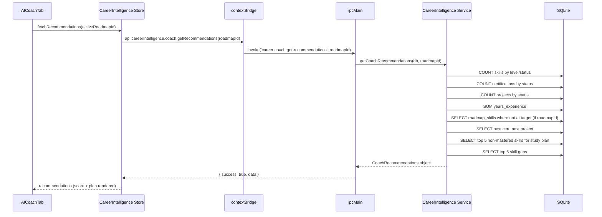

# AI Coach Module

## Purpose

The AI Coach is a cross-cutting intelligence layer rather than a standalone module with its own database tables. Its functionality is distributed across three entry points:

1. **Career Intelligence — AI Coach Tab**: heuristic readiness scoring and study planning derived from Skills, Certifications, and Projects data
2. **Learning Coach — Effectiveness Metrics**: statistical analysis of learning method effectiveness based on retention review history
3. **Challenges — Auto-generation**: context-aware daily and weekly challenge creation driven by live data counts

No external AI/LLM API calls are made anywhere in the current codebase. All "AI" functionality is rule-based computation over local SQLite data.

---

## Career Intelligence Coach (Primary Entry Point)

### Location

- Service: `electron/services/career-intelligence/career-intelligence.service.ts` — `getCoachRecommendations()`
- IPC: `career:coach:get-recommendations`
- UI: `src/features/career-intelligence/components/AICoachTab.tsx`

### What It Computes

**Job Readiness Score (0–100)** — weighted composite:

| Component | Weight | Calculation |
|---|---|---|
| Skills Score | 45% | `(strong × 3 + mid × 1.5) / (total × 3) × 100`; strong = advanced/expert or mastered; mid = intermediate or proficient |
| Certifications Score | 25% | `(earned × 2 + in_progress) / (total × 2) × 100` |
| Projects Score | 20% | `(completed × 2 + active) / (total × 2) × 100` |
| Experience Score | 10% | `MIN(100, total_years_experience / 5 × 100)` — capped at 5 years |

**Missing Skills** — top 10 skills from the active roadmap that are below target level, ordered by importance (critical → important → optional). Falls back to all beginner skills with a non-beginner target if no roadmap is active.

**Next Certification** — first `in-progress` or `planned` certification ordered by status priority then creation date.

**Next Project** — first `active` or `planning` project ordered by status priority then creation date.

**Weekly Study Plan** — top 5 skills that are not mastered and not at expert level, ordered by current proficiency (beginners first), each assigned `COALESCE(sp.weekly_goal_hours, 2)` recommended hours and a reason string.

**Top Skill Gaps** — top 6 skills where target level exceeds current level; ordered by gap size (1–3 levels) then recency.

### Input Parameters

`getCoachRecommendations(db, roadmapId?)` — optionally scoped to a specific roadmap.

### IPC Channel

```
career:coach:get-recommendations   — accepts optional roadmapId
```

Returns `CoachRecommendations`:
```typescript
interface CoachRecommendations {
  job_readiness_score: number
  readiness_breakdown: {
    skills_score: number
    certifications_score: number
    projects_score: number
    experience_score: number
  }
  missing_skills: Array<{ name: string; importance: string; skill_id: string | null }>
  next_certification: string | null
  next_project: string | null
  weekly_study_plan: Array<{ skill_name: string; recommended_hours: number; reason: string }>
  top_skill_gaps: Array<{ skill_name: string; current_level: string; target_level: string; gap: number }>
}
```

---

## Learning Coach Effectiveness Metrics

### Location

- Service: `electron/services/learning-coach/learning-coach.service.ts`
- IPC: `lc:effectiveness:get-metrics`
- UI: `src/features/learning-coach/components/LearningCoachPage.tsx`

### What It Computes

Correlates learning methods (video, lab, reading, etc.) with retention review performance. Identifies which methods produce the best retention outcomes for each skill based on historical review scores and intervals.

---

## Challenges Auto-Generation

### Location

- Service: `electron/services/challenges/challenges.service.ts` — `generateDailyChallenges()` and `generateWeeklyChallenge()`
- IPC: `challenges:generate-daily`, `challenges:generate-weekly`

### Logic

**Daily challenges** (generates up to 3 if fewer than 3 exist for today):

| Condition | Challenge Created |
|---|---|
| interview_questions count > 0 | "Interview Practice Sprint" — review MIN(10, count) questions |
| home_labs with status != 'completed' > 0 | "Lab Progress Push" — complete 1 lab task |
| SRS cards due today > 0 | "Spaced Repetition Review" — review MIN(20, due_count) cards |

**Weekly challenge** (idempotent — one per day, type = `weekly`):
- Requires at least 1 skill in the database
- Creates a cross-module learning challenge: watch video + complete lab + add 5 interview questions + write Feynman explanation (target_count: 4)

---

## AI Coach Tab UI

`src/features/career-intelligence/components/AICoachTab.tsx`

Displays:
- Circular readiness score gauge (large number prominently)
- Breakdown bars for each component score
- Missing skills list with importance badges
- Next certification and next project call-to-action items
- Weekly study plan table: skill name, recommended hours, reason
- Top skill gaps table: skill, current level, target level, gap size

---

## Data Flow



---

## Dependencies

- **Skills** — proficiency levels, status, years_experience
- **Certifications** — status (earned / in-progress / planned)
- **Projects** — status (completed / active / planning)
- **Skill Progress** — target_level, weekly_goal_hours
- **Career Roadmaps** — missing skills computed from roadmap_skills vs actual skill levels
- **Interview Questions** — daily challenge generation
- **Home Labs** — daily challenge generation
- **SRS (Learning System)** — daily challenge generation (due card count)

---

## Known Limitations

- All recommendations are fully deterministic and rule-based — there is no machine learning, natural language generation, or external API involved
- The readiness score is a simplified model; it does not account for skill recency decay, industry-specific weightings, or company-specific requirements
- The "reason" field in weekly study plans is hardcoded to two values: "Foundation building" (beginner) or "Advancing proficiency" (all others)
- No personalization over time — the coach does not learn from which suggestions the user follows
- No integration with job market data or salary benchmarks

---

## Future Roadmap

- Integrate Claude API (Anthropic) for natural language coaching responses and personalized advice
- Skill recency weighting — skills not studied recently should score lower
- Industry-specific readiness models (cloud vs. cybersecurity vs. networking)
- Trend analysis — track readiness score over time
- Push-style recommendations: highlight today's highest-priority action in the dashboard
- AI-generated quiz questions based on skill gaps
