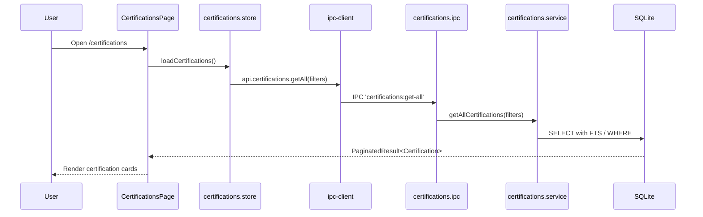

# Module: Certifications

## Purpose

The Certifications module tracks professional certifications throughout their entire lifecycle — from planning and study to earning, renewal, and expiry. Certifications can be linked to skills and are referenced by career roadmaps and skill hub views.

## Features

- Create, edit, and delete certifications
- Lifecycle status: `planned` → `in-progress` → `earned` → `expired` → `revoked`
- Store credential ID and verification URL
- Attach certificate file (local path)
- Track issue date and expiry date
- Record exam score and passing score
- Link certifications to skills (many-to-many)
- Tag certifications with cross-module tags
- Full-text search via FTS5 (name, issuer, description, notes)
- Filter by status and issuer
- Upcoming renewal alerts (surfaced in Learning Dashboard)
- Soft delete
- Pagination

## Database Tables

### `certifications`
| Column | Type | Constraints |
|---|---|---|
| id | TEXT | PRIMARY KEY |
| name | TEXT | NOT NULL |
| issuer | TEXT | NOT NULL |
| description | TEXT | nullable |
| status | TEXT | CHECK: planned/in-progress/earned/expired/revoked |
| credential_id | TEXT | nullable |
| credential_url | TEXT | nullable |
| certificate_path | TEXT | nullable (local file) |
| issue_date | TEXT | nullable ISO8601 date |
| expiry_date | TEXT | nullable ISO8601 date |
| score | REAL | nullable |
| passing_score | REAL | nullable |
| notes | TEXT | nullable |
| created_at | TEXT | ISO8601 |
| updated_at | TEXT | ISO8601 |
| deleted_at | TEXT | nullable |

Indexes: status, expiry_date, issuer (all partial on active records)

### `certification_skills`
| Column | Type | Constraints |
|---|---|---|
| certification_id | TEXT | PK composite, FK → certifications |
| skill_id | TEXT | PK composite, FK → skills |

### `certifications_fts` (virtual)
FTS5 over `certifications(name, issuer, description, notes)`.

## IPC Channels

| Channel | Action |
|---|---|
| `certifications:get-all` | Paginated list with filters |
| `certifications:get-by-id` | Single certification |
| `certifications:create` | Create certification |
| `certifications:update` | Update fields |
| `certifications:delete` | Soft delete |

## Service Functions

**File:** `electron/services/certifications/certifications.service.ts`

- `getAllCertifications(filters)` — paginated with status/issuer filter and FTS
- `getCertificationById(id)` — with skills joined
- `createCertification(data)` — insert with nanoid
- `updateCertification(id, data)` — partial update
- `deleteCertification(id)` — soft delete

## State Management

**File:** `src/features/certifications/store/certifications.store.ts`

```typescript
interface CertificationsState {
  certifications: Certification[]
  total: number
  isLoading: boolean
  filters: CertificationFilters
  loadCertifications: () => Promise<void>
  createCertification: (data: CreateCertificationInput) => Promise<void>
  updateCertification: (id: string, data: UpdateCertificationInput) => Promise<void>
  deleteCertification: (id: string) => Promise<void>
}
```

## Data Flow



## UI Components

| Component | File | Role |
|---|---|---|
| `CertificationsPage` | `components/CertificationsPage.tsx` | Main page: grid of certification cards, filters, create |

## Dependencies

- **Skills** — certification_skills junction table
- **Tags** — entity_tags
- **Skill Hub** — linked certifications tab
- **Career Intelligence** — roadmap_certifications, skill readiness calculation
- **Learning Dashboard** — upcoming_cert_renewals aggregation
- **Home Labs** — home_lab_certifications links labs to certs

## User Workflow

1. Navigate to **Certifications** in the Career OS sidebar
2. See all certs grouped or filtered by status
3. Click **Add Certification** to create a new record
4. Fill in name, issuer, status, dates, credential details
5. Attach the certificate file via the storage importer
6. As you progress, update the status from `planned` → `earned`
7. The Learning Dashboard will alert you when a cert is approaching expiry

## Known Limitations

- No reminder/notification system for expiry (only visible on Dashboard)
- Certificate file is stored by local path — moving the file breaks the link
- No automatic status update to `expired` when expiry_date passes

## Future Roadmap

- Expiry reminder notifications (Electron system notifications)
- Verify credential URL by opening it in the system browser
- Integration with Credly or Acclaim for auto-import
- Export to LinkedIn format
