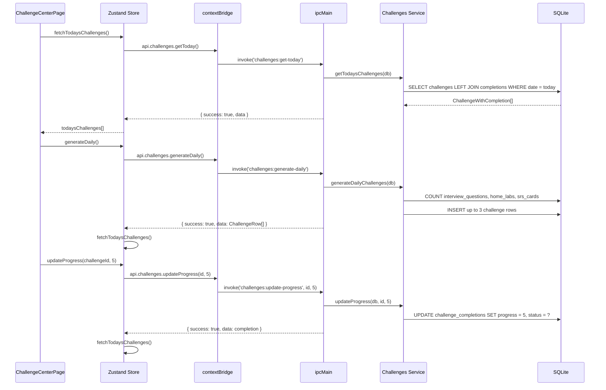

# Challenges Module

## Purpose

The Challenges module gamifies daily and weekly learning activity by generating structured challenges derived from the user's actual data — pending interview questions, active home labs, due SRS cards, and skill breadth. Challenges award XP on completion and track a daily completion streak. The system surfaces context-aware challenges rather than generic tasks.

---

## Features

- **Daily challenges** auto-generated from live data: interview practice sprints, lab progress pushes, SRS review sessions
- **Weekly challenge** auto-generated: deep-dive learning challenge spanning video, lab, interview, and Feynman explanation
- Custom challenges can be created manually with any type, difficulty, and XP reward
- Challenge types: `daily`, `weekly`, `lab`, `project`, `custom`
- Difficulty levels: `easy`, `medium`, `hard`, `expert`
- XP reward per challenge (configurable, defaults: 50–500 XP)
- Target count progress tracking (e.g., "review 10 interview questions")
- Start, update progress, and complete challenges with optional notes
- Stats: total challenges, completed, in-progress, total XP earned, streak days
- Streak calculation: consecutive days with at least one completed challenge

---

## Database Tables

| Table | Key Columns | Notes |
|---|---|---|
| `challenges` | `id` (`chl_` prefix), `title`, `description`, `type`, `difficulty`, `category`, `xp_reward`, `target_count`, `linked_entity_type`, `linked_entity_id`, `challenge_date`, `expires_at` | `linked_entity_type/id` allows linking to a specific skill, lab, or interview question |
| `challenge_completions` | `id` (`cc_` prefix), `challenge_id`, `status` (`in-progress`, `completed`, `failed`), `progress`, `notes`, `completed_at`, `started_at` | One completion record per challenge; `startChallenge` is idempotent |

**Migration:** co-located in the workspace/challenges migration (no dedicated migration identified — tables likely in `008_learning_system` or similar)

---

## IPC Channels

```
CHALLENGES
  challenges:get-today        — today's challenges with completion status
  challenges:get-week         — last 7 days of challenges
  challenges:get-all          — all challenges, optionally filtered by type
  challenges:create           — create a custom challenge
  challenges:start            — create completion record (idempotent)
  challenges:update-progress  — update progress count; auto-completes when target reached
  challenges:complete         — mark complete (sets progress to target_count)
  challenges:generate-daily   — generate up to 3 daily challenges from live data
  challenges:generate-weekly  — generate 1 weekly challenge (idempotent per day)
  challenges:get-stats        — total, completed, in_progress, XP earned, streak days
```

---

## Service Functions

Located at `electron/services/challenges/challenges.service.ts`.

| Function | Purpose |
|---|---|
| `getTodaysChallenges` | SELECT challenges for today's date OR weekly/custom types, LEFT JOIN completions |
| `getWeekChallenges` | SELECT challenges from last 6 days |
| `getAllChallenges` | Optional type filter; LEFT JOIN completions |
| `createChallenge` | INSERT with `chl_` prefixed nanoid |
| `startChallenge` | Idempotent — returns existing completion if present; else INSERT |
| `updateProgress` | UPDATE completion progress; auto-sets status to `completed` when `progress >= target_count` |
| `markChallengeComplete` | Calls `updateProgress(db, id, target_count)` |
| `generateDailyChallenges` | Checks live counts of interview questions, active labs, due SRS cards; creates up to 3 targeted challenges if < 3 daily challenges exist today |
| `generateWeeklyChallenge` | Creates a multi-step deep-dive challenge if none exists for today with type `weekly` |
| `getChallengeStats` | Aggregates completion counts, total XP, calculates streak from `completed_at` dates |

**Streak algorithm:** iterates `completed_at` dates in DESC order; counts consecutive days starting from today. Breaks on first gap.

---

## State Management

Store location: `src/features/challenges/store/`

State shape (inferred from component usage):

```typescript
interface ChallengesState {
  todaysChallenges: ChallengeWithCompletion[]
  weekChallenges: ChallengeWithCompletion[]
  stats: ChallengeStats | null
  isLoading: boolean
  isGenerating: boolean

  // Actions
  fetchTodaysChallenges: () => Promise<void>
  fetchWeekChallenges: () => Promise<void>
  fetchStats: () => Promise<void>
  generateDaily: () => Promise<void>
  generateWeekly: () => Promise<void>
  startChallenge: (id: string) => Promise<void>
  updateProgress: (id: string, progress: number, notes?: string) => Promise<void>
  completeChallenge: (id: string, notes?: string) => Promise<void>
  createChallenge: (params: CreateChallengeParams) => Promise<void>
}
```

---

## Data Flow



---

## UI Components

Located at `src/features/challenges/components/`:

| Component | Role |
|---|---|
| `ChallengeCenterPage.tsx` | Root page; displays today's challenges, week view, stats, and generate buttons |

---

## Dependencies

- **Interview Questions** — `generateDailyChallenges` counts interview questions for practice sprint challenge
- **Home Labs** — counts active (non-completed) labs for lab progress challenge
- **SRS (Learning System)** — counts due SRS cards for spaced repetition challenge

---

## User Workflow

1. Navigate to **Challenge Center** (`/challenge-center`)
2. Click **Generate Daily Challenges** to have the system create context-aware challenges from your data
3. Click **Generate Weekly Challenge** to create a deeper cross-module learning challenge
4. Click **Start** on a challenge to begin tracking it
5. As you complete activities (reviewing interview questions, working on labs), click **Update Progress** and enter how many units you completed
6. When progress reaches the target count, the challenge automatically marks as completed and awards XP
7. Check the stats panel to see your XP total and current completion streak
8. Create a **Custom Challenge** for any activity not covered by auto-generation

---

## Known Limitations

- `generateDailyChallenges` does not check if a challenge for a specific category already exists beyond the count threshold — calling it multiple times in a day may skip generation
- XP rewards are stored in the database but there is no XP leaderboard, level progression, or persistent player profile
- The `failed` status exists in the schema but there is no UI path to mark a challenge as failed
- Challenges with `expires_at` set do not auto-expire — expiry is not enforced in queries
- No push notifications to remind users of pending daily challenges

---

## Future Roadmap

- XP progression system with levels and badges
- Auto-expire overdue daily challenges
- Reminder notifications (OS-level via Electron)
- Difficulty adaptive scaling based on historical completion rates
- Challenge categories aligned to career roadmap gaps
