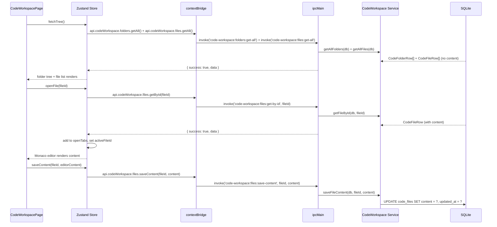

# Code Workspace Module

## Purpose

The Code Workspace module provides an in-app code editor powered by Monaco Editor (the same engine as VS Code) with a hierarchical folder/file tree. Users can write, organize, and store code snippets, scripts, configuration files, and study examples directly in CareerOS without leaving the application. Content is persisted in SQLite for offline access.

---

## Features

- Hierarchical folder tree with parent/child nesting
- Files within folders or at the root level
- Multi-language support: TypeScript (default), JavaScript, Python, Bash, PowerShell, SQL, YAML, JSON, and any other Monaco-supported language
- Monaco Editor for editing with syntax highlighting, autocomplete, bracket matching, and line numbering
- Tabbed interface for editing multiple files simultaneously
- File content stored separately from metadata (two distinct update paths: `updateFile` for metadata, `saveFileContent` for content)
- `getAllFiles` returns metadata without content (empty string) for efficient list rendering
- Status bar showing language mode and cursor position
- New file/folder creation dialog
- Sort order field on both folders and files for custom arrangement

---

## Database Tables

| Table | Key Columns | Notes |
|---|---|---|
| `code_folders` | `id`, `parent_id` (nullable, self-referential), `name`, `sort_order`, `created_at` | No soft-delete; hard DELETE cascades files |
| `code_files` | `id`, `folder_id` → `code_folders` ON DELETE CASCADE (implied), `title`, `language`, `content`, `sort_order`, `created_at`, `updated_at` | Content stored as TEXT |

**Migration:** `015_code_workspace`

---

## IPC Channels

```
CODE_WORKSPACE.FOLDERS
  code-workspace:folders:get-all    — all folders ordered by sort_order then name
  code-workspace:folders:create     — create folder with optional parent_id
  code-workspace:folders:update     — rename or reparent folder
  code-workspace:folders:delete     — hard-delete (cascades files)

CODE_WORKSPACE.FILES
  code-workspace:files:get-all      — all files (content excluded)
  code-workspace:files:get-by-id    — single file with full content
  code-workspace:files:create       — create file with optional content
  code-workspace:files:update       — update title / language / folder_id
  code-workspace:files:save-content — save content string only (no metadata change)
  code-workspace:files:delete       — hard-delete file
```

---

## Service Functions

Located at `electron/services/code-workspace/code-workspace.service.ts`.

| Function | Purpose |
|---|---|
| `getAllFolders` | SELECT all code_folders ORDER BY sort_order, name |
| `createFolder` | INSERT folder with optional `parent_id` |
| `updateFolder` | Dynamic SET for `name` and/or `parent_id` |
| `deleteFolder` | Hard DELETE |
| `getAllFiles` | SELECT with `"" AS content` — excludes actual content for performance |
| `getFileById` | SELECT * including full content |
| `createFile` | INSERT file; default language `'typescript'`; default content empty string |
| `updateFile` | Dynamic SET for `title`, `language`, `folder_id`; always sets `updated_at` |
| `saveFileContent` | UPDATE `content` and `updated_at` only |
| `deleteFile` | Hard DELETE |

---

## State Management

Store location: `src/features/code-workspace/store/`

State shape (inferred from component list):

```typescript
interface CodeWorkspaceState {
  folders: CodeFolderRow[]
  files: CodeFileRow[]  // metadata only
  openTabs: CodeFileRow[]  // with content loaded
  activeFileId: string | null
  isLoading: boolean

  // Actions
  fetchTree: () => Promise<void>  // fetches folders + files metadata
  openFile: (id: string) => Promise<void>  // loads content and adds to tabs
  closeTab: (id: string) => void
  saveContent: (id: string, content: string) => Promise<void>
  createFolder: (params: { name: string; parent_id?: string | null }) => Promise<void>
  updateFolder: (id: string, params: { name?: string; parent_id?: string | null }) => Promise<void>
  deleteFolder: (id: string) => Promise<void>
  createFile: (params: { title: string; language?: string; folder_id?: string | null }) => Promise<void>
  updateFile: (id: string, params: { title?: string; language?: string; folder_id?: string | null }) => Promise<void>
  deleteFile: (id: string) => Promise<void>
}
```

---

## Data Flow



---

## UI Components

Located at `src/features/code-workspace/components/`:

| Component | Role |
|---|---|
| `CodeWorkspacePage.tsx` | Root page; integrates file tree, tab bar, and editor |
| `FileTree.tsx` | Hierarchical folder/file tree with create, rename, delete actions |
| `EditorTabs.tsx` | Tab bar for open files; supports tab switching and close |
| `MonacoEditor.tsx` | Monaco Editor wrapper; handles language detection, content binding, and save events |
| `NewItemDialog.tsx` | Modal for creating a new folder or file |
| `StatusBar.tsx` | Bottom bar showing active file language and editor cursor position |
| `monacoSetup.ts` | Monaco initialization/configuration (language registration, themes) |

---

## Dependencies

- **@monaco-editor/react** and **monaco-editor** npm packages
- No cross-module database dependencies (standalone code store)

---

## User Workflow

1. Navigate to **Code Workspace** (`/code-workspace`)
2. The file tree shows all folders and files
3. Click **New Folder** to create an organizational folder
4. Click **New File** inside a folder, enter a name, and select the programming language
5. The file opens as a tab in the Monaco editor
6. Write or paste code; the editor provides syntax highlighting and IntelliSense
7. Press Save (Ctrl+S or the Save button) to persist the content to SQLite
8. Open multiple files as tabs; switch between them
9. Rename or move files by editing in the file tree
10. Delete files or folders (folders delete all contained files)

---

## Known Limitations

- No terminal integration — code cannot be executed within the app
- No Git integration — no commit, diff, or branch management
- Code is stored in SQLite TEXT columns with no size limit enforced; very large files may impact performance
- No syntax-aware formatting (Prettier/gofmt) or linting
- Folder nesting depth is not limited in the schema; deep trees may be unwieldy in the UI
- The `sort_order` field exists but there is no drag-to-reorder UI described

---

## Future Roadmap

- Integrated terminal (via Electron's `child_process`)
- Git repository management for stored code
- Code formatting with Prettier
- Lint markers via language server protocol
- Export a file to the filesystem
- Import files from the filesystem into the workspace
