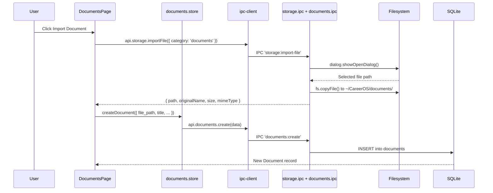

# Module: Documents

## Purpose

The Documents module is a file management system for career-related documents (resumes, certificates, reports, templates, references). Files are imported into the CareerOS data directory and can be opened, viewed in-app (PDF via pdfjs-dist, DOCX via mammoth), renamed, and organised with tags.

## Features

- Import files from the filesystem into the CareerOS storage directory
- Track document metadata: type, version, description, notes
- Document types: `resume`, `cover-letter`, `certificate`, `report`, `template`, `reference`, `other`
- Open documents in the system's default application
- Rename documents (updates DB record and optionally renames the file)
- View PDFs inline using the PDF Reader component (pdfjs-dist)
- View DOCX files inline using the DOCX Viewer (mammoth conversion)
- Add annotations (highlights, notes, bookmarks) to documents
- Track reading progress per document
- Organise documents into collections (Knowledge Vault)
- Mark documents as favourites
- Track recently opened documents
- Tag documents with cross-module tags
- Full-text search via FTS5 (title, description, notes)
- Soft delete

## Database Tables

### `documents`
| Column | Type | Constraints |
|---|---|---|
| id | TEXT | PRIMARY KEY |
| title | TEXT | NOT NULL |
| description | TEXT | nullable |
| file_path | TEXT | NOT NULL (absolute path in CareerOS dir) |
| original_filename | TEXT | NOT NULL |
| mime_type | TEXT | nullable |
| file_size_bytes | INTEGER | nullable |
| type | TEXT | CHECK: resume/cover-letter/certificate/report/template/reference/other |
| version | TEXT | DEFAULT '1.0' |
| notes | TEXT | nullable |
| created_at | TEXT | ISO8601 |
| updated_at | TEXT | ISO8601 |
| deleted_at | TEXT | nullable |

### `vault_metadata` (extended metadata for Knowledge Vault)
| Column | Type | Notes |
|---|---|---|
| document_id | TEXT | PK, FK → documents |
| source_url | TEXT | Origin URL |
| source_type | TEXT | local/youtube/website/ms-learn/github/custom |
| thumbnail_path | TEXT | Cover image |
| language | TEXT | DEFAULT 'en' |
| author | TEXT | nullable |
| publisher | TEXT | nullable |
| published_date | TEXT | nullable |
| topic_category | TEXT | nullable |
| difficulty | TEXT | beginner/intermediate/advanced/expert |
| reading_time_est | INTEGER | minutes |
| key_takeaways | TEXT | JSON array |
| related_skills | TEXT | JSON array of skill IDs |

### `document_annotations`
See [Knowledge Vault](./knowledge-vault.md) module.

### `document_reading_progress`
| Column | Type | Notes |
|---|---|---|
| document_id | TEXT | PK, FK → documents |
| current_page | INTEGER | DEFAULT 1 |
| total_pages | INTEGER | nullable |
| scroll_position | REAL | DEFAULT 0.0 |
| reading_time_min | INTEGER | DEFAULT 0 |
| completed | INTEGER | CHECK: 0/1 |
| last_read_at | TEXT | ISO8601 |

### `documents_fts` (virtual)
FTS5 over `documents(title, description, notes)`.

## IPC Channels

| Channel | Action |
|---|---|
| `documents:get-all` | Paginated list with filters |
| `documents:get-by-id` | Single document |
| `documents:create` | Register an imported document |
| `documents:update` | Update metadata |
| `documents:delete` | Soft delete |
| `documents:open` | Open in system default application |
| `documents:rename` | Rename title and optionally the file |
| `storage:import-file` | File picker dialog + copy to CareerOS dir |

## Service Functions

**File:** `electron/services/documents/documents.service.ts`

- `getAllDocuments(filters)` — paginated with type filter and FTS
- `getDocumentById(id)` — single document
- `createDocument(data)` — insert record (after file has been imported)
- `updateDocument(id, data)` — update metadata
- `deleteDocument(id)` — soft delete
- `openDocument(id)` — `shell.openPath()` to system default app
- `renameDocument(id, newTitle, newFilename?)` — update DB and optionally `fs.rename()`

## State Management

**File:** `src/features/documents/store/documents.store.ts`

```typescript
interface DocumentsState {
  documents: Document[]
  total: number
  isLoading: boolean
  filters: DocumentFilters
  loadDocuments: () => Promise<void>
  createDocument: (data: CreateDocumentInput) => Promise<void>
  updateDocument: (id: string, data: UpdateDocumentInput) => Promise<void>
  deleteDocument: (id: string) => Promise<void>
  openDocument: (id: string) => Promise<void>
  renameDocument: (id: string, newTitle: string, newFilename?: string) => Promise<void>
}
```

## Data Flow



## UI Components

| Component | File | Role |
|---|---|---|
| `DocumentsPage` | `components/DocumentsPage.tsx` | Main page: document grid, import, view panel |

## Dependencies

- **Storage** — storage:import-file handles file copying
- **Knowledge Vault** — vault_metadata, vault_collections, annotations extend documents
- **Tags** — entity_tags
- **SRS System** — documents can be referenced as SRS card entities
- **Knowledge Graph** — document nodes
- **Skill Hub** — skill_documents links docs to skills

## User Workflow

1. Navigate to **Documents** in the Knowledge sidebar
2. Click **Import Document** — file picker opens
3. Select a PDF, DOCX, or any file
4. File is copied to `~/CareerOS/documents/`
5. Add title, type, description, version, notes
6. Click the document to open the viewer:
   - PDF → opens the PDF Reader with annotations
   - DOCX → opens the DOCX Viewer with comments
   - Other → opens in system default app
7. Use tags and collections to organise

## Known Limitations

- `file_path` is an absolute path — moving the CareerOS folder breaks all document links
- No preview for file types other than PDF and DOCX
- Rename file does not handle conflicts if the new filename already exists
- No file versioning (the `version` field is a manual text field only)

## Future Roadmap

- File integrity check (hash verification that file still exists)
- Automatic file path repair after folder move
- Office/Google Docs direct import
- Full-text content indexing for PDF/DOCX in FTS
