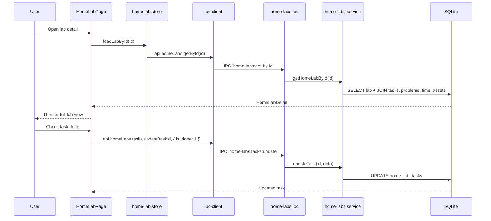

# Module: Home Labs

## Purpose

The Home Labs module tracks hands-on technical experiments and lab environments. Each lab has a task checklist, problem/solution log, time tracking, asset attachments, and links to skills and certifications. It is designed to document learning through practice — MSP home labs, cloud environment experiments, networking builds, etc.

## Features

- Create, edit, and delete home labs with full metadata
- Status lifecycle: `planned` → `in-progress` → `completed` → `paused` → `abandoned`
- Completion percentage tracking (0-100)
- Task checklist with completion state and ordering
- Problem/solution log (document issues encountered and how they were resolved)
- Time entry logging with date and optional note
- Asset attachments (screenshots, documents, links)
- Link labs to skills and certifications
- Lessons learned field
- Full-text search via FTS5 (title, description, notes, lessons_learned)
- Filter by status
- Soft delete with cascade to all child records
- Pagination

## Database Tables

### `home_labs`
| Column | Type | Constraints |
|---|---|---|
| id | TEXT | PRIMARY KEY |
| title | TEXT | NOT NULL |
| slug | TEXT | NOT NULL UNIQUE |
| description | TEXT | nullable |
| status | TEXT | CHECK: planned/in-progress/completed/paused/abandoned |
| notes | TEXT | nullable |
| lessons_learned | TEXT | nullable |
| completion_pct | INTEGER | CHECK: 0-100, DEFAULT 0 |
| started_at | TEXT | nullable ISO8601 |
| completed_at | TEXT | nullable ISO8601 |
| created_at | TEXT | ISO8601 |
| updated_at | TEXT | ISO8601 |
| deleted_at | TEXT | nullable |

### `home_lab_tasks`
| Column | Type | Constraints |
|---|---|---|
| id | TEXT | PRIMARY KEY |
| lab_id | TEXT | NOT NULL FK → home_labs CASCADE |
| title | TEXT | NOT NULL |
| is_done | INTEGER | CHECK: 0/1 |
| order_index | INTEGER | DEFAULT 0 |

### `home_lab_problems`
| Column | Type | Constraints |
|---|---|---|
| id | TEXT | PRIMARY KEY |
| lab_id | TEXT | NOT NULL FK → home_labs CASCADE |
| problem | TEXT | NOT NULL |
| solution | TEXT | nullable |
| order_index | INTEGER | DEFAULT 0 |

### `home_lab_time_entries`
| Column | Type | Constraints |
|---|---|---|
| id | TEXT | PRIMARY KEY |
| lab_id | TEXT | NOT NULL FK → home_labs CASCADE |
| duration_min | INTEGER | NOT NULL DEFAULT 0 |
| note | TEXT | nullable |
| logged_date | TEXT | DEFAULT date('now') |

### `home_lab_assets`
| Column | Type | Constraints |
|---|---|---|
| id | TEXT | PRIMARY KEY |
| lab_id | TEXT | NOT NULL FK → home_labs CASCADE |
| title | TEXT | NOT NULL |
| type | TEXT | CHECK: screenshot/document/link/other |
| file_path | TEXT | nullable |
| url | TEXT | nullable |
| notes | TEXT | nullable |
| order_index | INTEGER | DEFAULT 0 |

### `home_lab_skills`
| Column | Type | Constraints |
|---|---|---|
| lab_id | TEXT | PK composite, FK → home_labs |
| skill_id | TEXT | PK composite, FK → skills |

### `home_lab_certifications`
| Column | Type | Constraints |
|---|---|---|
| lab_id | TEXT | PK composite, FK → home_labs |
| certification_id | TEXT | PK composite, FK → certifications |

### `home_labs_fts` (virtual)
FTS5 over `home_labs(title, description, notes, lessons_learned)` — added in migration 016.

## IPC Channels

| Channel | Action |
|---|---|
| `home-labs:get-all` | Paginated list |
| `home-labs:get-by-id` | Full lab detail with tasks, problems, time, assets |
| `home-labs:create` | Create lab |
| `home-labs:update` | Update lab metadata |
| `home-labs:delete` | Soft delete lab |
| `home-labs:tasks:create` | Add task to lab |
| `home-labs:tasks:update` | Update task (title, is_done, order) |
| `home-labs:tasks:delete` | Remove task |
| `home-labs:problems:create` | Add problem/solution record |
| `home-labs:problems:update` | Update problem/solution |
| `home-labs:problems:delete` | Remove problem |
| `home-labs:time:log` | Log time entry |
| `home-labs:time:delete` | Remove time entry |
| `home-labs:time:get-all` | Get all time entries for lab |
| `home-labs:assets:create` | Add asset |
| `home-labs:assets:update` | Update asset |
| `home-labs:assets:delete` | Remove asset |

## Service Functions

**File:** `electron/services/home-labs/home-labs.service.ts`

- `getAllHomeLabs(filters)` — paginated with status filter and FTS, includes total_minutes aggregation
- `getHomeLabById(id)` — full detail: lab + tasks + problems + time entries + assets
- `createHomeLab(data)` — insert with nanoid, generate slug
- `updateHomeLab(id, data)` — partial update
- `deleteHomeLab(id)` — soft delete (CASCADE deletes all child records)
- `createTask / updateTask / deleteTask` — task CRUD
- `createProblem / updateProblem / deleteProblem` — problem/solution CRUD
- `logTime / deleteTime / getAllTime` — time tracking CRUD
- `createAsset / updateAsset / deleteAsset` — asset CRUD

## State Management

**Files:**
- `src/features/home-lab/store/home-lab.store.ts`

```typescript
interface HomeLabState {
  labs: HomeLabWithMeta[]
  total: number
  selectedLab: HomeLabDetail | null
  isLoading: boolean
  filters: HomeLabFilters
  loadLabs: () => Promise<void>
  loadLabById: (id: string) => Promise<void>
  createLab: (data: CreateHomeLabInput) => Promise<void>
  updateLab: (id: string, data: UpdateHomeLabInput) => Promise<void>
  deleteLab: (id: string) => Promise<void>
  // task, problem, time, asset mutations inline
}
```

## Data Flow



## UI Components

| Component | File | Role |
|---|---|---|
| `HomeLabPage` | `components/HomeLabPage.tsx` | Main page: lab list + detail panel with all sub-sections |

## Dependencies

- **Skills** — home_lab_skills links labs to skills
- **Certifications** — home_lab_certifications links labs to certs
- **Skill Hub** — linked labs tab queries home_lab_skills
- **Learning Dashboard** — labs_total, labs_completed, total_lab_minutes
- **Career Intelligence** — labs_score in readiness calculation

## User Workflow

1. Navigate to **Home Labs** in the Career OS sidebar
2. Click **New Lab** — set title, description, status, start date
3. Open the lab detail — add tasks (step-by-step checklist)
4. As you work, check off tasks; update completion_pct
5. Log time entries: "Spent 45 minutes on DNS configuration"
6. When you hit issues, log them in Problems with their solutions
7. Attach screenshots as assets
8. Write lessons_learned when done
9. Set status to `completed`

## Known Limitations

- No Kanban or visual task board — tasks are a flat ordered list
- completion_pct must be updated manually (not auto-calculated from tasks)
- Time logging is manual (no running timer/stopwatch)
- Assets stored by file_path — same fragility as documents

## Future Roadmap

- Auto-calculate completion_pct from task completion ratio
- Built-in stopwatch for time tracking
- Lab templates (pre-populate tasks for common lab types: Active Directory, Azure, Kubernetes, etc.)
- Lab sharing or export as step-by-step guide
- Network topology diagram integration (link to whiteboard)
