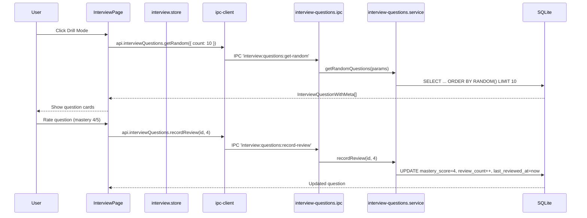

# Module: Interview Bank

## Purpose

The Interview Bank is a structured question-and-answer library for systematic interview preparation. Questions are organised into categories (Behavioral, Technical, System Design, etc.), rated by difficulty, tracked for mastery, and can be reviewed in random drill mode. Questions can be bulk-converted to SRS flashcards.

## Features

- Create, edit, and delete interview questions
- 8 seeded categories with colour coding: Behavioral, Technical, System Design, Problem Solving, Culture Fit, Situational, Leadership, Career Goals
- Custom categories supported
- Difficulty levels: `easy`, `medium`, `hard`
- Store personal answer and ideal answer per question
- Mastery score: 0-5 rating updated on each review
- Last reviewed timestamp and review count tracking
- Random question mode (filter by category and difficulty)
- Progress statistics: by mastery level, by category, by difficulty
- Link questions to skills (many-to-many via interview_question_skills)
- Full-text search via FTS5 (question, personal_answer, ideal_answer, notes) — added in migration 016
- Record review (increment count, update mastery, update timestamp)
- Bulk convert questions to SRS flashcards
- Soft delete

## Database Tables

### `interview_categories`
| Column | Type | Constraints |
|---|---|---|
| id | TEXT | PRIMARY KEY |
| name | TEXT | NOT NULL UNIQUE |
| description | TEXT | nullable |
| color_hex | TEXT | NOT NULL DEFAULT '#6B7280' |
| order_index | INTEGER | DEFAULT 0 |

8 categories seeded in migration 006.

### `interview_questions`
| Column | Type | Constraints |
|---|---|---|
| id | TEXT | PRIMARY KEY |
| category_id | TEXT | NOT NULL FK → interview_categories RESTRICT |
| question | TEXT | NOT NULL |
| difficulty | TEXT | CHECK: easy/medium/hard |
| personal_answer | TEXT | nullable |
| ideal_answer | TEXT | nullable |
| notes | TEXT | nullable |
| mastery_score | INTEGER | CHECK: 0-5, DEFAULT 0 |
| last_reviewed_at | TEXT | nullable ISO8601 |
| review_count | INTEGER | DEFAULT 0 |
| created_at | TEXT | ISO8601 |
| updated_at | TEXT | ISO8601 |
| deleted_at | TEXT | nullable |

Indexes: category_id, difficulty, mastery_score, created_at (all partial on active)

### `interview_question_skills`
| Column | Type | Constraints |
|---|---|---|
| question_id | TEXT | PK composite, FK → interview_questions |
| skill_id | TEXT | PK composite, FK → skills |

### `interview_questions_fts` (virtual)
FTS5 over `interview_questions(question, personal_answer, ideal_answer, notes)` — migration 016.

## IPC Channels

| Channel | Action |
|---|---|
| `interview:questions:get-all` | Paginated list with filters |
| `interview:questions:get-by-id` | Single question |
| `interview:questions:create` | Create question |
| `interview:questions:update` | Update fields |
| `interview:questions:delete` | Soft delete |
| `interview:questions:get-random` | Random questions (by category/difficulty) |
| `interview:questions:record-review` | Update mastery score and review stats |
| `interview:questions:get-progress` | Progress stats by mastery/difficulty/category |
| `interview:categories:get-all` | All categories |
| `interview:categories:create` | Create category |
| `interview:categories:update` | Update category |
| `interview:categories:delete` | Delete category |
| `srs:bulk-from-interview` | Generate SRS cards from all interview questions |

## Service Functions

**File:** `electron/services/interview-questions/interview-questions.service.ts`

- `getAllQuestions(filters)` — paginated with category/difficulty/mastery filter and FTS
- `getQuestionById(id)` — with category joined
- `createQuestion(data)` — insert
- `updateQuestion(id, data)` — partial update
- `deleteQuestion(id)` — soft delete
- `getRandomQuestions(params)` — SELECT with RANDOM() ORDER BY, filtered
- `recordReview(id, mastery_score)` — UPDATE mastery_score, last_reviewed_at, increment review_count
- `getProgress()` — aggregate stats (counts by mastery, difficulty, category)
- Category CRUD functions

## State Management

**Files:**
- `src/features/interview-questions/store/interview.store.ts`

```typescript
interface InterviewState {
  questions: InterviewQuestionWithMeta[]
  total: number
  categories: InterviewCategory[]
  progress: QuestionProgressStats | null
  isLoading: boolean
  filters: InterviewQuestionFilters
  loadQuestions: () => Promise<void>
  loadCategories: () => Promise<void>
  loadProgress: () => Promise<void>
  createQuestion: (data: CreateInterviewQuestionInput) => Promise<void>
  updateQuestion: (id: string, data: UpdateInterviewQuestionInput) => Promise<void>
  deleteQuestion: (id: string) => Promise<void>
  recordReview: (id: string, mastery_score: number) => Promise<void>
  getRandomQuestions: (params: RandomParams) => Promise<InterviewQuestionWithMeta[]>
}
```

## Data Flow



## UI Components

| Component | File | Role |
|---|---|---|
| `InterviewPage` | `components/InterviewPage.tsx` | Full interview bank: question list, drill mode, progress stats, category management |

## Dependencies

- **Skills** — interview_question_skills junction
- **Skill Hub** — linked interview questions tab
- **SRS System** — bulk-from-interview converts questions to flashcards
- **Learning Dashboard** — interview_questions_total, interview_questions_mastered

## User Workflow

1. Navigate to **Interview Bank** in the Career OS sidebar
2. Browse questions by category or difficulty
3. Click **Add Question** — write the question, set category and difficulty
4. Write your personal_answer (how you would answer it)
5. Write or paste an ideal_answer (model answer for comparison)
6. Use **Drill Mode** (getRandom) to practice: questions appear one at a time
7. After reviewing your answer, rate mastery 0-5
8. Mastery score is saved; low-mastery questions surface more in drill mode
9. Check Progress view for aggregate stats

## Known Limitations

- Drill mode doesn't implement spaced repetition (just random selection — use SRS module for that)
- No built-in flashcard flip animation
- No audio recording for practice answering out loud
- interview_question_skills management is not exposed in the UI directly

## Future Roadmap

- AI-powered ideal answer generation
- STAR method answer template
- Mock interview timer
- Export questions as PDF study sheet
- Community question pack import
