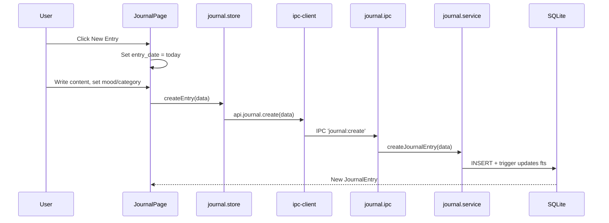

# Module: Journal

## Purpose

The Journal module provides daily career journaling with mood tracking, energy level, category classification, and privacy controls. It is designed for reflective career practice — capturing achievements, challenges, feedback, and goals in a structured, private log.

## Features

- Create, edit, and delete journal entries
- Date-stamped entries (entry_date, not just created_at)
- Mood tracking: `great`, `good`, `neutral`, `bad`, `terrible`
- Energy level: 1-5 scale
- Category: `achievement`, `challenge`, `reflection`, `learning`, `goal`, `feedback`, `general`
- Private flag (entries marked private are not shown in shared/export views)
- Full-text search via FTS5 (title, content)
- Filter by date range, mood, category
- Soft delete
- Pagination

## Database Tables

### `journal_entries`
| Column | Type | Constraints |
|---|---|---|
| id | TEXT | PRIMARY KEY |
| title | TEXT | NOT NULL |
| content | TEXT | NOT NULL DEFAULT '' |
| entry_date | TEXT | NOT NULL ISO8601 date |
| mood | TEXT | CHECK: great/good/neutral/bad/terrible (nullable) |
| energy_level | INTEGER | CHECK: 1-5 (nullable) |
| category | TEXT | CHECK: achievement/challenge/reflection/learning/goal/feedback/general |
| is_private | INTEGER | CHECK: 0/1, DEFAULT 0 |
| created_at | TEXT | ISO8601 |
| updated_at | TEXT | ISO8601 |
| deleted_at | TEXT | nullable |

Indexes: entry_date, category, mood (all partial on active records)

### `journal_entries_fts` (virtual)
FTS5 over `journal_entries(title, content)`.

## IPC Channels

| Channel | Action |
|---|---|
| `journal:get-all` | Paginated list with filters |
| `journal:get-by-id` | Single entry |
| `journal:create` | Create entry |
| `journal:update` | Update entry |
| `journal:delete` | Soft delete |

## Service Functions

**File:** `electron/services/journal/journal.service.ts`

- `getAllJournalEntries(filters)` — paginated with date/mood/category filter and FTS
- `getJournalEntryById(id)` — single entry
- `createJournalEntry(data)` — insert with nanoid
- `updateJournalEntry(id, data)` — partial update
- `deleteJournalEntry(id)` — soft delete

## State Management

**File:** `src/features/journal/store/journal.store.ts`

```typescript
interface JournalState {
  entries: JournalEntry[]
  total: number
  selectedEntry: JournalEntry | null
  isLoading: boolean
  filters: JournalFilters
  loadEntries: () => Promise<void>
  selectEntry: (id: string) => Promise<void>
  createEntry: (data: CreateJournalEntryInput) => Promise<void>
  updateEntry: (id: string, data: UpdateJournalEntryInput) => Promise<void>
  deleteEntry: (id: string) => Promise<void>
}
```

## Data Flow



## UI Components

| Component | File | Role |
|---|---|---|
| `JournalPage` | `components/JournalPage.tsx` | Timeline view of entries with create/edit panel |

## Dependencies

- **Tags** — entity_tags for journal entries (entity_type = 'journal_entry')
- **Search** — journal_entries_fts virtual table included in global search

## User Workflow

1. Navigate to **Journal** in the Knowledge sidebar
2. Click **New Entry** — today's date is pre-filled
3. Write a title and the content of the entry
4. Set mood, energy level, and category
5. Save — entry appears in the timeline
6. Scroll back through previous entries
7. Use search to find entries by keyword
8. Use filters to see entries by mood or category

## Known Limitations

- Journal content is plain text — no Markdown editor
- No calendar view (only chronological list)
- `is_private` flag is stored but no UI distinction between private and public entries
- No export to PDF or Markdown

## Future Roadmap

- Calendar grid view of entries
- Mood and energy trend charts
- Markdown editor with live preview
- Export journal as PDF book
- Annual review report auto-generation
