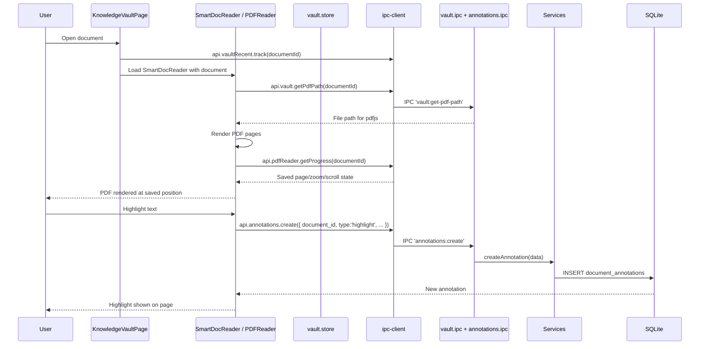

# Module: Knowledge Vault

## Purpose

The Knowledge Vault is an enhanced document reader and organiser. It builds on the Documents module to provide PDF reading with annotations, DOCX viewing with comments, collection organisation, favourites, and recent file tracking. It implements a colour-coded annotation system for active reading.

## Features

- PDF reading with pdfjs-dist: page navigation, zoom, dark mode
- PDF progress tracking (current page, zoom, reading time, completion)
- Annotations on documents: highlights, notes, bookmarks, comments
- Colour-coded annotations using the Knowledge Colors system (Red=Critical, Green=Mastered, etc.)
- DOCX viewing via mammoth HTML conversion with inline commenting
- Document collections (folders) with hierarchy support
- Favourite documents (starred for quick access)
- Recently opened documents (auto-tracked on open)
- Document reading statistics (total PDFs, completed, reading time)
- Smart document router (PDFReader for .pdf, DocxViewer for .docx, fallback for others)
- Annotation reading progress tracking separate from reading progress

## Database Tables

### `document_annotations`
| Column | Type | Constraints |
|---|---|---|
| id | TEXT | PRIMARY KEY |
| document_id | TEXT | NOT NULL FK → documents CASCADE |
| type | TEXT | CHECK: highlight/note/bookmark/comment |
| color_hex | TEXT | NOT NULL DEFAULT '#FBBF24' |
| color_meaning | TEXT | nullable (from knowledge_colors) |
| page_number | INTEGER | nullable |
| position_json | TEXT | NOT NULL DEFAULT '{}' |
| selected_text | TEXT | nullable |
| content | TEXT | nullable |
| order_index | INTEGER | DEFAULT 0 |

Indexes: document_id, type, (document_id, page_number)

### `document_reading_progress`
| Column | Type | Notes |
|---|---|---|
| document_id | TEXT | PK, FK → documents |
| current_page | INTEGER | DEFAULT 1 |
| total_pages | INTEGER | nullable |
| scroll_position | REAL | DEFAULT 0.0 |
| reading_time_min | INTEGER | accumulated minutes |
| completed | INTEGER | 0/1 |
| last_read_at | TEXT | ISO8601 |

### `pdf_reading_progress` (dedicated PDF state — migration 012)
| Column | Type | Notes |
|---|---|---|
| document_id | TEXT | PK, FK → documents |
| current_page | INTEGER | DEFAULT 1 |
| total_pages | INTEGER | nullable |
| zoom_level | REAL | DEFAULT 1.25 |
| is_dark_mode | INTEGER | 0/1 |
| scroll_percent | REAL | DEFAULT 0 |
| reading_time_sec | INTEGER | accumulated seconds |
| completed | INTEGER | 0/1 |
| last_read_at | TEXT | ISO8601 |
| created_at | TEXT | ISO8601 |
| updated_at | TEXT | ISO8601 |

### `knowledge_colors`
| Column | Type | Constraints |
|---|---|---|
| id | TEXT | PRIMARY KEY |
| color_hex | TEXT | NOT NULL UNIQUE |
| name | TEXT | NOT NULL |
| meaning | TEXT | NOT NULL |
| description | TEXT | nullable |
| order_index | INTEGER | DEFAULT 0 |
| is_system | INTEGER | CHECK: 0/1 |

6 system colors seeded in migration 008: Red (Critical), Orange (Need Revision), Yellow (Important), Blue (Useful), Green (Mastered), Purple (Interview Question).

### `document_comments` (DOCX-specific — migration 014)
| Column | Type | Notes |
|---|---|---|
| id | TEXT | PRIMARY KEY |
| document_id | TEXT | FK → documents CASCADE |
| paragraph_index | INTEGER | Paragraph position in converted HTML |
| char_offset_start | INTEGER | Character range within paragraph |
| char_offset_end | INTEGER | Character range within paragraph |
| selected_text | TEXT | nullable |
| content | TEXT | NOT NULL |
| color_hex | TEXT | DEFAULT '#FBBF24' |
| resolved | INTEGER | 0/1 |

### `vault_collections` (migration 011)
| Column | Type | Notes |
|---|---|---|
| id | TEXT | PRIMARY KEY |
| name | TEXT | NOT NULL |
| description | TEXT | nullable |
| color_hex | TEXT | DEFAULT '#6B7280' |
| icon | TEXT | DEFAULT 'folder' |
| parent_id | TEXT | FK → vault_collections (hierarchy) |
| order_index | INTEGER | DEFAULT 0 |

5 collections seeded: Study Materials, Certifications, Project Docs, Work & Career, Reference.

### `vault_collection_documents`
Many-to-many: documents belong to multiple collections.

### `vault_favorites`
One row per favourited document (document_id PK).

### `vault_recent_files`
One row per document; opened_at updated on each open (upsert).

## IPC Channels

| Channel | Action |
|---|---|
| `annotations:get-by-document` | Annotations for a document |
| `annotations:create` | Create annotation |
| `annotations:update` | Update annotation |
| `annotations:delete` | Delete annotation |
| `annotations:delete-by-document` | Delete all annotations for a document |
| `annotations:get-reading-progress` | Reading progress for a document |
| `annotations:update-reading-progress` | Update progress (page, scroll, time) |
| `annotations:get-reading-stats` | Aggregate reading stats |
| `knowledge-colors:get-all` | All annotation colors |
| `knowledge-colors:create` | Create custom color |
| `knowledge-colors:update` | Update color |
| `knowledge-colors:delete` | Delete custom color |
| `knowledge-colors:reorder` | Reorder colors |
| `pdf-reader:get-progress` | PDF progress for a document |
| `pdf-reader:save-progress` | Save PDF reading state |
| `pdf-reader:delete-progress` | Clear PDF progress |
| `pdf-reader:get-recent` | Recently read PDFs |
| `pdf-reader:get-stats` | PDF reading statistics |
| `vault:convert-docx` | Convert DOCX to HTML |
| `vault:read-text` | Read plain text from file |
| `vault:get-pdf-path` | Get file path for PDF rendering |
| `vault-collections:get-all` | All collections |
| `vault-collections:create` | Create collection |
| `vault-collections:update` | Update collection |
| `vault-collections:delete` | Delete collection |
| `vault-collections:add-document` | Add document to collection |
| `vault-collections:remove-document` | Remove document from collection |
| `vault-collections:get-document-ids` | Get document IDs in a collection |
| `vault-favorites:get-all` | All favourited documents |
| `vault-favorites:toggle` | Toggle favourite state |
| `vault-recent:get-all` | Recently opened documents |
| `vault-recent:track` | Track document open |
| `vault-recent:clear` | Clear recent files list |
| `docx-viewer:convert` | Convert DOCX to HTML |
| `docx-viewer:comments:get` | Comments for DOCX document |
| `docx-viewer:comments:create` | Create comment |
| `docx-viewer:comments:update` | Update comment |
| `docx-viewer:comments:delete` | Delete comment |
| `docx-viewer:comments:resolve` | Mark comment as resolved |

## Service Functions

**Files:**
- `electron/services/vault/pdf-progress.service.ts`
- `electron/services/vault/vault-collections.service.ts`
- `electron/services/annotations/annotations.service.ts`
- `electron/services/knowledge-colors/knowledge-colors.service.ts`
- `electron/services/docx/docx-comments.service.ts`
- `electron/services/markdown/markdown.service.ts` (for vault:read-text and vault:convert-docx)

## State Management

**File:** `src/features/knowledge-vault/store/vault.store.ts`

```typescript
interface VaultState {
  documents: Document[]
  selectedDocument: Document | null
  annotations: DocumentAnnotation[]
  readingProgress: ReadingProgress | null
  collections: VaultCollection[]
  favorites: string[] // document IDs
  recent: Document[]
  isLoading: boolean
  // all CRUD actions...
}
```

## Data Flow



## UI Components

| Component | File | Role |
|---|---|---|
| `KnowledgeVaultPage` | `components/KnowledgeVaultPage.tsx` | Main vault page: document list, collections sidebar, reader |
| `SmartDocReader` | `components/SmartDocReader.tsx` | Routes to PDFReader or DocxViewer based on mime_type |
| `SmartPDFReader` | `components/SmartPDFReader.tsx` | Full PDF reader with annotations panel |
| `PDFReader` | `components/PDFReader.tsx` | Core PDF rendering (pdfjs-dist) |
| `PDFPageAnnotationLayer` | `components/PDFPageAnnotationLayer.tsx` | Overlay for annotation positioning on PDF pages |
| `AnnotationPanel` | `components/AnnotationPanel.tsx` | Sidebar panel listing all annotations |
| `DocxViewer` | `components/DocxViewer.tsx` | DOCX HTML renderer with comment system |

## Dependencies

- **Documents** — vault features extend the documents table
- **Knowledge Colors** — knowledge_colors defines annotation colour meanings
- **SRS System** — documents can be source of SRS cards

## User Workflow

1. Navigate to **Knowledge Vault** in the Learning OS sidebar
2. See documents organised into collections (Study Materials, Certifications, etc.)
3. Click a document to open it in the smart reader
4. For PDFs: navigate pages, zoom, toggle dark mode; reading progress auto-saves
5. Select text to create a highlight annotation; choose a colour meaning
6. Add a note annotation anywhere on the page
7. For DOCX files: view converted HTML; click paragraphs to add comments
8. Use the Annotation Panel sidebar to see all annotations for the document
9. Favourite a document for quick access

## Known Limitations

- PDF annotation positioning uses position_json which stores coordinates; resizing the reader may misalign annotations
- DOCX viewer is a one-way conversion (no edit capability)
- No annotation export (cannot export highlights as a summary)
- Collections hierarchy is stored in DB but UI may not fully render tree navigation

## Future Roadmap

- Annotation export as Markdown summary
- Multi-page text selection for annotations
- OCR for scanned PDFs
- Full-text content indexing for PDF in FTS
- DOCX annotation export
