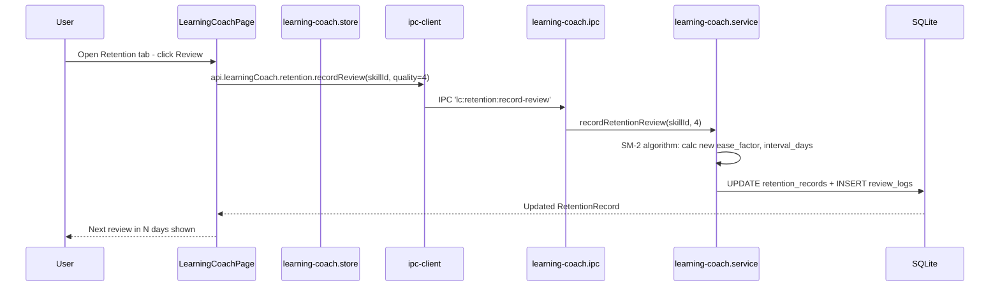

# Module: Learning Coach (AI Coach)

## Purpose

The Learning Coach is the most sophisticated module in CareerOS. It provides science-backed learning management: structured learning paths with skill sequencing, skill method configuration (what % of time to spend on labs vs videos vs notes), spaced repetition retention tracking at the skill level, AI-generated study plans, skill dependency graphs, and learning effectiveness metrics.

## Features

- **Learning Paths** — named career paths with ordered skill lists, unlocking prerequisites, and progress tracking
- **Skill Methods** — configurable learning method allocation per skill (home_lab_pct, notes_pct, videos_pct, active_recall_pct, flashcards_pct, interview_pct, projects_pct)
- **Retention System** — SM-2 spaced repetition at the skill level: next_review_at, ease_factor, interval_days, retention_score, review log
- **Study Plans** — generated multi-day study plans with ordered skill-action items; mark items done
- **Dependency Graph** — skill prerequisite relationships (required/recommended/optional strength); visual graph
- **Effectiveness Metrics** — aggregate analytics: study minutes, review quality, learning velocity, top retained skills, per-skill accuracy

## Database Tables

### `learning_paths`
| Column | Type | Constraints |
|---|---|---|
| id | TEXT | PRIMARY KEY |
| title | TEXT | NOT NULL |
| career_goal | TEXT | NOT NULL |
| description | TEXT | nullable |
| category | TEXT | CHECK: it-support/msp/sysadmin/azure-admin/cloud-support/cyber-security/custom |
| seniority_level | TEXT | CHECK: entry/junior/mid/senior/lead |
| estimated_weeks | INTEGER | DEFAULT 12 |
| available_hours_per_week | INTEGER | DEFAULT 10 |
| is_active | INTEGER | CHECK: 0/1 |
| deleted_at | TEXT | nullable |

### `learning_path_skills`
| Column | Type | Constraints |
|---|---|---|
| id | TEXT | PRIMARY KEY |
| path_id | TEXT | FK → learning_paths CASCADE |
| skill_id | TEXT | FK → skills SET NULL (nullable) |
| skill_name | TEXT | NOT NULL (denormalized for flexibility) |
| order_index | INTEGER | DEFAULT 0 |
| why_it_matters | TEXT | nullable |
| prerequisites_json | TEXT | JSON array |
| estimated_hours | REAL | DEFAULT 5 |
| target_level | TEXT | beginner/intermediate/advanced/expert |
| is_unlocked | INTEGER | CHECK: 0/1 |

### `skill_method_configs`
| Column | Type | Constraints |
|---|---|---|
| id | TEXT | PRIMARY KEY |
| skill_id | TEXT | NOT NULL UNIQUE FK → skills CASCADE |
| home_lab_pct | INTEGER | CHECK: 0-100 |
| notes_pct | INTEGER | CHECK: 0-100 |
| videos_pct | INTEGER | CHECK: 0-100 |
| active_recall_pct | INTEGER | CHECK: 0-100 |
| flashcards_pct | INTEGER | CHECK: 0-100 |
| interview_pct | INTEGER | CHECK: 0-100 |
| projects_pct | INTEGER | CHECK: 0-100 |
| rationale | TEXT | nullable |
| is_custom | INTEGER | CHECK: 0/1 |

### `retention_records`
| Column | Type | Constraints |
|---|---|---|
| id | TEXT | PRIMARY KEY |
| skill_id | TEXT | NOT NULL UNIQUE FK → skills CASCADE |
| ease_factor | REAL | DEFAULT 2.5 (SM-2) |
| interval_days | INTEGER | DEFAULT 1 |
| repetitions | INTEGER | DEFAULT 0 |
| next_review_at | TEXT | DEFAULT date+1 |
| last_reviewed_at | TEXT | nullable |
| retention_score | INTEGER | CHECK: 0-100 |

### `review_logs`
| Column | Type | Constraints |
|---|---|---|
| id | TEXT | PRIMARY KEY |
| skill_id | TEXT | FK → skills CASCADE |
| quality | INTEGER | CHECK: 0-5 |
| ease_factor_after | REAL | NOT NULL |
| interval_after | INTEGER | NOT NULL |
| notes | TEXT | nullable |
| reviewed_at | TEXT | ISO8601 |

### `study_plans`
| Column | Type | Constraints |
|---|---|---|
| id | TEXT | PRIMARY KEY |
| title | TEXT | NOT NULL |
| career_goal | TEXT | NOT NULL |
| plan_type | TEXT | CHECK: daily/weekly/monthly |
| start_date | TEXT | NOT NULL |
| end_date | TEXT | nullable |
| available_hours_per_week | INTEGER | DEFAULT 10 |
| is_active | INTEGER | CHECK: 0/1 |
| deleted_at | TEXT | nullable |

### `study_plan_items`
| Column | Type | Constraints |
|---|---|---|
| id | TEXT | PRIMARY KEY |
| plan_id | TEXT | FK → study_plans CASCADE |
| skill_id | TEXT | FK → skills SET NULL |
| skill_name | TEXT | NOT NULL |
| action | TEXT | NOT NULL |
| method | TEXT | CHECK: home-lab/notes/videos/active-recall/flashcards/interview-questions/projects |
| estimated_minutes | INTEGER | DEFAULT 30 |
| day_of_plan | INTEGER | DEFAULT 1 |
| order_index | INTEGER | DEFAULT 0 |
| is_done | INTEGER | CHECK: 0/1 |
| done_at | TEXT | nullable |

### `skill_dependencies`
| Column | Type | Constraints |
|---|---|---|
| skill_id | TEXT | PK composite, FK → skills CASCADE |
| prerequisite_id | TEXT | PK composite, FK → skills CASCADE |
| strength | TEXT | CHECK: required/recommended/optional |

## IPC Channels

| Channel | Action |
|---|---|
| `lc:paths:get-all` | All learning paths with progress |
| `lc:paths:get-by-id` | Single path with skills |
| `lc:paths:create` | Create path |
| `lc:paths:update` | Update path |
| `lc:paths:delete` | Delete path |
| `lc:paths:set-skills` | Replace all skills in a path |
| `lc:methods:get-all` | All skill method configs |
| `lc:methods:get-by-skill` | Method config for one skill |
| `lc:methods:upsert` | Create or update method config |
| `lc:retention:get-all` | All retention records |
| `lc:retention:get-due` | Skills due for review today |
| `lc:retention:upsert` | Create retention record for skill |
| `lc:retention:record-review` | Record review and update SM-2 state |
| `lc:retention:get-logs` | Review logs (optionally filtered by skill) |
| `lc:plans:get-all` | All study plans with items |
| `lc:plans:get-by-id` | Single plan with items |
| `lc:plans:generate` | Generate a new study plan |
| `lc:plans:delete` | Delete plan |
| `lc:plans:mark-item-done` | Mark plan item as done/undone |
| `lc:deps:get-all` | All dependency pairs |
| `lc:deps:add` | Add prerequisite |
| `lc:deps:remove` | Remove prerequisite |
| `lc:deps:get-graph` | Full dependency graph (nodes + edges) |
| `lc:effectiveness:get-metrics` | All effectiveness metrics |

## Service Functions

**File:** `electron/services/learning-coach/learning-coach.service.ts`

- Learning path CRUD + `setPathSkills()` (bulk replace)
- `getSkillMethodConfig(skillId)` / `upsertSkillMethodConfig(skillId, data)` — single config per skill
- `getRetentionRecords()` / `getDueRetention()` — SM-2 state queries
- `upsertRetention(skillId)` — create default SM-2 record
- `recordRetentionReview(skillId, quality, notes)` — SM-2 update algorithm
- `getStudyPlans()` / `generateStudyPlan(input)` — plan generation (rule-based, not AI)
- `markStudyPlanItemDone(itemId, done)` — toggle
- Skill dependency CRUD + `getDependencyGraph()` — nodes and edges for visualization
- `getEffectivenessMetrics()` — aggregate query across study_sessions, review_logs, retention_records

## State Management

**File:** `src/features/learning-coach/store/learning-coach.store.ts`

```typescript
interface LearningCoachState {
  learningPaths: LearningPath[]
  skillMethods: SkillMethodConfig[]
  retentionRecords: RetentionRecord[]
  dueRetention: RetentionRecord[]
  studyPlans: StudyPlan[]
  dependencies: SkillDependencyItem[]
  dependencyGraph: LearningCoachDependencyGraph | null
  effectivenessMetrics: LearningEffectivenessMetrics | null
  isLoading: boolean
  // all CRUD actions...
}
```

## Data Flow



## UI Components

| Component | File | Role |
|---|---|---|
| `LearningCoachPage` | `components/LearningCoachPage.tsx` | Tabbed container for all coach sub-features |
| `LearningPathsTab` | `components/LearningPathsTab.tsx` | Create and manage learning paths |
| `MethodRecommendationsTab` | `components/MethodRecommendationsTab.tsx` | Configure learning methods per skill |
| `RetentionSystemTab` | `components/RetentionSystemTab.tsx` | Spaced repetition review queue |
| `StudyPlannerTab` | `components/StudyPlannerTab.tsx` | Generate and track study plans |
| `DependencyGraphTab` | `components/DependencyGraphTab.tsx` | Visual dependency graph |
| `EffectivenessTab` | `components/EffectivenessTab.tsx` | Learning effectiveness metrics |

## Dependencies

- **Skills** — all coach data references skills
- **Home Labs** — lab minutes feed into effectiveness metrics
- **Study Sessions** — study_sessions table feeds effectiveness metrics
- **Career Intelligence** — shares the study_sessions table

## User Workflow

1. Navigate to **AI Coach** in the Learning OS sidebar
2. **Learning Paths tab:** Create a path (e.g., "Azure Administrator"), add skills in order, set estimated hours
3. **Retention tab:** Skills due for review appear; rate each 0-5 after reviewing; SM-2 schedules next review
4. **Study Planner tab:** Generate a study plan for your career goal with available hours per week
5. Each day, open the study plan and mark items done as you complete them
6. **Dependencies tab:** Define which skills require prerequisites; view as a dependency graph
7. **Effectiveness tab:** Review metrics — learning velocity, retention trends, method accuracy

## Known Limitations

- Study plan generation is rule-based (not AI) — distributes skills evenly across days without semantic understanding
- Dependency graph visualisation implementation detail requires investigation of DependencyGraphTab component
- SM-2 retention is at the skill level (coarse-grained) — SRS module handles card-level (fine-grained) retention
- No notification system for due reviews

## Future Roadmap

- Claude API integration for AI-powered plan generation
- Push notifications for due reviews (Electron system notifications)
- Learning path templates for common IT career tracks
- Integration with external learning platforms (Pluralsight, LinkedIn Learning)
