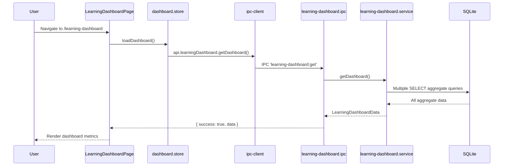

# Module: Learning Dashboard

## Purpose

The Learning Dashboard is the application's home screen — a read-only analytics aggregation of all modules. It displays key metrics, career readiness scores, skill growth trends, recent activity, upcoming certification renewals, and weekly/monthly reports. It does not store its own data; it queries across all entity tables.

## Features

- Career Readiness Score (composite metric 0-100) broken down by:
  - Skills score (mastered vs total)
  - Certifications score (earned vs total)
  - Projects score (completed vs total)
  - Labs score (completed vs total)
  - Interview score (mastered questions vs total)
- Total counts across all modules
- Skill growth trend (month-by-month)
- Recent activity feed (last N actions across all entity types)
- Top skills (by name, category, level, status)
- Upcoming certification renewals (within configurable window)
- Weekly activity chart (study_minutes, lab_minutes, skills_added, questions_reviewed)
- Monthly activity chart
- Weekly report generator
- Monthly report generator

## Database Tables

The Learning Dashboard does not own any tables. It queries the following tables across all modules:

- `skills` — skills_total, skills_mastered
- `projects` — projects_total, projects_completed
- `certifications` — certifications_total, certifications_earned, upcoming renewals
- `home_labs` — labs_total, labs_completed, lab_minutes
- `home_lab_time_entries` — total_lab_minutes
- `interview_questions` — interview_questions_total, interview_questions_mastered
- `study_sessions` — total_study_minutes
- `journal_entries` — recent activity
- `notes`, `documents`, `videos` — recent activity

## IPC Channels

| Channel | Action |
|---|---|
| `learning-dashboard:get` | Full dashboard data aggregate |
| `learning-dashboard:weekly-report` | Weekly report for a given week_start date |
| `learning-dashboard:monthly-report` | Monthly report for a given month (YYYY-MM) |

## Service Functions

**File:** `electron/services/learning-dashboard/learning-dashboard.service.ts`

- `getDashboard()` — executes multiple aggregate queries in a transaction, returns `LearningDashboardData`
- `getWeeklyReport(weekStart)` — aggregates activity for the 7-day period starting at weekStart
- `getMonthlyReport(month)` — aggregates activity for the given month

Key aggregations:
- `career_readiness` — weighted scoring formula: skills (30%), certs (25%), projects (20%), labs (15%), interview (10%)
- `recent_activity` — UNION query across entities ordered by created_at/updated_at
- `upcoming_cert_renewals` — certifications WHERE expiry_date BETWEEN now AND now+90 days
- `skill_growth` — GROUP BY strftime('%Y-%m', created_at) over skills

## State Management

**File:** `src/features/learning-dashboard/store/dashboard.store.ts`

```typescript
interface DashboardState {
  dashboard: LearningDashboardData | null
  weeklyReport: WeeklyReport | null
  monthlyReport: MonthlyReport | null
  isLoading: boolean
  loadDashboard: () => Promise<void>
  loadWeeklyReport: (weekStart: string) => Promise<void>
  loadMonthlyReport: (month: string) => Promise<void>
}
```

## Data Flow



## UI Components

| Component | File | Role |
|---|---|---|
| `LearningDashboardPage` | `components/LearningDashboardPage.tsx` | Full dashboard with all metric sections, charts, and activity feed |

## Dependencies

This module reads from all other modules but writes to none. It is purely an analytics view.

- Skills, Projects, Certifications, Home Labs, Interview Bank, Videos, Notes, Documents, Journal, Study Sessions

## User Workflow

1. App opens to `/learning-dashboard` by default (root redirect)
2. Dashboard loads automatically — all metrics displayed
3. Career Readiness Score shown prominently
4. Scroll to see skill growth chart, recent activity, upcoming renewals
5. Click "Weekly Report" to see this week's activity breakdown
6. Click "Monthly Report" to see this month's summary

## Known Limitations

- Dashboard is read-only — no editing from this view
- Refresh requires re-navigation or manual reload (no auto-refresh interval)
- Career Readiness Score formula is fixed — not user-configurable
- Recent activity feed is limited — exact limit not determined from source
- Charts are basic data tables — no visual chart library (actual chart rendering requires investigation of LearningDashboardPage component implementation)

## Future Roadmap

- Interactive charts with visual trend lines (recharts or similar)
- User-configurable career readiness weighting
- Goal setting with progress bars
- PDF export of dashboard state
- Weekly email summary (when cloud sync is added)
