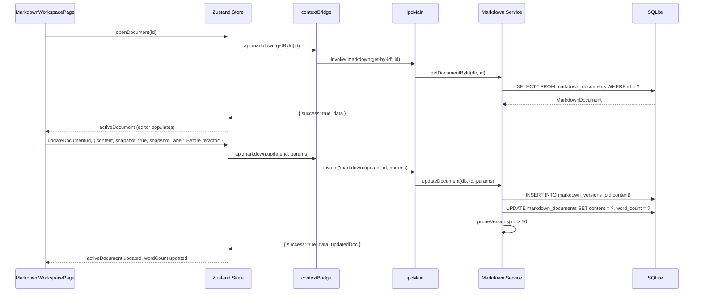

# Markdown Workspace Module

## Purpose

The Markdown Workspace module provides a full-featured in-app Markdown editor with live preview, YAML frontmatter parsing, word count tracking, automatic version history, and manual snapshot creation. It is the writing environment for long-form technical notes, blog drafts, study guides, or any structured prose content that benefits from Markdown formatting and version control.

---

## Features

- Create and manage Markdown documents with titles and content
- Live Markdown preview with GitHub Flavored Markdown (remark-gfm) and syntax highlighting (rehype-highlight)
- Mermaid diagram rendering inline within documents
- YAML frontmatter parsing — extracted and stored separately for metadata use
- Word count computed on every save
- Tags stored as a JSON array on the document record
- **Version history**: up to 50 versions retained; oldest pruned automatically
- **Manual snapshot**: create a named version checkpoint at any time
- **Restore version**: restores a previous version as the current content (auto-snapshots the pre-restore state)
- Version panel showing version number, label, and timestamp
- Automatic snapshot on restore ("Before restore to vN")
- Full CRUD on documents and versions

---

## Database Tables

| Table | Key Columns | Notes |
|---|---|---|
| `markdown_documents` | `id` (UUID), `title`, `content`, `frontmatter` (JSON), `word_count`, `tags` (JSON array), `created_at`, `updated_at` | Hard-delete; no soft-delete |
| `markdown_versions` | `id` (UUID), `document_id` → `markdown_documents`, `content`, `title`, `version_number`, `label` (nullable), `created_at` | Hard-delete; pruned to 50 max per document |

**Migration:** `013_markdown_workspace`

---

## IPC Channels

```
MARKDOWN
  markdown:get-all         — list all documents (content excluded for performance: not confirmed)
  markdown:get-by-id       — single document with full content
  markdown:create          — create document (optional initial content/title/tags)
  markdown:update          — update title/content/tags; optional snapshot flag
  markdown:delete          — hard-delete document and its versions

MARKDOWN.VERSIONS
  markdown:versions:get     — all versions for a document (DESC by version_number)
  markdown:versions:save    — save a manual named snapshot
  markdown:versions:restore — restore a specific version as current (auto-snapshots pre-restore state)
  markdown:versions:delete  — delete a specific version record
```

---

## Service Functions

Located at `electron/services/markdown/markdown.service.ts`.

| Function | Purpose |
|---|---|
| `getAllDocuments` | SELECT all markdown_documents ORDER BY updated_at DESC |
| `getDocumentById` | SELECT single document by id |
| `createDocument` | INSERT with UUID; parses frontmatter from initial content; computes word count |
| `updateDocument` | If `snapshot: true`, creates a version of the pre-update content first; then UPDATE document |
| `deleteDocument` | Hard DELETE (versions cascade via FK — not confirmed; or deleted separately) |
| `parseFrontmatter` | Regex `^---\n...\n---\n` parser; basic YAML key:value (no nesting); returns `{ frontmatter, body }` |
| `countWords` | `text.trim().split(/\s+/).length`; returns 0 for empty text |
| `getVersions` | SELECT markdown_versions WHERE document_id ORDER BY version_number DESC |
| `saveManualSnapshot` | Creates a version record with optional label; calls `pruneVersions` |
| `restoreVersion` | SELECT version; calls `updateDocument` with version content + snapshot of current state |
| `deleteVersion` | Hard DELETE from markdown_versions |
| `pruneVersions` (internal) | SELECT all version IDs DESC; DELETE any beyond the 50th |
| `createVersion` (internal) | INSERT into markdown_versions with next version number |
| `getNextVersionNumber` (internal) | `MAX(version_number) + 1` or 1 for first version |

---

## State Management

Store location: `src/features/markdown-workspace/store/`

State shape (inferred from component list):

```typescript
interface MarkdownWorkspaceState {
  documents: MarkdownDocument[]
  activeDocument: MarkdownDocument | null
  versions: MarkdownVersion[]
  isLoading: boolean
  isSaving: boolean
  isVersionPanelOpen: boolean
  wordCount: number

  // Actions
  fetchDocuments: () => Promise<void>
  openDocument: (id: string) => Promise<void>
  createDocument: (params?: CreateDocumentParams) => Promise<void>
  updateDocument: (id: string, params: UpdateDocumentParams) => Promise<void>
  deleteDocument: (id: string) => Promise<void>
  fetchVersions: (documentId: string) => Promise<void>
  saveSnapshot: (documentId: string, label?: string) => Promise<void>
  restoreVersion: (documentId: string, versionId: string) => Promise<void>
  deleteVersion: (versionId: string) => Promise<void>
}
```

---

## Data Flow



---

## UI Components

Located at `src/features/markdown-workspace/components/`:

| Component | Role |
|---|---|
| `MarkdownWorkspacePage.tsx` | Root page; split-pane editor/preview, document list sidebar, toolbar |
| `MarkdownPreview.tsx` | Rendered Markdown preview using react-markdown with remark-gfm and rehype-highlight |
| `MermaidBlock.tsx` | Renders `mermaid` code blocks as diagrams using the mermaid library |
| `VersionHistoryPanel.tsx` | Side panel showing version list with restore and delete actions |

---

## Dependencies

- **mermaid** npm library for diagram rendering in preview
- **react-markdown** with **remark-gfm** and **rehype-highlight** for Markdown rendering
- No cross-module database dependencies (standalone document store)

---

## User Workflow

1. Navigate to **Markdown Workspace** (`/markdown-workspace`)
2. Click **New Document** to create an empty document
3. Write content in the editor pane using Markdown syntax
4. The preview pane renders the output in real time
5. Include YAML frontmatter between `---` delimiters for metadata
6. Add `mermaid` code blocks for diagrams
7. Click **Save Snapshot** to checkpoint the current version with a label (e.g., "Draft 1")
8. Continue editing; previous versions are accessible from the Version History panel
9. Click **Restore** on a version to roll back; the current state is auto-snapshotted before restore
10. Delete documents from the list view

---

## Known Limitations

- Maximum 50 versions per document; oldest are pruned automatically without warning
- The frontmatter parser is basic (key: value only; no nested YAML, no arrays)
- Tags are stored as a JSON array but there is no integration with the global Tags module
- No collaborative editing
- No export to HTML or PDF from within the app
- Word count includes frontmatter YAML text — not pure body word count

---

## Future Roadmap

- Export to HTML, PDF, or plain text
- Full YAML parser for complex frontmatter
- Tags integration with the global Tags module
- Auto-save with configurable interval
- Spell check integration
- Link Markdown documents to skills, projects, or journal entries
