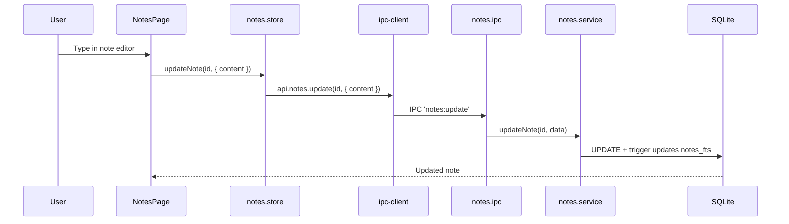

# Module: Notes

## Purpose

The Notes module provides quick note capture with type classification, pinning, tagging, and full-text search. Notes are general-purpose and are not linked to specific entities (for skill-specific notes, use the Skill Hub or Markdown Workspace).

## Features

- Create, edit, and delete notes
- Classify by type: `general`, `meeting`, `research`, `tutorial`, `reference`, `idea`
- Pin important notes to the top
- Tag notes with cross-module tags
- Full-text search via FTS5 (title, content)
- Filter by type and pin status
- Sort by updated_at (most recent first)
- Soft delete
- Pagination
- Bulk-export notes to SRS flashcards (`srs:bulk-from-notes`)

## Database Tables

### `notes`
| Column | Type | Constraints |
|---|---|---|
| id | TEXT | PRIMARY KEY |
| title | TEXT | NOT NULL |
| content | TEXT | NOT NULL DEFAULT '' |
| type | TEXT | CHECK: general/meeting/research/tutorial/reference/idea |
| is_pinned | INTEGER | CHECK: 0/1 |
| created_at | TEXT | ISO8601 |
| updated_at | TEXT | ISO8601 |
| deleted_at | TEXT | nullable |

Indexes: type, is_pinned (partial where pinned=1 and active), updated_at (partial active)

### `notes_fts` (virtual)
FTS5 over `notes(title, content)`.

## IPC Channels

| Channel | Action |
|---|---|
| `notes:get-all` | Paginated list with filters |
| `notes:get-by-id` | Single note |
| `notes:create` | Create note |
| `notes:update` | Update content or metadata |
| `notes:delete` | Soft delete |
| `srs:bulk-from-notes` | Generate SRS cards from all notes |

## Service Functions

**File:** `electron/services/notes/notes.service.ts`

- `getAllNotes(filters)` — paginated with type/pin filter and FTS
- `getNoteById(id)` — single note
- `createNote(data)` — insert
- `updateNote(id, data)` — partial update including content
- `deleteNote(id)` — soft delete

## State Management

**File:** `src/features/notes/store/notes.store.ts`

```typescript
interface NotesState {
  notes: Note[]
  total: number
  selectedNote: Note | null
  isLoading: boolean
  filters: NoteFilters
  loadNotes: () => Promise<void>
  selectNote: (id: string) => Promise<void>
  createNote: (data: CreateNoteInput) => Promise<void>
  updateNote: (id: string, data: UpdateNoteInput) => Promise<void>
  deleteNote: (id: string) => Promise<void>
}
```

## Data Flow



## UI Components

| Component | File | Role |
|---|---|---|
| `NotesPage` | `components/NotesPage.tsx` | Split-pane: note list + editor panel |

## Dependencies

- **Tags** — entity_tags links tags to notes
- **SRS System** — bulk-from-notes creates flashcards from note content
- **Knowledge Graph** — notes can be referenced as graph nodes

## User Workflow

1. Navigate to **Notes** in the Knowledge sidebar group
2. Click **New Note** to create a note
3. Type in the content area (plain text)
4. Set the type (meeting, research, etc.) and pin if important
5. Add tags for cross-module discovery
6. Use the filter or search to find notes later

## Known Limitations

- Note content is plain text — no Markdown rendering in the Notes module (use Markdown Workspace for rich content)
- No auto-save timer — saves only on explicit update action
- No folder or hierarchical organisation

## Future Roadmap

- Markdown rendering with live preview
- Auto-save on typing pause
- Folder/notebook organisation
- Note linking (wikilinks [[note-title]])
- Export to Markdown files
