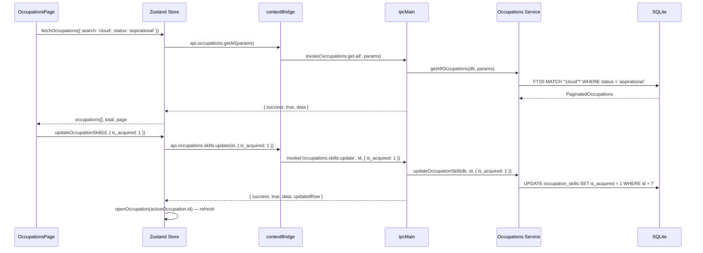

# Occupations Module

## Purpose

The Occupations module lets users define target job roles or career positions and map which skills are required for each, with importance weighting and acquisition tracking. Users can set an aspiration status, target date, industry, and seniority level for each occupation. This feeds into career planning alongside the Career Intelligence roadmaps module.

---

## Features

- Create and manage occupation records (job titles with description, industry, seniority level)
- Occupation statuses: `aspirational`, `active`, `applied`, `achieved`, `archived`
- Target date for when the user aims to qualify for the occupation
- Associate skills to an occupation with importance levels (`critical`, `important`, `nice-to-have`)
- Mark individual skills as acquired (`is_acquired = 1`) to track readiness
- Stats per occupation: total skills, acquired count, critical skill count, tag count
- Full-text search on occupations (FTS5) with relevance ranking
- Paginated results (default 24 per page)
- Filterable by `status` and `seniority_level`
- Tags support via `entity_tags` bridge table
- Soft-delete with `deleted_at`

---

## Database Tables

| Table | Key Columns | Notes |
|---|---|---|
| `occupations` | `id`, `title`, `description`, `industry`, `seniority_level`, `status`, `target_date`, `notes`, `deleted_at` | Soft-delete; status defaults to `'aspirational'` |
| `occupation_skills` | `id`, `occupation_id`, `skill_id` → `skills`, `importance`, `is_acquired` (0/1), `order_index`, `notes` | INSERT OR IGNORE; hard-delete on occupation update |
| `occupations_fts` (virtual) | FTS5 content from `occupations` | Used by `searchOccupationsFts` |
| `entity_tags` | `tag_id`, `entity_type = 'occupation'`, `entity_id` | Shared bridge table; see Tags module |

---

## IPC Channels

```
OCCUPATIONS
  occupations:get-all            — paginated + filtered list with stats
  occupations:get-by-id          — detail with skills and tags
  occupations:create             — create occupation (with optional skills and tags)
  occupations:update             — update fields, skills, tags
  occupations:delete             — soft-delete

OCCUPATIONS.SKILLS
  occupations:skills:get         — list occupation skills with skill detail
  occupations:skills:set         — replace full skill set for an occupation
  occupations:skills:update      — update a single occupation_skill record (importance, is_acquired, notes)
  occupations:skills:remove      — remove a single occupation_skill record
```

---

## Service Functions

Located at `electron/services/occupations/occupations.service.ts`.

| Function | Purpose |
|---|---|
| `getAllOccupations` | Routes to FTS search if query provided; else plain filter with pagination |
| `searchOccupationsFts` | FTS5 MATCH with additional status/seniority filters; ORDER BY rank |
| `getOccupationById` | Full detail: base record + skills with skill category info + tags |
| `createOccupation` | Transaction: INSERT occupation + optional skills + optional tags |
| `updateOccupation` | Transaction: UPDATE occupation fields + optional full skill replacement + optional tag sync |
| `softDeleteOccupation` | UPDATE `deleted_at` to now |
| `getOccupationSkills` | SELECT skills with skill category JOIN |
| `setOccupationSkills` | DELETE all + INSERT batch (replacement) |
| `updateOccupationSkill` | COALESCE update on a single occupation_skill row |
| `removeOccupationSkill` | DELETE single occupation_skill |
| `insertSkillEntries` (internal) | Batch INSERT OR IGNORE into `occupation_skills` |
| `syncTags` (internal) | DELETE existing occupation entity_tags then INSERT new ones |

**FTS query building:** splits on whitespace, wraps each token as `"token"*`, joins with space — same pattern as global search.

---

## State Management

Store location: `src/features/occupations/store/`

State shape (inferred from component list):

```typescript
interface OccupationsState {
  occupations: OccupationWithStats[]
  activeOccupation: OccupationDetail | null
  total: number
  page: number
  pageSize: number
  isLoading: boolean
  isFormOpen: boolean
  editingOccupationId: string | null
  isSubmitting: boolean
  deletingOccupationId: string | null
  isDeletingOccupation: boolean
  filters: {
    search: string
    status: string | null
    seniority_level: string | null
  }

  // Actions
  fetchOccupations: (params?: GetAllOccupationsParams) => Promise<void>
  openOccupation: (id: string) => Promise<void>
  openCreateOccupation: () => void
  openEditOccupation: (id: string) => void
  closeOccupationForm: () => void
  submitOccupation: (values: CreateOccupationParams) => Promise<boolean>
  confirmDeleteOccupation: (id: string) => void
  cancelDeleteOccupation: () => void
  executeDeleteOccupation: () => Promise<boolean>
  setOccupationSkills: (occupationId: string, entries: SkillEntry[]) => Promise<void>
  updateOccupationSkill: (id: string, params: { importance?: string; is_acquired?: number; notes?: string | null }) => Promise<void>
  removeOccupationSkill: (id: string) => Promise<void>
}
```

---

## Data Flow



---

## UI Components

Located at `src/features/occupations/components/`:

| Component | Role |
|---|---|
| `OccupationsPage.tsx` | Root page; list with search, filters, and pagination |
| `OccupationCard.tsx` | Card in the list showing title, status badge, skill counts |
| `OccupationFilters.tsx` | Filter controls for status and seniority level |
| `OccupationForm.tsx` | Create/edit form with skills selector and tag picker |
| `OccupationStatusBadge.tsx` | Colored badge for occupation status |
| `DeleteOccupationDialog.tsx` | Confirmation dialog before soft-deleting |

---

## Dependencies

- **Skills** — occupation skills reference `skills.id` and read `proficiency_level`, `status`, category info
- **Tags** — uses shared `entity_tags` table; tags fetched via Tags service

---

## User Workflow

1. Navigate to **Occupations** (`/occupations`)
2. Click **New Occupation** and enter the job title, industry, seniority level, status, and target date
3. Add required skills with importance levels (critical / important / nice-to-have)
4. Save. The occupation appears in the list with a skill readiness indicator
5. Open the occupation detail to see skill requirements
6. As you acquire skills, toggle `is_acquired` for each skill
7. Change the occupation status to `active` when applying for roles of that type
8. Use the search bar to find specific occupations by keyword

---

## Known Limitations

- Skill association is a full-replacement operation — editing the skill list replaces the entire set
- No direct linkage to Career Intelligence roadmaps (they are parallel planning tools)
- FTS5 search matches title and description fields only; notes and skills are not indexed
- No occupation "readiness score" computed at the service level (stats provide counts but not a percentage)
- Soft-deleted occupations are not recoverable through the UI

---

## Future Roadmap

- Occupation readiness score (percentage of critical skills acquired)
- Link occupations to career roadmaps for integrated planning
- Job posting import (paste a job description to extract required skills automatically)
- Export occupation skills list as PDF for interview preparation
