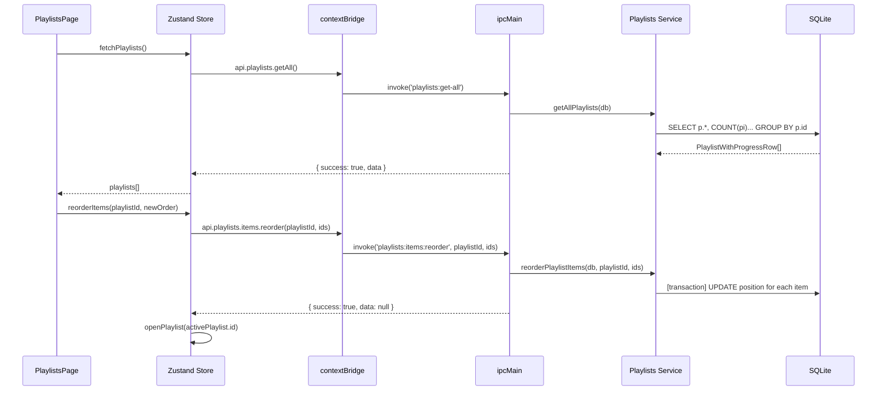

# Playlists Module

## Purpose

The Playlists module lets users organize learning videos into ordered, trackable playlists. Playlists can be linked to a skill and sourced from YouTube or custom URL collections. Each item in a playlist tracks its own watch status and playback progress independently from the Videos module. This enables structured learning paths (e.g., "Azure Fundamentals YouTube series") separate from the ad-hoc video library.

---

## Features

- Create playlists with a title, description, source (`youtube` or `custom`), source URL (e.g., a YouTube playlist URL), optional thumbnail, and optional skill association
- Add items to a playlist: each item has a title, URL, source type, duration, watch status (`unwatched`, `watching`, `completed`), playback progress in seconds, and notes
- Items can be linked to existing Videos module entries via `video_id`
- Position-based ordering of items; drag-to-reorder via the `reorder` IPC
- Progress summary: total items, completed count, total duration
- Skill association: filter playlists by a specific skill
- Full CRUD on playlists and individual items

---

## Database Tables

| Table | Key Columns | Notes |
|---|---|---|
| `playlists` | `id`, `title`, `description`, `source` (youtube/custom), `source_url`, `thumbnail`, `skill_id` → `skills` ON DELETE SET NULL | `source` CHECK constraint; `skill_id` is optional |
| `playlist_items` | `id`, `playlist_id` → `playlists` ON DELETE CASCADE, `video_id` → `videos` ON DELETE SET NULL, `title`, `url`, `source`, `duration_seconds`, `position`, `watch_status`, `progress_seconds`, `notes` | `watch_status` CHECK constraint; items cascade-delete with playlist |

**Migration:** `010_workspace_playlists`

---

## IPC Channels

```
PLAYLISTS
  playlists:get-all          — all playlists with progress summary (optional skillId filter)
  playlists:get-by-id        — single playlist with all items
  playlists:create           — create playlist
  playlists:update           — update playlist metadata
  playlists:delete           — hard-delete playlist (cascades items)

PLAYLISTS.ITEMS
  playlists:items:create     — add item to playlist
  playlists:items:update     — update item fields (status, progress, notes, etc.)
  playlists:items:delete     — remove item from playlist
  playlists:items:reorder    — reposition items by supplying ordered array of IDs
```

---

## Service Functions

Located at `electron/services/playlists/playlists.service.ts`.

| Function | Purpose |
|---|---|
| `getAllPlaylists` | SELECT with skill JOIN and aggregated `item_count`, `completed_count`, `total_duration_seconds`; optional `skillId` filter |
| `getPlaylistById` | Full playlist with JOIN to skill name + all items ordered by `position` |
| `createPlaylist` | INSERT; defaults: `source = 'custom'` |
| `updatePlaylist` | Merge existing with params; UPDATE all fields |
| `deletePlaylist` | Hard DELETE (cascades items) |
| `createPlaylistItem` | INSERT; auto-assigns `position = MAX(position) + 1` |
| `updatePlaylistItem` | Merge existing with params; UPDATE all fields |
| `deletePlaylistItem` | Hard DELETE |
| `reorderPlaylistItems` | Transaction: UPDATE each item's `position` from supplied ordered ID array |

---

## State Management

Store location: `src/features/playlists/store/`

State shape (inferred from component usage):

```typescript
interface PlaylistsState {
  playlists: PlaylistWithProgressRow[]
  activePlaylist: PlaylistDetailRow | null
  isLoading: boolean
  isSubmitting: boolean
  isFormOpen: boolean
  editingPlaylistId: string | null

  // Actions
  fetchPlaylists: (skillId?: string) => Promise<void>
  openPlaylist: (id: string) => Promise<void>
  createPlaylist: (params: CreatePlaylistParams) => Promise<void>
  updatePlaylist: (id: string, params: UpdatePlaylistParams) => Promise<void>
  deletePlaylist: (id: string) => Promise<void>
  addItem: (params: CreatePlaylistItemParams) => Promise<void>
  updateItem: (id: string, params: UpdatePlaylistItemParams) => Promise<void>
  deleteItem: (id: string) => Promise<void>
  reorderItems: (playlistId: string, orderedIds: string[]) => Promise<void>
}
```

---

## Data Flow



---

## UI Components

Located at `src/features/playlists/components/`:

| Component | Role |
|---|---|
| `PlaylistsPage.tsx` | Root page; list of playlists, playlist detail view with ordered items, progress tracking, add/edit/reorder items |

---

## Dependencies

- **Skills** — playlists can be associated with a skill via `skill_id`
- **Videos** — playlist items can be linked to Videos module entries via `video_id`

---

## User Workflow

1. Navigate to **Playlists** (`/playlists`)
2. Click **New Playlist** and enter title, source type (YouTube/custom), optional source URL, and link to a skill
3. Open the playlist and click **Add Item** to add videos by title and URL
4. Optionally link each item to an existing Video module entry
5. Drag items to reorder the learning sequence
6. As you watch each video, click the item to update its status (`watching` → `completed`) and record progress in seconds
7. Add notes per item to capture key takeaways
8. Monitor the playlist's completion percentage from the list view

---

## Known Limitations

- No automatic YouTube playlist import — the `source_url` field stores the URL but there is no scraping or YouTube Data API integration
- Duration must be entered manually; no automatic retrieval from YouTube
- `progress_seconds` tracking is manual; there is no embedded video player within the Playlists module
- Thumbnail is stored as a URL or path string but there is no auto-fetch from YouTube

---

## Future Roadmap

- YouTube Data API integration to auto-import playlist items, titles, durations, and thumbnails
- Embedded video player with automatic progress sync
- Integration with the Videos module so playlist completion updates the video's `watch_status`
- Smart playlist suggestions based on skill gaps from Career Intelligence
