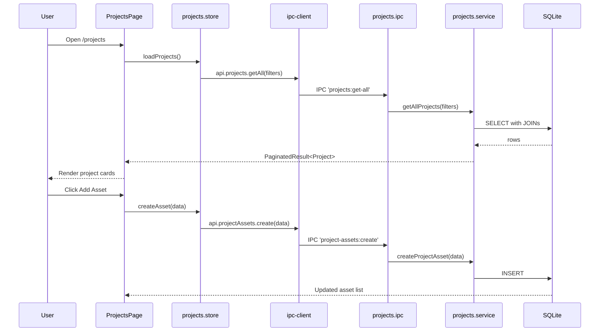

# Module: Projects

## Purpose

The Projects module maintains a portfolio of technical projects — personal, professional, open-source, freelance, or academic. Each project can have attached assets (files, screenshots, links), linked skills, tags, and status lifecycle management from planning through to completion.

## Features

- Create, edit, and delete projects with rich metadata
- Track project status: `planning` → `active` → `completed` → `paused` → `abandoned`
- Classify project type: `personal`, `professional`, `open-source`, `freelance`, `academic`
- Record repository URL, live URL, and cover image
- Mark projects as featured
- Record start date and completion date
- Attach project assets (images, videos, documents, links, screenshots, demos)
- Reorder project assets with drag-based index updates
- Link skills to projects (many-to-many)
- Tag projects with cross-module tags
- Full-text search via FTS5 (title, summary, description)
- Soft delete (preserve data integrity)
- Filter by status and type
- Pagination (24 per page)

## Database Tables

### `projects`
| Column | Type | Constraints |
|---|---|---|
| id | TEXT | PRIMARY KEY |
| title | TEXT | NOT NULL |
| slug | TEXT | NOT NULL UNIQUE |
| summary | TEXT | nullable |
| description | TEXT | nullable (full rich text) |
| status | TEXT | CHECK: planning/active/completed/paused/abandoned |
| type | TEXT | CHECK: personal/professional/open-source/freelance/academic |
| repo_url | TEXT | nullable |
| live_url | TEXT | nullable |
| cover_image_path | TEXT | nullable |
| is_featured | INTEGER | CHECK: 0/1 |
| started_at | TEXT | nullable ISO8601 |
| completed_at | TEXT | nullable ISO8601 |
| created_at | TEXT | ISO8601 |
| updated_at | TEXT | ISO8601 |
| deleted_at | TEXT | nullable (soft delete) |

Indexes: status, type, is_featured, started_at, completed_at (all partial where deleted_at IS NULL)

### `project_assets`
| Column | Type | Constraints |
|---|---|---|
| id | TEXT | PRIMARY KEY |
| project_id | TEXT | NOT NULL FK → projects |
| title | TEXT | NOT NULL |
| description | TEXT | nullable |
| type | TEXT | CHECK: image/video/document/link/screenshot/demo/other |
| file_path | TEXT | nullable |
| url | TEXT | nullable |
| mime_type | TEXT | nullable |
| file_size_bytes | INTEGER | nullable |
| order_index | INTEGER | DEFAULT 0 |

### `project_skills`
| Column | Type | Constraints |
|---|---|---|
| project_id | TEXT | PK composite, FK → projects |
| skill_id | TEXT | PK composite, FK → skills |

### `projects_fts` (virtual)
FTS5 over `projects(title, summary, description)`.

## IPC Channels

| Channel | Action |
|---|---|
| `projects:get-all` | Paginated list with filters |
| `projects:get-by-id` | Single project by ID |
| `projects:create` | Create project |
| `projects:update` | Update project fields |
| `projects:delete` | Soft delete project |
| `project-assets:get-all` | All assets for a project |
| `project-assets:create` | Add asset to project |
| `project-assets:update` | Update asset metadata |
| `project-assets:delete` | Remove asset |
| `project-assets:reorder` | Reorder assets by ID array |

## Service Functions

**File:** `electron/services/projects/projects.service.ts`

- `getAllProjects(filters)` — paginated query with status/type filters and FTS
- `getProjectById(id)` — project with skills and assets joined
- `createProject(data)` — insert with nanoid, generate slug
- `updateProject(id, data)` — partial update
- `deleteProject(id)` — soft delete
- `getProjectAssets(projectId)` — ordered asset list
- `createProjectAsset(data)` — insert asset
- `updateProjectAsset(id, data)` — update title, description, order
- `deleteProjectAsset(id)` — hard delete (cascade from project)
- `reorderProjectAssets(projectId, ids)` — update order_index for each ID

## State Management

**File:** `src/features/projects/store/projects.store.ts`

```typescript
interface ProjectsState {
  projects: Project[]
  total: number
  selectedProject: Project | null
  assets: ProjectAsset[]
  isLoading: boolean
  filters: ProjectFilters
  loadProjects: () => Promise<void>
  loadProjectById: (id: string) => Promise<void>
  createProject: (data: CreateProjectInput) => Promise<void>
  updateProject: (id: string, data: UpdateProjectInput) => Promise<void>
  deleteProject: (id: string) => Promise<void>
  loadAssets: (projectId: string) => Promise<void>
  createAsset: (data: ProjectAssetCreateInput) => Promise<void>
  deleteAsset: (id: string) => Promise<void>
  reorderAssets: (projectId: string, ids: string[]) => Promise<void>
}
```

## Data Flow



## UI Components

| Component | File | Role |
|---|---|---|
| `ProjectsPage` | `components/ProjectsPage.tsx` | Main page with grid layout, create button, asset panel |
| `ProjectCard` | `components/ProjectCard.tsx` | Card showing status, type, dates, featured badge |
| `ProjectForm` | `components/ProjectForm.tsx` | Create/edit form with all fields |
| `ProjectFilters` | `components/ProjectFilters.tsx` | Filter by status and type |
| `ProjectStatusBadge` | `components/ProjectStatusBadge.tsx` | Colour-coded status badge |
| `DeleteProjectDialog` | `components/DeleteProjectDialog.tsx` | Confirmation dialog |

## Dependencies

- **Skills** — project_skills links skills to projects
- **Tags** — entity_tags links tags to projects
- **Skill Hub** — linked projects tab references this module
- **Career Intelligence** — roadmap_projects can reference projects

## User Workflow

1. Navigate to **Projects** in the Career OS sidebar
2. See all projects as cards filtered by status/type
3. Click **Add Project** to open the form
4. Fill in title, type, status, description, URLs, dates
5. Save — project appears in the grid
6. Click a project card to open the detail panel
7. In the detail panel, add assets (links, files, screenshots)
8. Mark project as Featured to highlight it in the portfolio view

## Known Limitations

- Project description is plain text — no rich text editor
- Cover image must be imported as a file asset (no URL-based cover)
- Skills linked to a project are not managed from the Projects module directly (managed from Skill Hub)
- No export to GitHub profile README or portfolio website

## Future Roadmap

- Rich text (Markdown) description editor
- GitHub repository integration (auto-import README)
- Portfolio export (PDF, HTML)
- Project timeline view
- Team members / collaborators field
