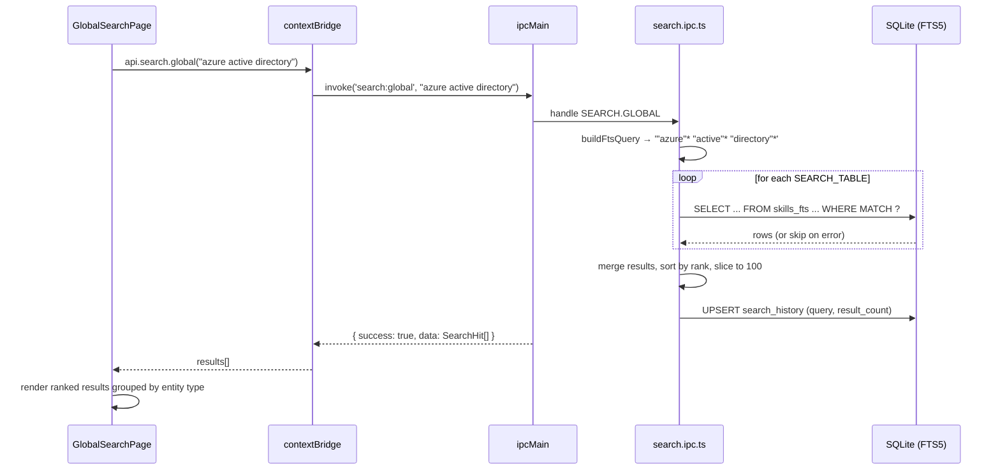

# Search Module

## Purpose

The Search module provides a unified full-text search (FTS5) interface across all major CareerOS content modules. A single query returns ranked results from skills, projects, certifications, notes, documents, home labs, and interview questions simultaneously. Search queries are logged to a history table for quick re-execution. A module-scoped search mode allows targeting a specific entity type.

---

## Features

- **Global search**: searches across 7 entity types in one query and returns up to 100 ranked results
- **Module search**: narrows the same FTS5 query to a single entity type, returning up to 50 results
- Results include `entity_type`, `entity_id`, `title`, `excerpt` (first 160 characters), `subtitle`, and BM25 `rank` score
- Results sorted by BM25 relevance (lower rank = better match in SQLite FTS5)
- Prefix matching: each word in the query is wrapped as `"word"*` for partial match support
- **Search history**: recent queries stored with result count and timestamp; deduplicated by query string (UNIQUE constraint + UPSERT)
- History can be cleared
- FTS5 tables exist for: `skills_fts`, `projects_fts`, `certifications_fts`, `notes_fts`, `documents_fts`, `home_labs_fts`, `interview_questions_fts`
- Each FTS table joined to its base table for `deleted_at IS NULL` filtering
- Silent fallback if an FTS table is not yet populated (try/catch per table)

---

## Database Tables

| Table | Key Columns | Notes |
|---|---|---|
| `search_history` | `id`, `query` (UNIQUE), `result_count`, `searched_at` | UPSERT on conflict: updates `result_count` and `searched_at` |
| `skills_fts` (virtual) | Content from `skills` | FTS5 virtual table |
| `projects_fts` (virtual) | Content from `projects` | FTS5 virtual table |
| `certifications_fts` (virtual) | Content from `certifications` | FTS5 virtual table |
| `notes_fts` (virtual) | Content from `notes` | FTS5 virtual table |
| `documents_fts` (virtual) | Content from `documents` | FTS5 virtual table |
| `home_labs_fts` (virtual) | Content from `home_labs` | FTS5 virtual table |
| `interview_questions_fts` (virtual) | Content from `interview_questions` | FTS5 virtual table |

**Migrations:** `002_fts5_search` (initial FTS tables), `016_search_index` (search_history table and index additions)

---

## IPC Channels

```
SEARCH
  search:global          — search across all 7 entity types
  search:module          — search within a single module type

SEARCH.HISTORY
  search:history:get     — get recent queries (default limit: 20)
  search:history:clear   — delete all search history rows
```

---

## Service Functions

The search logic lives entirely in `electron/ipc/search.ipc.ts` (no dedicated service file; IPC handler is the service).

| Function | Purpose |
|---|---|
| `buildFtsQuery(q)` | Splits query on whitespace, wraps each word as `"word"*`, joins with space |
| Global search handler | Iterates `SEARCH_TABLES` array; runs FTS5 MATCH query per table; merges and sorts by rank; logs to `search_history` |
| Module search handler | Finds matching table config by type; runs FTS5 MATCH query on that table only |
| History GET handler | SELECT from `search_history` ORDER BY `searched_at` DESC LIMIT ? |
| History CLEAR handler | DELETE all from `search_history` |

**Searched tables and their fields:**

| Entity Type | FTS Table | Title Column | Excerpt Column | Subtitle SQL |
|---|---|---|---|---|
| `skill` | `skills_fts` | `name` | `description` | skill category name |
| `project` | `projects_fts` | `title` | `summary` | `type` |
| `certification` | `certifications_fts` | `name` | `description` | `issuer` |
| `note` | `notes_fts` | `title` | `content` | (empty) |
| `document` | `documents_fts` | `title` | `description` | `type` |
| `home_lab` | `home_labs_fts` | `title` | `description` | `status` |
| `interview_question` | `interview_questions_fts` | `question` | `ideal_answer` | category name |

---

## State Management

Store location: `src/features/search/components/` (component-local state, not a dedicated Zustand store)

```typescript
// Component-local state (inferred)
const [query, setQuery] = useState('')
const [results, setResults] = useState<SearchHit[]>([])
const [history, setHistory] = useState<SearchHistoryItem[]>([])
const [isLoading, setIsLoading] = useState(false)
```

---

## Data Flow



---

## UI Components

Located at `src/features/search/components/`:

| Component | Role |
|---|---|
| `GlobalSearchPage.tsx` | Full-page search interface; input field, recent history display, results list grouped by entity type, click-through navigation to entity detail |

---

## Dependencies

- All FTS5 tables are maintained alongside their base tables (triggers or content tables defined in migrations)
- Navigation from a search result to the entity's detail page depends on the Router and the entity's module route

---

## User Workflow

1. Navigate to **Search** (`/search`) or press the search keyboard shortcut
2. Type a query (e.g., "azure", "networking", "active directory")
3. Results appear ranked by relevance across all modules
4. Each result shows the title, a 160-character excerpt, and a subtitle (category/issuer/status)
5. Click a result to navigate to the entity's page
6. Use recent history to re-run a previous query
7. Clear history to reset

---

## Known Limitations

- FTS5 indexes are not automatically kept in sync if records are updated outside the normal CRUD path
- Journals, videos (title only), and playlists are not indexed in global search
- The excerpt is a raw substring (first 160 characters); it does not highlight the matched terms
- No advanced query syntax exposed to users (AND, OR, NOT — though FTS5 supports them internally)
- Module search requires knowing the exact `entity_type` string; there is no type selector in the UI based on code read

---

## Future Roadmap

- Highlight matched terms in excerpt snippets using SQLite `snippet()` function
- Add videos, journal entries, and playlists to global search
- Fuzzy / spelling-tolerant search
- Keyboard-driven quick-launch palette (Cmd+K)
- Filter results by entity type in the UI
