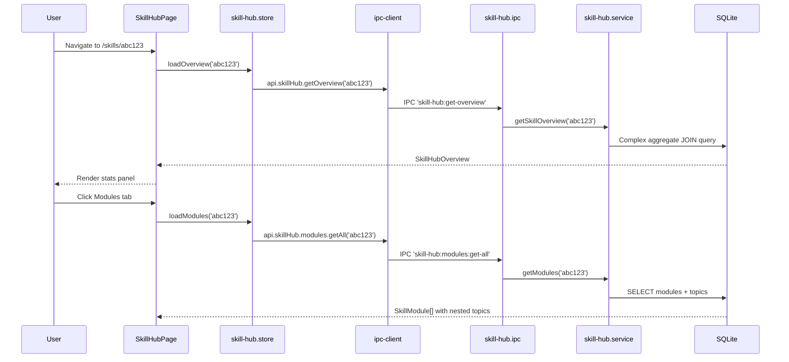

# Module: Skill Hub

## Purpose

The Skill Hub is a per-skill deep-dive management centre, accessed at `/skills/:skillId`. When a user clicks a skill card, they enter the Skill Hub which aggregates all information about that skill: learning modules, external resources, quiz system, experience log, and links to all related entities (labs, projects, certifications, interview questions, videos, related skills).

## Features

- Skill overview: proficiency level, status, years experience, category, aggregate stats
- **Modules tab:** Ordered learning modules (topics within a module), completion tracking, hours spent
- **Resources tab:** External learning resources with provider, difficulty, estimated hours, completion flag
- **Quiz tab:** Flashcard/MCQ/scenario questions with answer reveal, accuracy tracking, attempt stats
- **Experience Log tab:** Date-stamped work experience entries with hours and lessons learned
- **Home Labs tab:** All labs linked to this skill
- **Projects tab:** All projects linked to this skill
- **Certifications tab:** All certifications linked to this skill
- **Interview Prep tab:** All interview questions tagged to this skill
- **Videos tab:** All videos tagged to this skill
- **Related Skills tab:** Other skills in the same category
- **Roadmap tab:** Career Intelligence roadmaps that include this skill
- **Study Sessions tab:** Study sessions logged against this skill
- All data aggregated into a single `getOverview` endpoint for stats panel

## Database Tables

### `skill_modules`
| Column | Type | Constraints |
|---|---|---|
| id | TEXT | PRIMARY KEY |
| skill_id | TEXT | NOT NULL FK → skills CASCADE |
| title | TEXT | NOT NULL |
| description | TEXT | nullable |
| order_index | INTEGER | DEFAULT 0 |
| is_complete | INTEGER | CHECK: 0/1 |
| hours_spent | REAL | DEFAULT 0 |
| notes | TEXT | nullable |
| completed_at | TEXT | nullable |

### `skill_module_topics`
| Column | Type | Constraints |
|---|---|---|
| id | TEXT | PRIMARY KEY |
| module_id | TEXT | NOT NULL FK → skill_modules CASCADE |
| title | TEXT | NOT NULL |
| is_complete | INTEGER | CHECK: 0/1 |
| order_index | INTEGER | DEFAULT 0 |

### `skill_resources`
| Column | Type | Constraints |
|---|---|---|
| id | TEXT | PRIMARY KEY |
| skill_id | TEXT | NOT NULL FK → skills CASCADE |
| title | TEXT | NOT NULL |
| provider | TEXT | CHECK: youtube/microsoft-learn/udemy/linkedin/pluralsight/blog/docs/pdf/other |
| url | TEXT | nullable |
| difficulty | TEXT | beginner/intermediate/advanced |
| est_hours | REAL | DEFAULT 0 |
| notes | TEXT | nullable |
| is_completed | INTEGER | CHECK: 0/1 |
| order_index | INTEGER | DEFAULT 0 |

### `skill_experience_log`
| Column | Type | Constraints |
|---|---|---|
| id | TEXT | PRIMARY KEY |
| skill_id | TEXT | NOT NULL FK → skills CASCADE |
| date | TEXT | NOT NULL DEFAULT date('now') |
| task | TEXT | NOT NULL |
| hours | REAL | NOT NULL DEFAULT 0 |
| what_learned | TEXT | nullable |

### `skill_quiz_questions`
| Column | Type | Constraints |
|---|---|---|
| id | TEXT | PRIMARY KEY |
| skill_id | TEXT | NOT NULL FK → skills CASCADE |
| question | TEXT | NOT NULL |
| type | TEXT | CHECK: flashcard/mcq/scenario |
| answer | TEXT | nullable |
| options_json | TEXT | nullable (JSON array for MCQ) |
| explanation | TEXT | nullable |
| difficulty | TEXT | easy/medium/hard |
| order_index | INTEGER | DEFAULT 0 |

### `skill_quiz_attempts`
| Column | Type | Constraints |
|---|---|---|
| id | TEXT | PRIMARY KEY |
| skill_id | TEXT | FK → skills CASCADE |
| question_id | TEXT | FK → skill_quiz_questions SET NULL |
| is_correct | INTEGER | CHECK: 0/1 |
| time_taken_s | INTEGER | nullable |
| attempt_date | TEXT | DEFAULT date('now') |

Junction tables: `project_skills`, `certification_skills`, `interview_question_skills`, `home_lab_skills`, `video_skills`

## IPC Channels

| Channel | Action |
|---|---|
| `skill-hub:get-overview` | Aggregate stats for a skill |
| `skill-hub:modules:get-all` | Ordered modules with topics |
| `skill-hub:modules:create` | Add module |
| `skill-hub:modules:update` | Update module |
| `skill-hub:modules:delete` | Delete module |
| `skill-hub:modules:reorder` | Reorder modules |
| `skill-hub:module-topics:create` | Add topic to module |
| `skill-hub:module-topics:update` | Update topic |
| `skill-hub:module-topics:delete` | Delete topic |
| `skill-hub:resources:get-all` | Resources for skill |
| `skill-hub:resources:create/update/delete` | Resource CRUD |
| `skill-hub:experience-log:get-all` | Experience entries for skill |
| `skill-hub:experience-log:create/update/delete` | Experience CRUD |
| `skill-hub:quiz-questions:get-all` | Quiz questions for skill |
| `skill-hub:quiz-questions:create/update/delete` | Quiz CRUD |
| `skill-hub:quiz-attempts:log` | Log quiz attempt |
| `skill-hub:quiz-attempts:get-stats` | Accuracy stats for skill |
| `skill-hub:linked-labs:get-all` | Labs linked to skill |
| `skill-hub:linked-labs:link/unlink` | Manage lab links |
| `skill-hub:linked-projects:get-all` | Projects linked to skill |
| `skill-hub:linked-projects:link/unlink` | Manage project links |
| `skill-hub:linked-certifications:get-all` | Certs linked to skill |
| `skill-hub:linked-certifications:link/unlink` | Manage cert links |
| `skill-hub:linked-interview-questions:get-all` | Interview Qs for skill |
| `skill-hub:linked-interview-questions:link/unlink` | Manage question links |
| `skill-hub:linked-videos:get-all` | Videos tagged to skill |
| `skill-hub:related-skills:get-all` | Same-category skills |

## Service Functions

**File:** `electron/services/skill-hub/skill-hub.service.ts`

- `getSkillOverview(skillId)` — complex JOIN query aggregating all skill stats
- `getModules(skillId)` — ordered modules with topics nested
- `createModule / updateModule / deleteModule / reorderModules`
- `createTopic / updateTopic / deleteTopic`
- `getResources / createResource / updateResource / deleteResource`
- `getExperienceLog / createEntry / updateEntry / deleteEntry`
- `getQuizQuestions / createQuestion / updateQuestion / deleteQuestion`
- `logQuizAttempt(data)` — INSERT into skill_quiz_attempts
- `getQuizStats(skillId)` — aggregate correct/total counts
- `getLinkedLabs / linkLab / unlinkLab` — manage home_lab_skills
- `getLinkedProjects / linkProject / unlinkProject` — manage project_skills
- `getLinkedCertifications / linkCert / unlinkCert` — manage certification_skills
- `getLinkedInterviewQuestions / linkQuestion / unlinkQuestion` — manage interview_question_skills
- `getLinkedVideos(skillId)` — videos via video_skills join
- `getRelatedSkills(skillId)` — skills with same category_id

## State Management

**File:** `src/features/skill-hub/store/skill-hub.store.ts`

```typescript
interface SkillHubState {
  overview: SkillHubOverview | null
  modules: SkillModule[]
  resources: SkillResource[]
  experienceLog: SkillExperienceEntry[]
  quizQuestions: SkillQuizQuestion[]
  quizStats: QuizAttemptStats | null
  linkedLabs: LinkedLab[]
  linkedProjects: LinkedProject[]
  linkedCertifications: LinkedCertification[]
  linkedInterviewQuestions: LinkedInterviewQuestion[]
  linkedVideos: LinkedVideo[]
  relatedSkills: RelatedSkill[]
  isLoading: boolean
  currentSkillId: string | null
  // all CRUD + link actions...
}
```

## Data Flow



## UI Components

| Component | File | Role |
|---|---|---|
| `SkillHubPage` | `components/SkillHubPage.tsx` | Tabbed container for all skill sub-features |
| `OverviewTab` | `components/tabs/OverviewTab.tsx` | Stats panel: progress bars, counts |
| `StudySessionsTab` | `components/tabs/StudySessionsTab.tsx` | Study sessions logged for this skill |
| `ResourcesTab` | `components/tabs/ResourcesTab.tsx` | Learning resources list |
| `ExperienceLogTab` | `components/tabs/ExperienceLogTab.tsx` | Work experience entries |
| `QuizTab` | `components/tabs/QuizTab.tsx` | Quiz flashcards with answer reveal |
| `HomeLabsTab` | `components/tabs/HomeLabsTab.tsx` | Linked labs |
| `ProjectsTab` | `components/tabs/ProjectsTab.tsx` | Linked projects |
| `CertificationsTab` | `components/tabs/CertificationsTab.tsx` | Linked certifications |
| `InterviewPrepTab` | `components/tabs/InterviewPrepTab.tsx` | Linked interview questions |
| `VideosTab` | `components/tabs/VideosTab.tsx` | Videos tagged to skill |
| `RelatedSkillsTab` | `components/tabs/RelatedSkillsTab.tsx` | Related skills by category |
| `RoadmapTab` | `components/tabs/RoadmapTab.tsx` | Roadmaps referencing this skill |

## Dependencies

- **Skills** — Skill Hub is the deep-dive for a specific skill
- **Home Labs** — linked via home_lab_skills
- **Projects** — linked via project_skills
- **Certifications** — linked via certification_skills
- **Interview Bank** — linked via interview_question_skills
- **Videos** — linked via video_skills
- **Career Intelligence** — roadmap_skills may reference skills
- **Learning Coach** — study sessions aggregated in overview

## User Workflow

1. From the Skills page, click any skill card
2. Skill Hub opens at the Overview tab
3. See aggregate stats: total modules, hours studied, labs, projects, etc.
4. Switch to **Modules** tab: create a learning curriculum for the skill
5. Switch to **Resources** tab: add books, videos, courses with links
6. Switch to **Experience Log**: record daily work/practice
7. Switch to **Quiz** tab: create flashcards or MCQ questions; practice them
8. Switch to **Labs / Projects / Certifications**: link or view related entities

## Known Limitations

- The Roadmap tab in the Skill Hub queries career roadmaps for this skill — implementation detail requires verification
- Linking videos from the Skill Hub only supports viewing (read-only from video_skills; video tagging is done from the Videos module)
- Quiz MCQ options_json requires manual JSON formatting

## Future Roadmap

- Skill progress timeline graph
- Automated study session logging from timer
- Quiz mode with scoring and session history
- Skill export as portfolio entry
