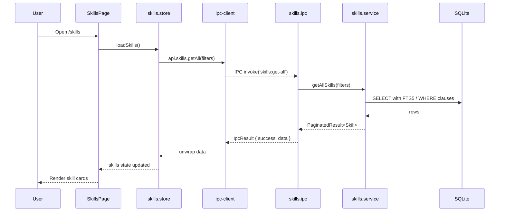

# Module: Skills

## Purpose

The Skills module is the foundational entity in CareerOS. It maintains an inventory of technical and professional skills, organised by category, with proficiency levels and status tracking. Skills are the central hub that most other modules link to (projects, certifications, labs, videos, roadmaps, interview questions).

## Features

- Create, edit, and delete skills with full metadata
- Categorise skills into 10 seeded categories (Programming Languages, Frontend, Backend, Databases, DevOps & Cloud, Mobile, AI & ML, Architecture, Tools & Workflow, Soft Skills)
- Track proficiency level: `beginner` → `intermediate` → `advanced` → `expert`
- Track status: `learning` → `practicing` → `proficient` → `mastered`
- Record years of experience (decimal, e.g. 2.5)
- Soft delete (skills with linked data are preserved via `deleted_at`)
- Full-text search via FTS5 (name, description, notes)
- Tag skills with cross-module tags
- Manage skill categories with colour and icon
- Public/private flag for portfolio visibility
- Pagination (24 per page)
- Filter by category, status, proficiency level
- Navigate to Skill Hub (deep-dive) via `/skills/:skillId`

## Database Tables

### `skills`
| Column | Type | Constraints |
|---|---|---|
| id | TEXT | PRIMARY KEY |
| name | TEXT | NOT NULL |
| slug | TEXT | NOT NULL UNIQUE |
| description | TEXT | nullable |
| category_id | TEXT | NOT NULL, FK → skill_categories |
| proficiency_level | TEXT | CHECK: beginner/intermediate/advanced/expert |
| status | TEXT | CHECK: learning/practicing/proficient/mastered |
| years_experience | REAL | DEFAULT 0.0 |
| notes | TEXT | nullable |
| is_public | INTEGER | CHECK: 0/1, DEFAULT 1 |
| created_at | TEXT | ISO8601 |
| updated_at | TEXT | ISO8601 |
| deleted_at | TEXT | nullable (soft delete) |

Indexes: category_id, status, proficiency_level, active (partial where deleted_at IS NULL)

### `skill_categories`
| Column | Type | Constraints |
|---|---|---|
| id | TEXT | PRIMARY KEY |
| name | TEXT | NOT NULL |
| description | TEXT | nullable |
| color_hex | TEXT | DEFAULT '#6B7280' |
| icon | TEXT | nullable |
| parent_id | TEXT | FK → skill_categories (self-referential) |
| order_index | INTEGER | DEFAULT 0 |

10 categories seeded in migration 003.

### `skills_fts` (virtual)
FTS5 virtual table over `skills(name, description, notes)` with unicode61 tokenizer. Maintained by INSERT/UPDATE/DELETE triggers.

### `entity_tags` (shared)
Links tags to skills via `entity_type = 'skill'`.

### `skill_documents`
Links documents directly to a skill (migration 004).

## IPC Channels

| Channel | Action |
|---|---|
| `skills:get-all` | Paginated list with filters |
| `skills:get-by-id` | Single skill by ID |
| `skills:create` | Create new skill |
| `skills:update` | Update skill fields |
| `skills:delete` | Soft delete skill |
| `skill-categories:get-all` | All categories |
| `skill-categories:create` | Create category |
| `skill-categories:update` | Update category |
| `skill-categories:delete` | Delete category |

## Service Functions

**File:** `electron/services/skills/skills.service.ts`

Key functions (inferred from IPC handlers):
- `getAllSkills(filters)` — paginated query with optional category/status/proficiency filters, FTS search
- `getSkillById(id)` — single skill with category join
- `createSkill(data)` — insert with nanoid, generate slug from name
- `updateSkill(id, data)` — partial update with `updated_at` refresh
- `deleteSkill(id)` — set `deleted_at` timestamp (soft delete)
- `getAllCategories()` — ordered list of categories
- `createCategory(data)` — insert new category
- `updateCategory(id, data)` — update category fields
- `deleteCategory(id)` — delete category (RESTRICT prevents deletion if skills exist)

## State Management

**Files:**
- `src/features/skills/store/skills.store.ts`
- `src/features/skills/store/categories.store.ts`

```typescript
interface SkillsState {
  skills: Skill[]
  total: number
  page: number
  isLoading: boolean
  error: string | null
  filters: SkillFilters
  loadSkills: () => Promise<void>
  createSkill: (data: CreateSkillInput) => Promise<void>
  updateSkill: (id: string, data: UpdateSkillInput) => Promise<void>
  deleteSkill: (id: string) => Promise<void>
  setFilters: (filters: Partial<SkillFilters>) => void
}

interface CategoriesState {
  categories: SkillCategory[]
  isLoading: boolean
  loadCategories: () => Promise<void>
  createCategory: (data: CreateSkillCategoryInput) => Promise<void>
  updateCategory: (id: string, data: UpdateSkillCategoryInput) => Promise<void>
  deleteCategory: (id: string) => Promise<void>
}
```

## Data Flow



## UI Components

| Component | File | Role |
|---|---|---|
| `SkillsPage` | `components/SkillsPage.tsx` | Main page: filter bar, skill grid, create button |
| `SkillCard` | `components/SkillCard.tsx` | Individual skill card with level/status badges |
| `SkillForm` | `components/SkillForm.tsx` | Create/edit form (React Hook Form + Zod) |
| `SkillFilters` | `components/SkillFilters.tsx` | Filter panel (category, status, proficiency) |
| `SkillLevelBadge` | `components/SkillLevelBadge.tsx` | Colour-coded proficiency badge |
| `SkillStatusBadge` | `components/SkillStatusBadge.tsx` | Colour-coded status badge |
| `DeleteSkillDialog` | `components/DeleteSkillDialog.tsx` | Confirmation dialog before soft delete |

## Dependencies

- **Tags** — entity_tags links tags to skills
- **Skill Hub** — navigates to `/skills/:skillId` for deep-dive
- **Career Intelligence** — skill_progress extends skills
- **Learning Coach** — retention_records and skill_dependencies reference skills
- **Projects, Certifications, Videos, Home Labs** — all reference skills via junction tables

## User Workflow

1. Navigate to **Skills** in the Career OS sidebar group
2. View all skills as cards with level and status badges
3. Click **Add Skill** to open the creation form
4. Select a category, set proficiency and status, optionally add description and notes
5. Save — skill appears in the grid immediately
6. Click a skill card to open **Skill Hub** (deep-dive per-skill management)
7. Use the filter bar to narrow by category, status, or proficiency
8. Use the search bar for full-text search (name, description, notes)

## Known Limitations

- Skills cannot be merged or deduplicated through the UI
- The slug is generated at creation time and cannot be changed
- Bulk import/export of skills is not implemented
- The `is_public` flag is stored but not used for any export or sharing feature

## Future Roadmap

- Bulk CSV import of skills
- Skill comparison view (side-by-side)
- Export skills to LinkedIn or resume format
- AI-powered skill gap analysis given a job description
- Skill endorsements or evidence links
