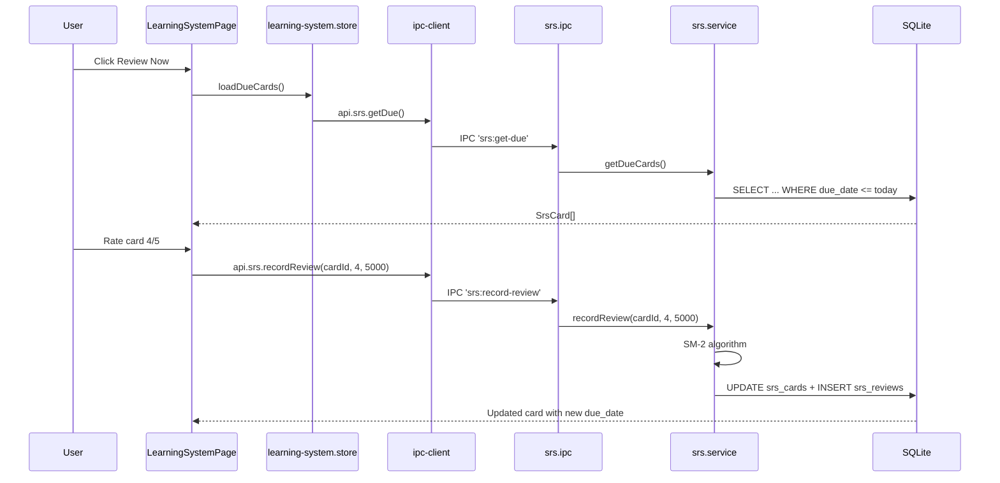

# Module: SRS & Recall (Learning System)

## Purpose

The SRS (Spaced Repetition System) module implements the SM-2 algorithm at the flashcard level. Cards can be created from interview questions, notes, skills, documents, scenarios, or custom content. The module also includes a Feynman Technique entry system for testing conceptual understanding through explanation.

## Features

- Create SRS flashcards manually or bulk-generate from interview questions / notes
- Card types: `note`, `interview_question`, `skill`, `document`, `scenario`, `custom`
- SM-2 algorithm: interval_days, ease_factor, repetitions, due_date, retention_score
- Review queue: cards due today, upcoming cards
- Rate reviews: 0-5 (Again/Hard/Good/Easy/Perfect)
- Suspend/unsuspend cards
- Review history per card
- Aggregate stats: total cards, due today, learning/review counts, avg retention
- Bulk import: create cards from all interview questions or all notes in one action
- **Feynman Technique entries:** Write an explanation of a concept in simple language, identify gaps, write a revised explanation, rate understanding 0-10
- Feynman entries can be linked to any entity (entity_type + entity_id)

## Database Tables

### `srs_cards`
| Column | Type | Constraints |
|---|---|---|
| id | TEXT | PRIMARY KEY |
| entity_type | TEXT | CHECK: note/interview_question/skill/document/scenario/custom |
| entity_id | TEXT | NOT NULL (ID of source entity) |
| front | TEXT | NOT NULL (question/prompt) |
| back | TEXT | NOT NULL (answer) |
| interval_days | INTEGER | DEFAULT 1 |
| ease_factor | REAL | DEFAULT 2.5 |
| repetitions | INTEGER | DEFAULT 0 |
| due_date | TEXT | DEFAULT date('now') |
| last_review_at | TEXT | nullable |
| retention_score | REAL | DEFAULT 0.0 |
| is_suspended | INTEGER | CHECK: 0/1 |
| created_at | TEXT | ISO8601 |
| updated_at | TEXT | ISO8601 |

Indexes: due_date (partial where not suspended), entity (entity_type, entity_id)

### `srs_reviews`
| Column | Type | Constraints |
|---|---|---|
| id | TEXT | PRIMARY KEY |
| card_id | TEXT | NOT NULL FK → srs_cards CASCADE |
| rating | INTEGER | CHECK: 0-5 |
| time_spent_ms | INTEGER | DEFAULT 0 |
| reviewed_at | TEXT | ISO8601 |

Indexes: card_id, reviewed_at

### `feynman_entries`
| Column | Type | Constraints |
|---|---|---|
| id | TEXT | PRIMARY KEY |
| topic | TEXT | NOT NULL |
| entity_type | TEXT | nullable |
| entity_id | TEXT | nullable |
| explanation | TEXT | NOT NULL (first attempt) |
| gaps_identified | TEXT | nullable |
| revised_explanation | TEXT | nullable |
| understanding_score | INTEGER | CHECK: 0-10 |
| created_at | TEXT | ISO8601 |
| updated_at | TEXT | ISO8601 |

## IPC Channels

| Channel | Action |
|---|---|
| `srs:get-due` | Cards due for review (limit optional) |
| `srs:get-upcoming` | Upcoming cards in next N days |
| `srs:get-all` | All cards (optionally filtered by entity_type/entity_id) |
| `srs:get-by-id` | Single card |
| `srs:create` | Create card manually |
| `srs:update` | Update card (front/back/is_suspended) |
| `srs:record-review` | Record review and apply SM-2 algorithm |
| `srs:delete` | Delete card |
| `srs:get-review-history` | All reviews for a card |
| `srs:get-stats` | Aggregate stats |
| `srs:bulk-from-interview` | Bulk create from all interview questions |
| `srs:bulk-from-notes` | Bulk create from all notes |
| `feynman:get-all` | All Feynman entries |
| `feynman:create` | Create entry |
| `feynman:update` | Update entry |
| `feynman:delete` | Delete entry |

## Service Functions

**File:** `electron/services/srs/srs.service.ts`

- `getDueCards(limit)` — SELECT WHERE due_date <= date('now') AND is_suspended = 0
- `getUpcomingCards(days)` — SELECT WHERE due_date <= date('now', '+N days')
- `getAllCards(entityType?, entityId?)` — optionally filtered
- `createCard(data)` — insert with SM-2 defaults
- `recordReview(cardId, rating, timeSpentMs)` — SM-2 algorithm:
  - If rating >= 3: `ease_factor = ease_factor + (0.1 - (5-rating)*(0.08+(5-rating)*0.02))`, `interval *= ease_factor`, `repetitions++`
  - If rating < 3: `interval = 1`, `repetitions = 0`
  - Clamp ease_factor >= 1.3
  - Set due_date = date('now', `+interval days`)
  - Insert into srs_reviews
- `bulkFromInterview()` — SELECT interview_questions, INSERT srs_cards if not exists
- `bulkFromNotes()` — SELECT notes, INSERT srs_cards if not exists

## State Management

**File:** `src/features/learning-system/store/learning-system.store.ts`

```typescript
interface LearningSystemState {
  dueCards: SrsCard[]
  upcomingCards: SrsCard[]
  allCards: SrsCard[]
  stats: SrsStats | null
  feynmanEntries: FeynmanEntry[]
  isLoading: boolean
  loadDueCards: () => Promise<void>
  recordReview: (cardId: string, rating: number, timeSpentMs: number) => Promise<void>
  createCard: (data: CreateCardInput) => Promise<void>
  deleteCard: (id: string) => Promise<void>
  bulkFromInterview: () => Promise<void>
  bulkFromNotes: () => Promise<void>
  loadFeynmanEntries: () => Promise<void>
  createFeynmanEntry: (data: CreateFeynmanInput) => Promise<void>
  updateFeynmanEntry: (id: string, data: UpdateFeynmanInput) => Promise<void>
  deleteFeynmanEntry: (id: string) => Promise<void>
}
```

## Data Flow



## UI Components

| Component | File | Role |
|---|---|---|
| `LearningSystemPage` | `components/LearningSystemPage.tsx` | Review queue, card browser, stats, Feynman entries, bulk import |

## Dependencies

- **Notes** — bulk-from-notes creates cards from notes
- **Interview Bank** — bulk-from-interview creates cards from questions
- **Knowledge Vault / Documents** — entity_type='document' cards can reference documents

## User Workflow

1. Navigate to **SRS & Recall** in the Learning OS sidebar
2. Due cards appear in the review queue
3. Click **Bulk Import from Interview Questions** or **from Notes** to populate deck
4. Review cards: flip front → back, rate 0-5
5. SM-2 schedules next review date automatically
6. Use **Feynman** tab to explain a concept in simple terms, identify gaps, revise
7. Check stats to see deck health (retention score, streak)

## Known Limitations

- Bulk import creates duplicate cards if called multiple times (no idempotency check visible — requires service code verification)
- SM-2 does not consider spaced repetition within a single session (all due cards treated equally)
- No rich text in card front/back (plain text only)
- Feynman entries are not linked to SRS cards

## Future Roadmap

- Card templates (cloze deletion, image occlusion)
- Deck organisation (tags, folders)
- Study streak tracking
- Import/export to Anki format
- Connect Feynman entries to SRS cards automatically
