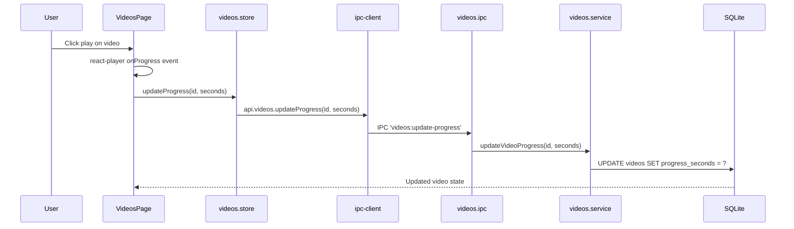

# Module: Videos

## Purpose

The Videos module is a curated video learning library. Users add videos from YouTube, Vimeo, Udemy, Coursera, Pluralsight, or local files. Progress is tracked per video, and videos can be linked to skills and organised into playlists.

## Features

- Add videos from YouTube, Vimeo, Udemy, Coursera, Pluralsight, local file, or other
- Track watch status: `unwatched` → `watching` → `completed` → `revisit`
- Track progress in seconds (synced during playback)
- Store duration, channel, publish date, and thumbnail
- Play videos inline with react-player (YouTube/Vimeo embed, local file via Electron)
- Link videos to skills (many-to-many)
- Tag videos with cross-module tags
- Full-text search via FTS5 (title, description, channel, notes)
- Filter by watch status, source
- Soft delete
- Pagination

## Database Tables

### `videos`
| Column | Type | Constraints |
|---|---|---|
| id | TEXT | PRIMARY KEY |
| title | TEXT | NOT NULL |
| description | TEXT | nullable |
| url | TEXT | nullable (remote URL) |
| local_path | TEXT | nullable (local file) |
| source | TEXT | CHECK: youtube/vimeo/udemy/coursera/pluralsight/local/other |
| channel | TEXT | nullable |
| duration_seconds | INTEGER | nullable |
| watch_status | TEXT | CHECK: unwatched/watching/completed/revisit |
| progress_seconds | INTEGER | DEFAULT 0 |
| thumbnail_path | TEXT | nullable |
| published_at | TEXT | nullable ISO8601 |
| notes | TEXT | nullable |
| created_at | TEXT | ISO8601 |
| updated_at | TEXT | ISO8601 |
| deleted_at | TEXT | nullable |

Indexes: watch_status, source, created_at (partial on active)

### `video_skills`
| Column | Type | Constraints |
|---|---|---|
| video_id | TEXT | PK composite, FK → videos |
| skill_id | TEXT | PK composite, FK → skills |

### `videos_fts` (virtual)
FTS5 over `videos(title, description, channel, notes)`.

## IPC Channels

| Channel | Action |
|---|---|
| `videos:get-all` | Paginated list with filters |
| `videos:get-by-id` | Single video |
| `videos:create` | Create video record |
| `videos:update` | Update video metadata |
| `videos:delete` | Soft delete |
| `videos:update-progress` | Update progress_seconds |

## Service Functions

**File:** `electron/services/videos/videos.service.ts`

- `getAllVideos(filters)` — paginated with status/source filter and FTS
- `getVideoById(id)` — single video with skills joined
- `createVideo(data)` — insert record
- `updateVideo(id, data)` — update metadata
- `deleteVideo(id)` — soft delete
- `updateVideoProgress(id, seconds)` — update progress_seconds, set watch_status to 'watching' if > 0; 'completed' if >= duration

## State Management

**File:** `src/features/videos/store/videos.store.ts`

```typescript
interface VideosState {
  videos: Video[]
  total: number
  isLoading: boolean
  filters: VideoFilters
  loadVideos: () => Promise<void>
  createVideo: (data: CreateVideoInput) => Promise<void>
  updateVideo: (id: string, data: UpdateVideoInput) => Promise<void>
  deleteVideo: (id: string) => Promise<void>
  updateProgress: (id: string, seconds: number) => Promise<void>
}
```

## Data Flow



## UI Components

| Component | File | Role |
|---|---|---|
| `VideosPage` | `components/VideosPage.tsx` | Main page: video grid, player panel, filters |

## Dependencies

- **Skills** — video_skills junction table
- **Tags** — entity_tags
- **Playlists** — playlist_items can reference video_id
- **Skill Hub** — linked videos tab

## User Workflow

1. Navigate to **Videos** in the Knowledge sidebar group
2. Click **Add Video** and paste a YouTube/Vimeo URL or import a local file
3. The video appears in the library
4. Click the video to open the inline player
5. Watch progress is tracked automatically
6. Mark as `completed` or `revisit` as needed
7. Link the video to a skill from the edit form

## Known Limitations

- Thumbnail for YouTube videos must be manually entered (no auto-fetch via API)
- Local video files must be within the CareerOS data directory or accessible by file path
- No speed control in the embedded player (browser/react-player default)
- CSP allows YouTube/Vimeo/Googlevideo frame embeds but restricts other sources

## Future Roadmap

- YouTube Data API integration to auto-fill metadata (title, description, duration, thumbnail)
- Timestamp bookmarks within videos
- Note-taking panel alongside the video player
- Import YouTube playlist as video records
