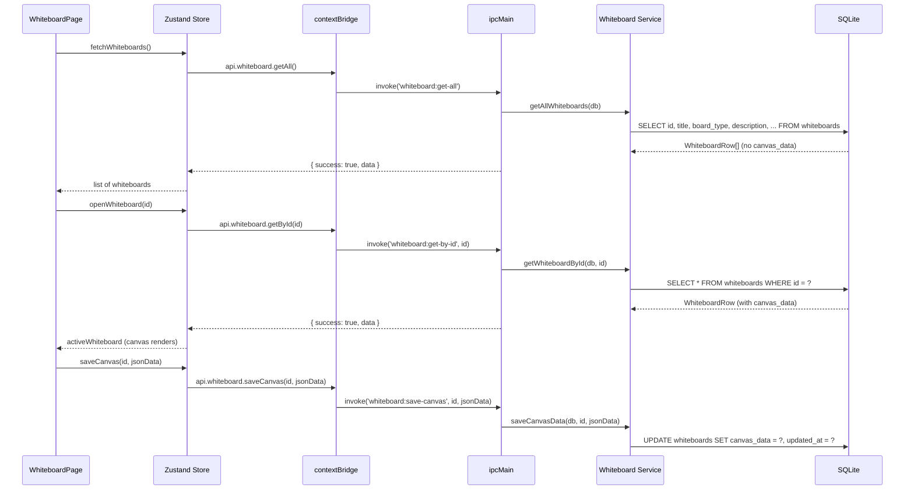

# Whiteboard Module

## Purpose

The Whiteboard module provides free-form visual drawing canvases where users can sketch diagrams, network topologies, system architectures, mind maps, or any other visual content. Each whiteboard stores its canvas state as a JSON blob and can be linked to other CareerOS entities (skills, projects, labs, etc.) for cross-referencing.

---

## Features

- Create multiple named whiteboards with optional description
- Board types: `free-drawing` (default); additional types are stored as plain strings (not constrained)
- Canvas state persisted as JSON including version, background color, zoom level, pan offset, and elements array
- Default canvas background: `#1e1e2e` (dark theme)
- Entity links: attach a whiteboard to any number of existing entities (skill, project, lab, document, video, etc.) by `entity_type` + `entity_id`
- Duplicate links are prevented by UNIQUE constraint; re-linking an existing pair silently returns the existing record
- Save canvas data separately from metadata updates (two distinct IPC channels)
- Full CRUD on whiteboard records

---

## Database Tables

| Table | Key Columns | Notes |
|---|---|---|
| `whiteboards` | `id`, `title`, `board_type`, `description`, `canvas_data` (TEXT JSON), `created_at`, `updated_at` | No soft-delete; deletion is permanent |
| `whiteboard_links` | `id`, `whiteboard_id` → `whiteboards`, `entity_type`, `entity_id`, `created_at` | UNIQUE(whiteboard_id, entity_type, entity_id) |

**Indexes:** `idx_whiteboard_links_whiteboard`, `idx_whiteboard_links_entity`

**Migration:** `017_whiteboard`

---

## IPC Channels

```
WHITEBOARD
  whiteboard:get-all       — list all whiteboards (metadata only, no canvas_data)
  whiteboard:get-by-id     — single whiteboard with full canvas_data
  whiteboard:create        — create new whiteboard
  whiteboard:update        — update title / board_type / description
  whiteboard:delete        — hard delete
  whiteboard:save-canvas   — save canvas_data JSON blob

WHITEBOARD.LINKS
  whiteboard:links:get     — get all entity links for a whiteboard
  whiteboard:links:add     — add entity link (idempotent)
  whiteboard:links:remove  — remove entity link
```

---

## Service Functions

Located at `electron/services/whiteboard/whiteboard.service.ts`.

| Function | Purpose |
|---|---|
| `getAllWhiteboards` | SELECT all whiteboards, excluding `canvas_data` for performance |
| `getWhiteboardById` | SELECT single whiteboard including full `canvas_data` |
| `createWhiteboard` | INSERT with default canvas JSON; accepts `title`, `board_type`, `description` |
| `updateWhiteboard` | Dynamic SET builder for partial updates |
| `deleteWhiteboard` | Hard DELETE |
| `saveCanvasData` | UPDATE `canvas_data` + `updated_at` only; separate from metadata update |
| `getLinks` | SELECT all links for a whiteboard |
| `addLink` | Check for existing link first; if none, INSERT new link |
| `removeLink` | DELETE by `whiteboard_id` + `entity_type` + `entity_id` |

---

## State Management

Store location: `src/features/whiteboard/store/`

State shape (inferred from component usage):

```typescript
interface WhiteboardState {
  whiteboards: WhiteboardRow[]
  activeWhiteboard: WhiteboardRow | null
  links: WhiteboardLinkRow[]
  isLoading: boolean
  isSaving: boolean
  error: string | null

  // Actions
  fetchWhiteboards: () => Promise<void>
  openWhiteboard: (id: string) => Promise<void>
  createWhiteboard: (params: { title: string; board_type?: string; description?: string | null }) => Promise<void>
  updateWhiteboard: (id: string, params: { title?: string; board_type?: string; description?: string | null }) => Promise<void>
  deleteWhiteboard: (id: string) => Promise<void>
  saveCanvas: (id: string, canvasData: string) => Promise<void>
  fetchLinks: (whiteboardId: string) => Promise<void>
  addLink: (whiteboardId: string, entityType: string, entityId: string) => Promise<void>
  removeLink: (whiteboardId: string, entityType: string, entityId: string) => Promise<void>
}
```

---

## Data Flow



---

## UI Components

Located at `src/features/whiteboard/components/`:

| Component | Role |
|---|---|
| `WhiteboardPage.tsx` | Root page; renders the list of whiteboards and opens the active canvas |
| `WhiteboardCard.tsx` | Card in the list view showing title, board type, and last updated date |
| `WhiteboardForm.tsx` | Create/edit form for whiteboard title, type, and description |
| `WhiteboardCanvas.tsx` | The drawing canvas; handles rendering elements, pan/zoom, and touch/mouse input |
| `ToolBar.tsx` | Drawing tool selection (pen, shapes, text, eraser, etc.) |
| `ShapeLibrary.tsx` | Palette for inserting preset shapes or symbols |
| `PropertyPanel.tsx` | Right-side panel for editing selected element properties |
| `LinkPanel.tsx` | Panel for viewing and managing entity links attached to the whiteboard |

---

## Dependencies

- No other CareerOS module depends on the Whiteboard module
- Entity links reference entities from Skills, Projects, Home Labs, Documents, Videos, Certifications, Notes, but the links are stored as opaque `(entity_type, entity_id)` pairs — no FK enforcement

---

## User Workflow

1. Navigate to **Whiteboard** (`/whiteboard`)
2. Click **New Whiteboard** and enter a title and optional description
3. The whiteboard opens in the canvas editor
4. Select drawing tools from the ToolBar and draw freely on the canvas
5. Insert preset shapes from the Shape Library
6. Select drawn elements to edit their color, size, or label via the Property Panel
7. Optionally open the Link Panel to associate the whiteboard with a project or skill
8. The canvas is saved explicitly (Save button) or on navigation away
9. Return to the whiteboard list to create additional boards or open existing ones

---

## Known Limitations

- Canvas data is stored as a plain JSON TEXT column — there is no size limit enforced in the schema; very large canvases could grow the database significantly
- No collaborative editing
- No canvas export to image (PNG/SVG/PDF)
- No version history for canvas state
- Board type is not enforced by a CHECK constraint (the `DEFAULT 'free-drawing'` is advisory only)
- Not determined from source: the exact rendering library used for the canvas (custom SVG, Konva, Fabric, or similar)

---

## Future Roadmap

- Export canvas as PNG or SVG
- Canvas history (undo/redo with snapshots)
- Template library (network diagram, system architecture, mind map starters)
- Embed whiteboard within a project or lab record
- Collaborative drawing (out of scope for local-first v1)
