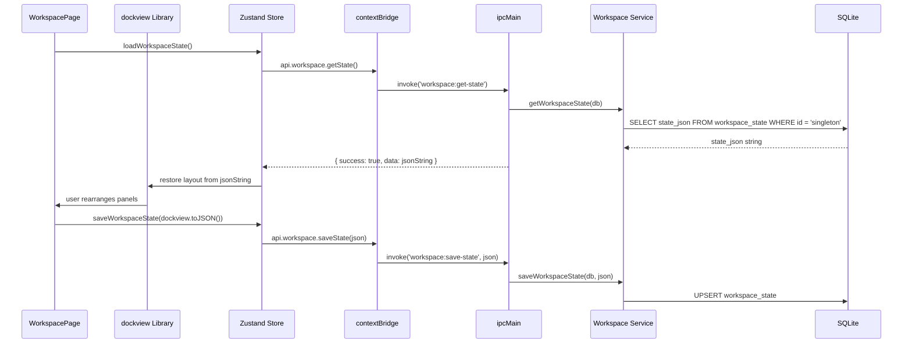

# Workspace Module

## Purpose

The Workspace module provides a flexible multi-panel desktop environment powered by **dockview** (a React dockable panel library). It lets users arrange multiple CareerOS views simultaneously in a split-pane layout — for example, viewing notes alongside a video alongside a skill record. The workspace state is persisted as a single JSON blob in the database so the layout is restored on next launch. A secondary floating window can be opened for always-on-top reference.

---

## Features

- Dockable, resizable panel layout using the `dockview` library
- Multiple panels open simultaneously, each rendering any CareerOS module
- Workspace state persisted as a singleton JSON blob (`workspace_state` table)
- Save and restore layout on next application launch
- Floating window support: launch a secondary Electron `BrowserWindow` at specified display coordinates for always-on-top overlay use
- Get available displays (for floating window positioning)

---

## Database Tables

| Table | Key Columns | Notes |
|---|---|---|
| `workspace_state` | `id` (always `'singleton'`), `state_json` (TEXT), `updated_at` | Single-row table; INSERT OR CONFLICT DO UPDATE pattern |

**Migration:** `010_workspace_playlists` (co-located with Playlists migration)

---

## IPC Channels

```
WORKSPACE
  workspace:get-state            — retrieve the saved JSON state blob
  workspace:save-state           — persist a new JSON state blob
  workspace:open-floating-window — launch a secondary BrowserWindow
  workspace:get-displays         — enumerate available displays/screens
```

---

## Service Functions

Located at `electron/services/workspace/workspace.service.ts`.

| Function | Purpose |
|---|---|
| `getWorkspaceState` | SELECT `state_json` from `workspace_state` where `id = 'singleton'`; returns `'{}'` if not found |
| `saveWorkspaceState` | UPSERT `workspace_state` — INSERT or UPDATE on conflict |

The floating window and display enumeration logic lives in the IPC handler (`electron/ipc/workspace.ipc.ts`) rather than the service, as it uses Electron's `BrowserWindow` and `screen` APIs directly.

---

## State Management

Store location: `src/features/workspace/store/`

State shape (inferred from component usage):

```typescript
interface WorkspaceState {
  stateJson: string | null
  isLoading: boolean
  isSaving: boolean
  displays: DisplayInfo[]

  // Actions
  loadWorkspaceState: () => Promise<void>
  saveWorkspaceState: (json: string) => Promise<void>
  openFloatingWindow: (options: FloatingWindowOptions) => Promise<void>
  getDisplays: () => Promise<void>
}
```

The `dockview` panel layout is managed by the library's own state; the Zustand store only handles persistence (loading/saving the serialized layout string).

---

## Data Flow



---

## UI Components

Located at `src/features/workspace/components/`:

| Component | Role |
|---|---|
| `WorkspacePage.tsx` | Main page; initializes dockview, restores saved layout, provides controls to add panels and open floating window |
| `FloatingPanel.tsx` | Rendered in the secondary BrowserWindow at `/workspace/float`; displays a lightweight overlay UI |

---

## Dependencies

- **dockview** npm package for panel layout management
- Relies on Electron's `BrowserWindow` API (via IPC) for the floating window feature
- Content within workspace panels references all other CareerOS modules

---

## User Workflow

1. Navigate to **Workspace** (`/workspace`)
2. The previously saved layout is restored automatically
3. Use the workspace controls to add new panels; select which module each panel displays
4. Drag panel tabs to rearrange, split, or stack them
5. Resize panels by dragging the separator between them
6. Click **Save Layout** (or auto-save on change) to persist the arrangement
7. Click **Open Floating Window** to launch a secondary always-on-top window for reference material
8. On next launch, the same layout is restored

---

## Known Limitations

- The floating window feature depends on Electron's `screen` and `BrowserWindow` APIs; it does not work in browser mode
- Workspace state is a single JSON blob — if the dockview schema changes between versions, saved layouts may fail to restore
- No multiple named workspaces / presets; only one layout is persisted at a time
- Panel content loading within the workspace may cause duplicate data fetching (each panel initializes its own store slice)

---

## Future Roadmap

- Named workspace presets (save and switch between layouts)
- Keyboard shortcut to toggle the floating window
- Panel type selector when adding a new panel
- Drag-and-drop entity cards from one panel to another for cross-module linking
